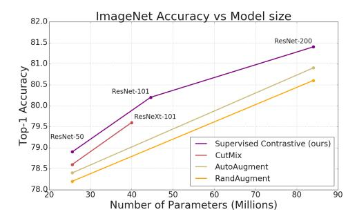
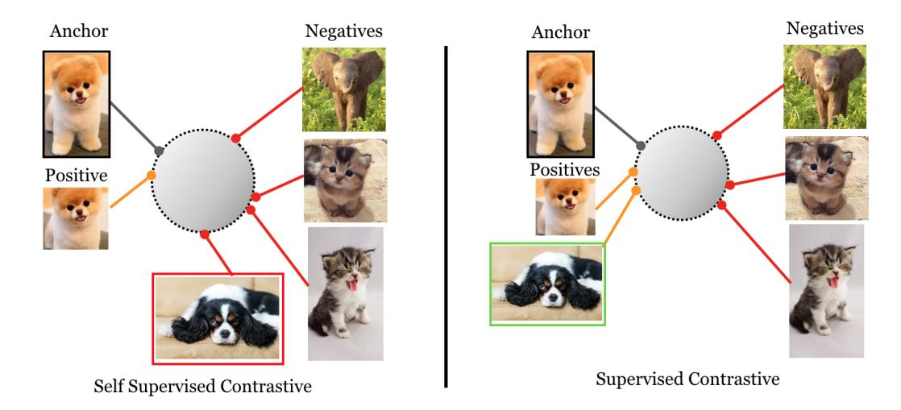
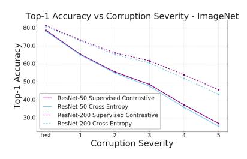
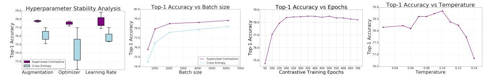
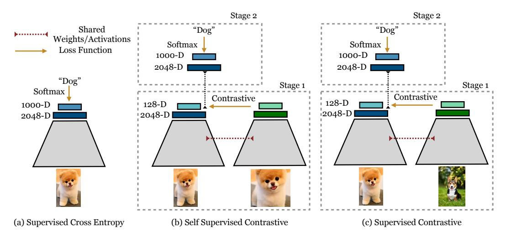
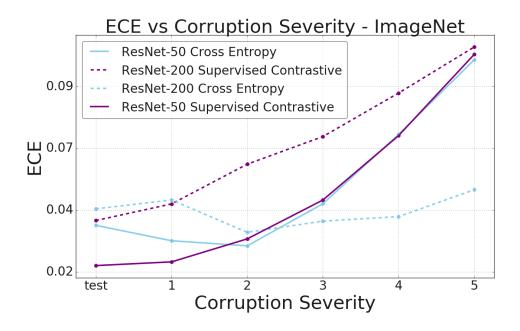
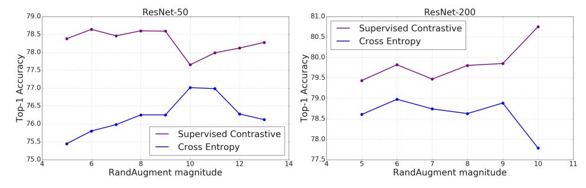

# Supervised Contrastive Learning

Prannay Khosla ∗ Google Research Piotr Teterwak ∗† Boston University Chen Wang † Snap Inc. Aaron Sarna ‡ Google Research

Yonglong Tian † MIT Phillip Isola † MIT Aaron Maschinot Google Research Ce Liu Google Research

> Dilip Krishnan Google Research

# Abstract

Contrastive learning applied to self-supervised representation learning has seen a resurgence in recent years, leading to state of the art performance in the unsupervised training of deep image models. Modern batch contrastive approaches subsume or significantly outperform traditional contrastive losses such as triplet, max-margin and the N-pairs loss. In this work, we extend the self-supervised batch contrastive approach to the *fully-supervised* setting, allowing us to effectively leverage label information. Clusters of points belonging to the same class are pulled together in embedding space, while simultaneously pushing apart clusters of samples from different classes. We analyze two possible versions of the supervised contrastive (SupCon) loss, identifying the best-performing formulation of the loss. On ResNet-200, we achieve top-1 accuracy of 81.4% on the ImageNet dataset, which is 0.8% above the best number reported for this architecture. We show consistent outperformance over cross-entropy on other datasets and two ResNet variants. The loss shows benefits for robustness to natural corruptions, and is more stable to hyperparameter settings such as optimizers and data augmentations. Our loss function is simple to implement and reference TensorFlow code is released at <https://t.ly/supcon> [1](#page-0-0) .

# 1 Introduction

The cross-entropy loss is the most widely used loss function for supervised learning of deep classification models. A number of works have explored shortcomings of this loss, such as lack of robustness to noisy labels [\[64,](#page-11-1) [46\]](#page-10-0) and the possibility of poor margins [\[10,](#page-9-0) [31\]](#page-10-1), leading to reduced generalization performance. However, in practice, most proposed alternatives have not worked better for large-scale datasets, such as ImageNet [\[7\]](#page-8-2), as evidenced by the continued use of cross-entropy to achieve state of the art results [\[5,](#page-8-0) [6,](#page-8-1) [56,](#page-11-2) [25\]](#page-9-1).

Figure 1: Our SupCon loss consistently outperforms cross-entropy with standard data augmentations. We show top-1 accuracy for the ImageNet dataset, on ResNet-50, ResNet-101 and ResNet-200, and compare against AutoAugment [\[5\]](#page-8-0), RandAugment [\[6\]](#page-8-1) and CutMix [\[60\]](#page-11-0).

∗ Equal contribution.

†Work done while at Google Research.

‡ Corresponding author: sarna@google.com

1 PyTorch implementation: <https://github.com/HobbitLong/SupContrast>

Figure 2: Supervised vs. self-supervised contrastive losses: The self-supervised contrastive loss (left, Eq. [1\)](#page-3-0) contrasts a *single* positive for each anchor (i.e., an augmented version of the same image) against a set of negatives consisting of the entire remainder of the batch. The supervised contrastive loss (right) considered in this paper (Eq. [2\)](#page-4-0), however, contrasts the set of *all* samples from the same class as positives against the negatives from the remainder of the batch. As demonstrated by the photo of the black and white puppy, taking class label information into account results in an embedding space where elements of the same class are more closely aligned than in the self-supervised case.

In recent years, a resurgence of work in contrastive learning has led to major advances in selfsupervised representation learning [\[55,](#page-11-3) [18,](#page-9-2) [38,](#page-10-2) [48,](#page-10-3) [22,](#page-9-3) [3,](#page-8-3) [15\]](#page-9-4). The common idea in these works is the following: pull together an anchor and a "positive" sample in embedding space, and push apart the anchor from many "negative" samples. Since no labels are available, a positive pair often consists of data augmentations of the sample, and negative pairs are formed by the anchor and randomly chosen samples from the minibatch. This is depicted in Fig. [2](#page-1-0) (left). In [\[38,](#page-10-2) [48\]](#page-10-3), connections are made of the contrastive loss to maximization of mutual information between different views of the data.

In this work, we propose a loss for supervised learning that builds on the contrastive self-supervised literature by leveraging label information. Normalized embeddings from the *same class* are pulled closer together than embeddings from *different classes*. Our technical novelty in this work is to consider *many positives* per anchor in addition to many negatives (as opposed to self-supervised contrastive learning which uses only a single positive). These positives are drawn from samples of the same class as the anchor, rather than being data augmentations of the anchor, as done in self-supervised learning. While this is a simple extension to the self-supervised setup, it is nonobvious how to setup the loss function correctly, and we analyze two alternatives. Fig. [2](#page-1-0) (right) and Fig. 1 (Supplementary) provide a visual explanation of our proposed loss. Our loss can be seen as a generalization of both the triplet [\[53\]](#page-10-4) and N-pair losses [\[45\]](#page-10-5); the former uses only one positive and one negative sample per anchor, and the latter uses one positive and many negatives. The use of many positives and many negatives for each anchor allows us to achieve state of the art performance without the need for hard negative mining, which can be difficult to tune properly. To the best of our knowledge, this is the first contrastive loss to consistently perform better than cross-entropy on large-scale classification problems. Furthermore, it provides a unifying loss function that can be used for either self-supervised or supervised learning.

Our resulting loss, SupCon, is simple to implement and stable to train, as our empirical results show. It achieves excellent top-1 accuracy on the ImageNet dataset on the ResNet-50 and ResNet-200 architectures [\[17\]](#page-9-5). On ResNet-200 [\[5\]](#page-8-0), we achieve a top-1 accuracy of 81.4%, which is a 0.8% improvement over the state of the art [\[30\]](#page-9-6) cross-entropy loss on the same architecture (see Fig. [1\)](#page-0-1). The gain in top-1 accuracy is accompanied by increased robustness as measured on the ImageNet-C dataset [\[19\]](#page-9-7). Our main contributions are summarized below:

1. We propose a novel extension to the contrastive loss function that allows for multiple positives per anchor, thus adapting contrastive learning to the fully supervised setting. Analytically and empirically, we show that a na¨ıve extension performs much worse than our proposed version.

- 2. We show that our loss provides consistent boosts in top-1 accuracy for a number of datasets. It is also more robust to natural corruptions.
- 3. We demonstrate analytically that the gradient of our loss function encourages learning from hard positives and hard negatives.
- 4. We show empirically that our loss is less sensitive than cross-entropy to a range of hyperparameters.

# 2 Related Work

Our work draws on existing literature in self-supervised representation learning, metric learning and supervised learning. Here we focus on the most relevant papers. The cross-entropy loss was introduced as a powerful loss function to train deep networks [\[40,](#page-10-6) [1,](#page-8-4) [29\]](#page-9-8). The key idea is simple and intuitive: each class is assigned a target (usually 1-hot) vector. However, it is unclear why these target labels should be the optimal ones and some work has tried to identify better target label vectors, e.g. [\[57\]](#page-11-4). A number of papers have studied other drawbacks of the cross-entropy loss, such as sensitivity to noisy labels [\[64,](#page-11-1) [46\]](#page-10-0), presence of adversarial examples [\[10,](#page-9-0) [36\]](#page-10-7), and poor margins [\[2\]](#page-8-5). Alternative losses have been proposed, but the most effective ideas in practice have been approaches that change the reference label distribution, such as label smoothing [\[47,](#page-10-8) [35\]](#page-10-9), data augmentations such as Mixup [\[61\]](#page-11-5) and CutMix [\[60\]](#page-11-0), and knowledge distillation [\[21\]](#page-9-9).

Powerful self-supervised representation learning approaches based on deep learning models have recently been developed in the natural language domain [\[8,](#page-8-6) [58,](#page-11-6) [33\]](#page-10-10). In the image domain, pixelpredictive approaches have also been used to learn embeddings [\[9,](#page-9-10) [62,](#page-11-7) [63,](#page-11-8) [37\]](#page-10-11). These methods try to predict missing parts of the input signal. However, a more effective approach has been to replace a dense per-pixel predictive loss, with a loss in lower-dimensional representation space. The state of the art family of models for self-supervised representation learning using this paradigm are collected under the umbrella of contrastive learning [\[55,](#page-11-3) [18,](#page-9-2) [22,](#page-9-3) [48,](#page-10-3) [43,](#page-10-12) [3,](#page-8-3) [51\]](#page-10-13). In these works, the losses are inspired by noise contrastive estimation [\[13,](#page-9-11) [34\]](#page-10-14) or N-pair losses [\[45\]](#page-10-5). Typically, the loss is applied at the last layer of a deep network. At test time, the embeddings from a previous layer are utilized for downstream transfer tasks, fine tuning or direct retrieval tasks. [\[15\]](#page-9-4) introduces the approximation of only back-propagating through part of the loss, and also the approximation of using stale representations in the form of a memory bank.

Closely related to contrastive learning is the family of losses based on metric distance learning or triplets [\[4,](#page-8-7) [53,](#page-10-4) [42\]](#page-10-15). These losses have been used to learn powerful representations, often in supervised settings, where labels are used to guide the choice of positive and negative pairs. The key distinction between triplet losses and contrastive losses is the number of positive and negative pairs per data point; triplet losses use exactly one positive and one negative pair per anchor. In the supervised metric learning setting, the positive pair is chosen from the same class and the negative pair is chosen from other classes, nearly always requiring hard-negative mining for good performance [\[42\]](#page-10-15). Self-supervised contrastive losses similarly use just one positive pair for each anchor sample, selected using either co-occurrence [\[18,](#page-9-2) [22,](#page-9-3) [48\]](#page-10-3) or data augmentation [\[3\]](#page-8-3). The major difference is that many negative pairs are used for each anchor. These are usually chosen uniformly at random using some form of weak knowledge, such as patches from other images, or frames from other randomly chosen videos, relying on the assumption that this approach yields a very low probability of false negatives.

Resembling our supervised contrastive approach is the soft-nearest neighbors loss introduced in [\[41\]](#page-10-16) and used in [\[54\]](#page-11-9). Like [\[54\]](#page-11-9), we improve upon [\[41\]](#page-10-16) by normalizing the embeddings and replacing euclidean distance with inner products. We further improve on [\[54\]](#page-11-9) by the increased use of data augmentation, a disposable contrastive head and two-stage training (contrastive followed by crossentropy), and crucially, changing the form of the loss function to significantly improve results (see Section 3). [\[12\]](#page-9-12) also uses a closely related loss formulation to ours to *entangle* representations at intermediate layers by maximizing the loss. Most similar to our method is the Compact Clustering via Label Propagation (CCLP) regularizer in Kamnitsas et. al. [\[24\]](#page-9-13). While CCLP focuses mostly on the semi-supervised case, in the fully supervised case the regularizer reduces to almost exactly our loss formulation. Important practical differences include our normalization of the contrastive embedding onto the unit sphere, tuning of a temperature parameter in the contrastive objective, and stronger augmentation. Additionally, Kamnitsas et. al. use the contrastive embedding as an input to a classification head, which is trained jointly with the CCLP regularizer, while SupCon employs a two stage training and discards the contrastive head. Lastly, the scale of experiments in Kamnitsas et. al. is much smaller than in this work. Merging the findings of our paper and CCLP is a promising direction for semi-supervised learning research.

### 3 Method

Our method is structurally similar to that used in [48, 3] for self-supervised contrastive learning, with modifications for supervised classification. Given an input batch of data, we first apply data augmentation twice to obtain two copies of the batch. Both copies are forward propagated through the encoder network to obtain a 2048-dimensional normalized embedding. During training, this representation is further propagated through a projection network that is discarded at inference time. The supervised contrastive loss is computed on the outputs of the projection network. To use the trained model for classification, we train a linear classifier on top of the frozen representations using a cross-entropy loss. Fig. 1 in the Supplementary material provides a visual explanation.

### 3.1 Representation Learning Framework

The main components of our framework are:

- Data Augmentation module,  $Aug(\cdot)$ . For each input sample, x, we generate two random augmentations,  $\tilde{x} = Aug(x)$ , each of which represents a different *view* of the data and contains some subset of the information in the original sample. Sec. 4 gives details of the augmentations.
- Encoder Network,  $Enc(\cdot)$ , which maps x to a representation vector,  $r = Enc(x) \in \mathcal{R}^{D_E}$ . Both augmented samples are separately input to the same encoder, resulting in a pair of representation vectors. r is normalized to the unit hypersphere in  $\mathcal{R}^{D_E}$  ( $D_E = 2048$  in all our experiments in the paper). Consistent with the findings of [42, 52], our analysis and experiments show that this normalization improves top-1 accuracy.
- Projection Network,  $Proj(\cdot)$ , which maps r to a vector  $z = Proj(r) \in \mathbb{R}^{D_P}$ . We instantiate  $Proj(\cdot)$  as either a multi-layer perceptron [14] with a single hidden layer of size 2048 and output vector of size  $D_P = 128$  or just a single linear layer of size  $D_P = 128$ ; we leave to future work the investigation of optimal  $Proj(\cdot)$  architectures. We again normalize the output of this network to lie on the unit hypersphere, which enables using an inner product to measure distances in the projection space. As in self-supervised contrastive learning [48, 3], we discard  $Proj(\cdot)$  at the end of contrastive training. As a result, our inference-time models contain exactly the same number of parameters as a cross-entropy model using the same encoder,  $Enc(\cdot)$ .

### 3.2 Contrastive Loss Functions

Given this framework, we now look at the family of contrastive losses, starting from the self-supervised domain and analyzing the options for adapting it to the supervised domain, showing that one formulation is superior. For a set of N randomly sampled sample/label pairs,  $\{\boldsymbol{x}_k, \boldsymbol{y}_k\}_{k=1...N}$ , the corresponding batch used for training consists of 2N pairs,  $\{\tilde{\boldsymbol{x}}_\ell, \tilde{\boldsymbol{y}}_\ell\}_{\ell=1...2N}$ , where  $\tilde{\boldsymbol{x}}_{2k}$  and  $\tilde{\boldsymbol{x}}_{2k-1}$  are two random augmentations (a.k.a., "views") of  $\boldsymbol{x}_k$  (k=1...N) and  $\tilde{\boldsymbol{y}}_{2k-1}=\tilde{\boldsymbol{y}}_{2k}=\boldsymbol{y}_k$ . For the remainder of this paper, we will refer to a set of N samples as a "batch" and the set of 2N augmented samples as a "multiviewed batch".

### 3.2.1 Self-Supervised Contrastive Loss

Within a multiviewed batch, let  $i \in I \equiv \{1...2N\}$  be the index of an arbitrary augmented sample, and let j(i) be the index of the other augmented sample originating from the same source sample. In *self-supervised* contrastive learning (e.g., [3, 48, 18, 22]), the loss takes the following form.

$$\mathcal{L}^{self} = \sum_{i \in I} \mathcal{L}_{i}^{self} = -\sum_{i \in I} \log \frac{\exp\left(\mathbf{z}_{i} \cdot \mathbf{z}_{j(i)} / \tau\right)}{\sum_{a \in A(i)} \exp\left(\mathbf{z}_{i} \cdot \mathbf{z}_{a} / \tau\right)}$$
(1)

Here,  $\mathbf{z}_{\ell} = Proj(Enc(\tilde{\mathbf{x}}_{\ell})) \in \mathcal{R}^{D_P}$ , the • symbol denotes the inner (dot) product,  $\tau \in \mathcal{R}^+$  is a scalar temperature parameter, and  $A(i) \equiv I \setminus \{i\}$ . The index i is called the *anchor*, index j(i) is called the *positive*, and the other 2(N-1) indices  $(\{k \in A(i) \setminus \{j(i)\})$  are called the *negatives*.

Note that for each anchor i, there is 1 positive pair and 2N-2 negative pairs. The denominator has a total of 2N-1 terms (the positive and negatives).

### **Supervised Contrastive Losses**

For supervised learning, the contrastive loss in Eq. 1 is incapable of handling the case where, due to the presence of labels, more than one sample is known to belong to the same class. Generalization to an arbitrary numbers of positives, though, leads to a choice between multiple possible functions. Eqs. 2 and 3 present the two most straightforward ways to generalize Eq. 1 to incorporate supervision.

$$\mathcal{L}_{out}^{sup} = \sum_{i \in I} \mathcal{L}_{out,i}^{sup} = \sum_{i \in I} \frac{-1}{|P(i)|} \sum_{p \in P(i)} \log \frac{\exp(\mathbf{z}_i \cdot \mathbf{z}_p / \tau)}{\sum_{a \in A(i)} \exp(\mathbf{z}_i \cdot \mathbf{z}_a / \tau)}$$
(2)

$$\mathcal{L}_{in}^{sup} = \sum_{i \in I} \mathcal{L}_{in,i}^{sup} = \sum_{i \in I} -\log \left\{ \frac{1}{|P(i)|} \sum_{p \in P(i)} \frac{\exp\left(\mathbf{z}_i \cdot \mathbf{z}_p / \tau\right)}{\sum\limits_{a \in A(i)} \exp\left(\mathbf{z}_i \cdot \mathbf{z}_a / \tau\right)} \right\}$$
(3)

Here,  $P(i) \equiv \{p \in A(i) : \tilde{y}_p = \tilde{y}_i\}$  is the set of indices of all positives in the multiviewed batch distinct from i, and |P(i)| is its cardinality. In Eq. 2, the summation over positives is located *outside* of the  $\log(\mathcal{L}^{sup}_{out})$  while in Eq. 3, the summation is located *inside* of the  $\log(\mathcal{L}^{sup}_{in})$ . Both losses have the following desirable properties:

- Generalization to an arbitrary number of positives. The major structural change of Eqs. 2 and 3 over Eq. 1 is that now, for any anchor, all positives in a multiviewed batch (i.e., the augmentation-based sample as well as any of the remaining samples with the same label) contribute to the numerator. For randomly-generated batches whose size is large with respect to the number of classes, multiple additional terms will be present (on average, N/C, where C is the number of classes). The supervised losses encourage the encoder to give closely aligned representations to all entries from the same class, resulting in a more robust clustering of the representation space than that generated from Eq. 1, as is supported by our experiments in Sec. 4.
- Contrastive power increases with more negatives. Eqs. 2 and 3 both preserve the summation over negatives in the contrastive denominator of Eq. 1. This form is largely motivated by noise contrastive estimation and N-pair losses [13, 45], wherein the ability to discriminate between signal and noise (negatives) is improved by adding more examples of negatives. This property is important for representation learning via self-supervised contrastive learning, with many papers showing increased performance with increasing number of negatives [18, 15, 48, 3].
- Intrinsic ability to perform hard positive/negative mining. When used with normalized representations, the loss in Eq. 1 induces a gradient structure that gives rise to implicit hard positive/negative mining. The gradient contributions from hard positives/negatives (i.e., ones against which continuing to contrast the anchor *greatly* benefits the encoder) are large while those for *easy* positives/negatives (i.e., ones against which continuing to contrast the anchor only weakly benefits the encoder) are small. Furthermore, for hard positives, the effect increases (asymptotically) as the number of negatives does. Eqs. 2 and 3 both preserve this useful property and generalize it to all positives. This implicit property allows the contrastive loss to sidestep the need for explicit hard mining, which is a delicate but critical part of many losses, such as triplet loss [42]. We note that this implicit property applies to both supervised and self-supervised contrastive losses, but our derivation is the first to clearly show this property. We provide a full derivation of this property from the loss gradient in the Supplementary material.

The two loss formulations are not, however, equivalent. Because log is a concave function, Jensen's Inequality [23] implies that  $\mathcal{L}_{in}^{sup} \leq \mathcal{L}_{out}^{sup}$ . One would thus expect  $\mathcal{L}_{out}^{sup}$  to be the superior supervised loss function (since it upper-bounds  $\mathcal{L}_{in}^{sup}$ ). This conclusion is also supported analytically. Table 1 compares the ImageNet [7] top-1 classification accuracy using  $\mathcal{L}_{out}^{sup}$  and  $\mathcal{L}_{in}^{sup}$  for different batch sizes (N) on the ResNet-50 losses on ResNet-50 for a batch size of [17] architecture. The  $\mathcal{L}_{out}^{sup}$  supervised loss achieves significantly higher performance than  $\mathcal{L}_{in}^{sup}$ . We conjecture that this is due to the gradient of  $\mathcal{L}_{in}^{sup}$  having

| Loss                                              | Top-1          |
|---------------------------------------------------|----------------|
| $\mathcal{L}_{in}^{sup}$ $\mathcal{L}_{in}^{sup}$ | 78.7% 67.4% |

Table 1: ImageNet Top-1 classification losses on ResNet-50 for a batch size of

structure less optimal for training than that of  $\mathcal{L}^{sup}_{out}$ . For  $\mathcal{L}^{sup}_{out}$ , the positives normalization factor (i.e., 1/|P(i)|) serves to remove bias present in the positives in a multiviewed batch contributing to the loss. However, though  $\mathcal{L}^{sup}_{in}$  also contains the same normalization factor, it is located *inside* of the log. It thus contributes only an additive constant to the overall loss, which does not affect the gradient. Without any normalization effects, the gradients of  $\mathcal{L}^{sup}_{in}$  are more susceptible to bias in the positives, leading to sub-optimal training.

An analysis of the gradients themselves supports this conclusion. As shown in the Supplementary, the gradient for  $either \mathcal{L}^{sup}_{out,i}$  or  $\mathcal{L}^{sup}_{in,i}$  with respect to the embedding  $z_i$  has the following form.

$$\frac{\partial \mathcal{L}_{i}^{sup}}{\partial \boldsymbol{z}_{i}} = \frac{1}{\tau} \left\{ \sum_{p \in P(i)} \boldsymbol{z}_{p} (P_{ip} - X_{ip}) + \sum_{n \in N(i)} \boldsymbol{z}_{n} P_{in} \right\}$$
(4)

Here,  $N(i) \equiv \{n \in A(i) : \tilde{\boldsymbol{y}}_n \neq \tilde{\boldsymbol{y}}_i\}$  is the set of indices of all negatives in the multiviewed batch, and  $P_{ix} \equiv \exp\left(\boldsymbol{z}_i \cdot \boldsymbol{z}_x/\tau\right) / \sum_{a \in A(i)} \exp\left(\boldsymbol{z}_i \cdot \boldsymbol{z}_a/\tau\right)$ . The difference between the gradients for the two losses is in  $X_{ip}$ .

$$X_{ip} = \begin{cases} \frac{\exp(\mathbf{z}_{i} \cdot \mathbf{z}_{p} / \tau)}{\sum\limits_{p' \in P(i)} \exp(\mathbf{z}_{i} \cdot \mathbf{z}_{p'} / \tau)} &, & \text{if } \mathcal{L}_{i}^{sup} = \mathcal{L}_{in,i}^{sup} \\ \frac{1}{|P(i)|} &, & \text{if } \mathcal{L}_{i}^{sup} = \mathcal{L}_{out,i}^{sup} \end{cases}$$
(5)

If each  $z_p$  is set to the (less biased) mean positive representation vector,  $\overline{z}$ ,  $X_{ip}^{in}$  reduces to  $X_{ip}^{out}$ :

$$X_{ip}^{in}\big|_{\boldsymbol{z}_{p}=\overline{\boldsymbol{z}}} = \frac{\exp\left(\boldsymbol{z}_{i} \cdot \overline{\boldsymbol{z}}/\tau\right)}{\sum\limits_{p' \in P(i)} \exp\left(\boldsymbol{z}_{i} \cdot \overline{\boldsymbol{z}}/\tau\right)} = \frac{\exp\left(\boldsymbol{z}_{i} \cdot \overline{\boldsymbol{z}}/\tau\right)}{|P(i)| \cdot \exp\left(\boldsymbol{z}_{i} \cdot \overline{\boldsymbol{z}}/\tau\right)} = \frac{1}{|P(i)|} = X_{ip}^{out} \tag{6}$$

From the form of  $\partial \mathcal{L}_i^{sup}/\partial z_i$ , we conclude that the stabilization due to using the mean of positives benefits training. Throughout the rest of the paper, we consider only  $\mathcal{L}_{out}^{sup}$ .

#### 3.2.3 Connection to Triplet Loss and N-pairs Loss

Supervised contrastive learning is closely related to the triplet loss [53], one of the widely-used loss functions for supervised learning. In the Supplementary, we show that the triplet loss is a special case of the contrastive loss when one positive and one negative are used. When more than one negative is used, we show that the SupCon loss becomes equivalent to the N-pairs loss [45].

### 4 Experiments

We evaluate our SupCon loss ( $\mathcal{L}_{out}^{sup}$ , Eq. 2) by measuring classification accuracy on a number of common image classification benchmarks including CIFAR-10 and CIFAR-100 [27] and ImageNet [7]. We also benchmark our ImageNet models on robustness to common image corruptions [19] and show how performance varies with changes to hyperparameters and reduced data. For the encoder network ( $Enc(\cdot)$ ) we experimented with three commonly used encoder architectures: ResNet-50, ResNet-101, and ResNet-200 [17]. The normalized activations of the final pooling layer ( $D_E=2048$ ) are used as the representation vector. We experimented with four different implementations of the  $Aug(\cdot)$  data augmentation module: AutoAugment [5]; RandAugment [6]; SimAugment [3], and Stacked RandAugment [49] (see details of our SimAugment and Stacked RandAugment implementations in the Supplementary). AutoAugment outperforms all other data augmentation strategies on ResNet-50 for both SupCon and cross-entropy. Stacked RandAugment performed best for ResNet-200 for both loss functions. We provide more details in the Supplementary.

# 4.1 Classification Accuracy

Table 2 shows that SupCon generalizes better than cross-entropy, margin classifiers (with use of labels) and unsupervised contrastive learning techniques on CIFAR-10, CIFAR-100 and ImageNet datasets. Table 3 shows results for ResNet-50 and ResNet-200 (we use ResNet-v1 [17]) for ImageNet. We achieve a new state of the art accuracy of 78.7% on ResNet-50 with AutoAugment (for

| Dataset              | SimCLR[3]    | Cross-Entropy | Max-Margin [32] | SupCon       |
|----------------------|--------------|---------------|-----------------|--------------|
| CIFAR10              | 93.6         | 95.0          | 92.4            | 96.0         |
| CIFAR100 ImageNet | 70.7 70.2 | 75.3 78.2  | 70.5 78.0    | 76.5 78.7 |

Table 2: Top-1 classification accuracy on ResNet-50 [\[17\]](#page-9-5) for various datasets. We compare cross-entropy training, unsupervised representation learning (SimCLR [\[3\]](#page-8-3)), max-margin classifiers [\[32\]](#page-10-19) and SupCon (ours). We re-implemented and tuned hyperparameters for all baseline numbers except margin classifiers where we report published results. Note that the CIFAR-10 and CIFAR-100 results are from our PyTorch implementation and ImageNet from our TensorFlow implementation.

| Loss                      | Architecture | Augmentation             | Top-1 | Top-5 |
|---------------------------|--------------|--------------------------|-------|-------|
| Cross-Entropy (baseline)  | ResNet-50    | MixUp [61]               | 77.4  | 93.6  |
| Cross-Entropy (baseline)  | ResNet-50    | CutMix [60]              | 78.6  | 94.1  |
| Cross-Entropy (baseline)  | ResNet-50    | AutoAugment [5]          | 78.2  | 92.9  |
| Cross-Entropy (our impl.) | ResNet-50    | AutoAugment [30]         | 77.6  | 95.3  |
| SupCon                    | ResNet-50    | AutoAugment [5]          | 78.7  | 94.3  |
| Cross-Entropy (baseline)  | ResNet-200   | AutoAugment [5]          | 80.6  | 95.3  |
| Cross-Entropy (our impl.) | ResNet-200   | Stacked RandAugment [49] | 80.9  | 95.2  |
| SupCon                    | ResNet-200   | Stacked RandAugment [49] | 81.4  | 95.9  |
| SupCon                    | ResNet-101   | Stacked RandAugment [49] | 80.2  | 94.7  |

Table 3: Top-1/Top-5 accuracy results on ImageNet for AutoAugment [\[5\]](#page-8-0) with ResNet-50 and for Stacked RandAugment [\[49\]](#page-10-18) with ResNet-101 and ResNet-200. The baseline numbers are taken from the referenced papers, and we also re-implement cross-entropy.

comparison, a number of the other top-performing methods are shown in Fig. [1\)](#page-0-1). Note that we also achieve a slight improvement over CutMix [\[60\]](#page-11-0), which is considered to be a state of the art data augmentation strategy. Incorporating data augmentation strategies such as CutMix [\[60\]](#page-11-0) and MixUp [\[61\]](#page-11-5) into contrastive learning could potentially improve results further.

We also experimented with memory based alternatives [\[15\]](#page-9-4). On ImageNet, with a memory size of 8192 (requiring only the storage of 128-dimensional vectors), a batch size of 256, and SGD optimizer, running on 8 Nvidia V100 GPUs, SupCon is able to achieve 79.1% top-1 accuracy on ResNet-50. This is in fact slightly better than the 78.7% accuracy with 6144 batch size (and no memory); and with significantly reduced compute and memory footprint.

Since SupCon uses 2 views per sample, its batch sizes are effectively twice the cross-entropy equivalent. We therefore also experimented with the cross-entropy ResNet-50 baselines using a batch size of 12,288. These only achieved 77.5% top-1 accuracy. We additionally experimented with increasing the number of training epochs for cross-entropy all the way to 1400, but this actually decreased accuracy (77.0%).

We tested the N-pairs loss [\[45\]](#page-10-5) in our framework with a batch size of 6144. N-pairs achieves only 57.4% top-1 accuracy on ImageNet. We believe this is due to multiple factors missing from N-pairs loss compared to supervised contrastive: the use of multiple views; lower temperature; and many more positives. We show some results of the impact of the number of positives per anchor in the Supplementary (Sec. 6), and the N-pairs result is inline with them. We also note that the original N-pairs paper [\[45\]](#page-10-5) has already shown the outperformance of N-pairs loss to triplet loss.

### 4.2 Robustness to Image Corruptions and Reduced Training Data

Deep neural networks lack robustness to out of distribution data or natural corruptions such as noise, blur and JPEG compression. The benchmark ImageNet-C dataset [\[19\]](#page-9-7) is used to measure trained model performance on such corruptions. In Fig. [3\(](#page-7-0)left), we compare the supervised contrastive models to cross-entropy using the Mean Corruption Error (mCE) and Relative Mean Corruption Error metrics [\[19\]](#page-9-7). Both metrics measure average degradation in performance compared to ImageNet test set, averaged over all possible corruptions and severity levels. Relative mCE is a better metric when we compare models with different Top-1 accuracy, while mCE is a better measure of absolute robustness to corruptions. The SupCon models have lower mCE values across different corruptions,

| Loss                         | Architecture                                     | rel. mCE mCE            |                       |
|------------------------------|--------------------------------------------------|-------------------------|-----------------------|
| Cross-Entropy (baselines) | AlexNet [28] VGG-19+BN [44] ResNet-18 [17] | 100.0 122.9 103.9 | 100.0 81.6 84.7 |
| Cross-Entropy                | ResNet-50                                        | 96.2                    | 68.6                  |
| (our implementation)         | ResNet-200                                       | 69.1                    | 52.4                  |
| Supervised Contrastive       | ResNet-50                                        | 94.6                    | 67.2                  |
|                              | ResNet-200                                       | 66.5                    | 50.6                  |

Figure 3: Training with supervised contrastive loss makes models more robust to corruptions in images. Left: Robustness as measured by Mean Corruption Error (mCE) and relative mCE over the ImageNet-C dataset [\[19\]](#page-9-7) (lower is better). Right: Mean Accuracy as a function of corruption severity averaged over all various corruptions. (higher is better).

Figure 4: Accuracy of cross-entropy and supervised contrastive loss as a function of hyperparameters and training data size, all measured on ImageNet with a ResNet-50 encoder. (From left to right) (a): Standard boxplot showing Top-1 accuracy vs changes in augmentation, optimizer and learning rates. (b): Top-1 accuracy as a function of batch size shows both losses benefit from larger batch sizes while Supervised Contrastive has higher Top-1 accuracy even when trained with smaller batch sizes. (c): Top-1 accuracy as a function of SupCon pretraining epochs. (d): Top-1 accuracy as a function of temperature during pretraining stage for SupCon.

|                                             |                |                         | Food CIFAR10 CIFAR100 Birdsnap SUN397 Cars Aircraft VOC2007 DTD |                         |                         |                         |                         |                         |                                           | Pets Caltech-101 Flowers Mean |                        |                         |
|---------------------------------------------|----------------|-------------------------|-----------------------------------------------------------------|-------------------------|-------------------------|-------------------------|-------------------------|-------------------------|-------------------------------------------|-------------------------------|------------------------|-------------------------|
| SimCLR-50 [3] 88.20 Xent-50 SupCon-50 | 87.38 87.23 | 97.70 96.50 97.42 | 85.90 84.93 84.27                                         | 75.90 74.70 75.15 | 63.50 63.15 58.04 | 91.30 89.57 91.69 | 88.10 80.80 84.09 | 84.10 85.36 85.17 | 73.20 89.20 76.86 92.35 74.60 93.47 | 92.10 92.34 91.04       | 97.00 96.93 96.0 | 84.81 84.67 84.27 |
| Xent-200 SupCon-200                      | 89.36 88.62 | 97.96 98.28          | 86.49 87.28                                                  | 76.50 76.26          | 64.36 60.46          | 90.01 91.78          | 84.22 88.68          | 86.27 85.18          | 76.76 93.48 74.26 93.12                | 93.84 94.91                | 97.20 96.97         | 85.77 85.67          |

Table 4: Transfer learning results. Numbers are mAP for VOC2007 [\[11\]](#page-9-18); mean-per-class accuracy for Aircraft, Pets, Caltech, and Flowers; and top-1 accuracy for all other datasets.

showing increased robustness. We also see from Fig. [3\(](#page-7-0)right) that SupCon models demonstrate lesser degradation in accuracy with increasing corruption severity.

### 4.3 Hyperparameter Stability

We experimented with hyperparameter stability by changing augmentations, optimizers and learning rates one at a time from the best combination for each of the methodologies. In Fig. [4\(](#page-7-1)a), we compare the top-1 accuracy of SupCon loss against cross-entropy across changes in augmentations (RandAugment [\[6\]](#page-8-1), AutoAugment [\[5\]](#page-8-0), SimAugment [\[3\]](#page-8-3), Stacked RandAugment [\[49\]](#page-10-18)); optimizers (LARS, SGD with Momentum and RMSProp); and learning rates. We observe significantly lower variance in the output of the contrastive loss. Note that batch sizes for cross-entropy and supervised contrastive are the same, thus ruling out any batch-size effects. In Fig. [4\(](#page-7-1)b), sweeping batch size and holding all other hyperparameters constant results in consistently better top-1 accuracy of the supervised contrastive loss.

# 4.4 Transfer Learning

We evaluate the learned representation for fine-tuning on 12 natural image datasets, following the protocol in Chen et.al. [\[3\]](#page-8-3). SupCon is on par with cross-entropy and *self-supervised* contrastive loss on transfer learning performance when trained on the same architecture (Table [4\)](#page-7-2). Our results are consistent with the findings in [\[16\]](#page-9-19) and [\[26\]](#page-9-20): while better ImageNet models are correlated with better transfer performance, the dominant factor is architecture. Understanding the connection between training objective and transfer performance is left to future work.

### 4.5 Training Details

The SupCon loss was trained for 700 epochs during pretraining for ResNet-200 and 350 epochs for smaller models. Fig. [4\(](#page-7-1)c) shows accuracy as a function of SupCon training epochs for a ResNet50, demonstrating that even 200 epochs is likely sufficient for most purposes.

An (optional) additional step of training a linear classifier is used to compute top-1 accuracy. This is not needed if the purpose is to use representations for transfer learning tasks or retrieval. The second stage needs as few as 10 epochs of additional training. Note that in practice the linear classifier can be trained jointly with the encoder and projection networks by blocking gradient propagation from the linear classifier back to the encoder, and achieve roughly the same results without requiring two-stage training. We chose not to do that here to help isolate the effects of the SupCon loss.

We trained our models with batch sizes of up to 6144, although batch sizes of 2048 suffice for most purposes for both SupCon and cross-entropy losses (as shown in Fig. [4\(](#page-7-1)b)). We associate some of the performance increase with batch size to the effect on the gradient due to hard positives increasing with an increasing number of negatives (see the Supplementary for details). We report metrics for experiments with batch size 6144 for ResNet-50 and batch size 4096 for ResNet-200 (due to the larger network size, a smaller batch size is necessary). We observed that for a fixed batch size it was possible to train with SupCon using larger learning rates than what was required by cross-entropy to achieve similar performance.

All our results used a temperature of τ = 0.1. Smaller temperature benefits training more than higher ones, but extremely low temperatures are harder to train due to numerical instability. Fig. [4\(](#page-7-1)d) shows the effect of temperature on Top-1 performance of supervised contrastive learning. As we can see from Eq. [4,](#page-5-1) the gradient scales inversely with choice of temperature τ ; therefore we rescale the loss by τ during training for stability.

We experimented with standard optimizers such as LARS [\[59\]](#page-11-10), RMSProp [\[20\]](#page-9-21) and SGD with momentum [\[39\]](#page-10-21) in different permutations for the initial pre-training step and training of the dense layer. While SGD with momentum works best for training ResNets with cross-entropy, we get the best performance for SupCon on ImageNet by using LARS for pre-training and RMSProp to training the linear layer. For CIFAR10 and CIFAR100 SGD with momentum performed best. Additional results for combinations of optimizers are provided in the Supplementary. Reference code is released at <https://t.ly/supcon>.

# References

- [1] Eric B Baum and Frank Wilczek. Supervised learning of probability distributions by neural networks. In *Neural information processing systems*, pages 52–61, 1988. [3](#page-2-0)
- [2] Kaidi Cao, Colin Wei, Adrien Gaidon, Nikos Arechiga, and Tengyu Ma. Learning imbalanced datasets with label-distribution-aware margin loss. In *Advances in Neural Information Processing Systems*, pages 1565–1576, 2019. [3](#page-2-0)
- [3] Ting Chen, Simon Kornblith, Mohammad Norouzi, and Geoffrey Hinton. A simple framework for contrastive learning of visual representations. *arXiv preprint arXiv:2002.05709*, 2020. [2,](#page-1-1) [3,](#page-2-0) [4,](#page-3-1) [5,](#page-4-3) [6,](#page-5-2) [7,](#page-6-2) [8,](#page-7-3) [16,](#page-15-0) [18,](#page-17-0) [19,](#page-18-0) [21,](#page-20-0) [22](#page-21-0)
- [4] Sumit Chopra, Raia Hadsell, and Yann LeCun. Learning a similarity metric discriminatively, with application to face verification. In *2005 IEEE Computer Society Conference on Computer Vision and Pattern Recognition (CVPR'05)*, volume 1, pages 539–546. IEEE, 2005. [3](#page-2-0)
- [5] Ekin D Cubuk, Barret Zoph, Dandelion Mane, Vijay Vasudevan, and Quoc V Le. Autoaugment: Learning augmentation strategies from data. In *Proceedings of the IEEE conference on computer vision and pattern recognition*, pages 113–123, 2019. [1,](#page-0-2) [2,](#page-1-1) [6,](#page-5-2) [7,](#page-6-2) [8,](#page-7-3) [21](#page-20-0)
- [6] Ekin D Cubuk, Barret Zoph, Jonathon Shlens, and Quoc V Le. Randaugment: Practical data augmentation with no separate search. *arXiv preprint arXiv:1909.13719*, 2019. [1,](#page-0-2) [6,](#page-5-2) [8,](#page-7-3) [21,](#page-20-0) [22](#page-21-0)
- [7] Jia Deng, Wei Dong, Richard Socher, Li-Jia Li, Kai Li, and Li Fei-Fei. Imagenet: A largescale hierarchical image database. In *2009 IEEE conference on computer vision and pattern recognition*, 2009. [1,](#page-0-2) [5,](#page-4-3) [6](#page-5-2)
- [8] Jacob Devlin, Ming-Wei Chang, Kenton Lee, and Kristina Toutanova. Bert: Pre-training of deep bidirectional transformers for language understanding. *arXiv preprint arXiv:1810.04805*, 2018. [3](#page-2-0)

- [9] Carl Doersch, Abhinav Gupta, and Alexei A Efros. Unsupervised visual representation learning by context prediction. In *Proceedings of the IEEE International Conference on Computer Vision*, pages 1422–1430, 2015. [3](#page-2-0)
- [10] Gamaleldin Elsayed, Dilip Krishnan, Hossein Mobahi, Kevin Regan, and Samy Bengio. Large margin deep networks for classification. In *Advances in neural information processing systems*, pages 842–852, 2018. [1,](#page-0-2) [3](#page-2-0)
- [11] M. Everingham, L. Van Gool, C. K. I. Williams, J. Winn, and A. Zisserman. The PASCAL Visual Object Classes Challenge 2007 (VOC2007) Results. http://www.pascalnetwork.org/challenges/VOC/voc2007/workshop/index.html. [8](#page-7-3)
- [12] Nicholas Frosst, Nicolas Papernot, and Geoffrey E. Hinton. Analyzing and improving representations with the soft nearest neighbor loss. In Kamalika Chaudhuri and Ruslan Salakhutdinov, editors, *Proceedings of the 36th International Conference on Machine Learning, ICML 2019, 9-15 June 2019, Long Beach, California, USA*, volume 97 of *Proceedings of Machine Learning Research*, pages 2012–2020. PMLR, 2019. [3](#page-2-0)
- [13] Michael Gutmann and Aapo Hyvarinen. Noise-contrastive estimation: A new estimation prin- ¨ ciple for unnormalized statistical models. In *Proceedings of the Thirteenth International Conference on Artificial Intelligence and Statistics*, pages 297–304, 2010. [3,](#page-2-0) [5](#page-4-3)
- [14] Trevor Hastie, Robert Tibshirani, and Jerome Friedman. *The Elements of Statistical Learning*. Springer Series in Statistics. Springer New York Inc., New York, NY, USA, 2001. [4](#page-3-1)
- [15] Kaiming He, Haoqi Fan, Yuxin Wu, Saining Xie, and Ross Girshick. Momentum contrast for unsupervised visual representation learning. *arXiv preprint arXiv:1911.05722*, 2019. [2,](#page-1-1) [3,](#page-2-0) [5,](#page-4-3) [7](#page-6-2)
- [16] Kaiming He, Ross Girshick, and Piotr Dollar. Rethinking imagenet pre-training. In ´ *Proceedings of the IEEE International Conference on Computer Vision*, pages 4918–4927, 2019. [8](#page-7-3)
- [17] Kaiming He, Xiangyu Zhang, Shaoqing Ren, and Jian Sun. Deep residual learning for image recognition. In *Proceedings of the IEEE conference on computer vision and pattern recognition*, pages 770–778, 2016. [2,](#page-1-1) [5,](#page-4-3) [6,](#page-5-2) [7,](#page-6-2) [8](#page-7-3)
- [18] Olivier J Henaff, Ali Razavi, Carl Doersch, SM Eslami, and Aaron van den Oord. ´ Data-efficient image recognition with contrastive predictive coding. *arXiv preprint arXiv:1905.09272*, 2019. [2,](#page-1-1) [3,](#page-2-0) [4,](#page-3-1) [5](#page-4-3)
- [19] Dan Hendrycks and Thomas Dietterich. Benchmarking neural network robustness to common corruptions and perturbations. *arXiv preprint arXiv:1903.12261*, 2019. [2,](#page-1-1) [6,](#page-5-2) [7,](#page-6-2) [8,](#page-7-3) [19,](#page-18-0) [20](#page-19-0)
- [20] Geoffrey Hinton, Nitish Srivastava, and Kevin Swersky. Neural networks for machine learning lecture 6a overview of mini-batch gradient descent. *Cited on*, 14(8), 2012. [9](#page-8-8)
- [21] Geoffrey Hinton, Oriol Vinyals, and Jeff Dean. Distilling the knowledge in a neural network. *arXiv preprint arXiv:1503.02531*, 2015. [3](#page-2-0)
- [22] R Devon Hjelm, Alex Fedorov, Samuel Lavoie-Marchildon, Karan Grewal, Adam Trischler, and Yoshua Bengio. Learning deep representations by mutual information estimation and maximization. In *International Conference on Learning Representations*, 2019. [2,](#page-1-1) [3,](#page-2-0) [4](#page-3-1)
- [23] J. L. W. V. Jensen. Sur les fonctions convexes et les in´egalit´es entre les valeurs moyennes. *Acta Math*, 1906. [5](#page-4-3)
- [24] Konstantinos Kamnitsas, Daniel C. Castro, Lo¨ıc Le Folgoc, Ian Walker, Ryutaro Tanno, Daniel Rueckert, Ben Glocker, Antonio Criminisi, and Aditya V. Nori. Semi-supervised learning via compact latent space clustering. In *International Conference on Machine Learning*, 2018. [3](#page-2-0)
- [25] Alexander Kolesnikov, Lucas Beyer, Xiaohua Zhai, Joan Puigcerver, Jessica Yung, Sylvain Gelly, and Neil Houlsby. Large scale learning of general visual representations for transfer. *arXiv preprint arXiv:1912.11370*, 2019. [1](#page-0-2)
- [26] Simon Kornblith, Jonathon Shlens, and Quoc V Le. Do better imagenet models transfer better? In *Proceedings of the IEEE conference on computer vision and pattern recognition*, pages 2661–2671, 2019. [8](#page-7-3)
- [27] Alex Krizhevsky, Geoffrey Hinton, et al. Learning multiple layers of features from tiny images. 2009. [6](#page-5-2)
- [28] Alex Krizhevsky, Ilya Sutskever, and Geoffrey E Hinton. Imagenet classification with deep convolutional neural networks. In *Advances in neural information processing systems*, pages 1097–1105, 2012. [8](#page-7-3)
- [29] Esther Levin and Michael Fleisher. Accelerated learning in layered neural networks. *Complex systems*, 2:625–640, 1988. [3](#page-2-0)
- [30] Sungbin Lim, Ildoo Kim, Taesup Kim, Chiheon Kim, and Sungwoong Kim. Fast autoaugment. *arXiv preprint arXiv:1905.00397*, 2019. [2,](#page-1-1) [7,](#page-6-2) [21](#page-20-0)

- [31] Weiyang Liu, Yandong Wen, Zhiding Yu, and Meng Yang. Large-margin softmax loss for convolutional neural networks. In *ICML*, volume 2, page 7, 2016. [1](#page-0-2)
- [32] Weiyang Liu, Yandong Wen, Zhiding Yu, and Meng Yang. Large-margin softmax loss for convolutional neural networks, 2016. [7](#page-6-2)
- [33] Tomas Mikolov, Ilya Sutskever, Kai Chen, Greg S Corrado, and Jeff Dean. Distributed representations of words and phrases and their compositionality. In *Advances in neural information processing systems*, pages 3111–3119, 2013. [3](#page-2-0)
- [34] Andriy Mnih and Koray Kavukcuoglu. Learning word embeddings efficiently with noisecontrastive estimation. In *Advances in neural information processing systems*, pages 2265– 2273, 2013. [3](#page-2-0)
- [35] Rafael Muller, Simon Kornblith, and Geoffrey E Hinton. When does label smoothing help? In ¨ *Advances in Neural Information Processing Systems*, pages 4696–4705, 2019. [3](#page-2-0)
- [36] Kamil Nar, Orhan Ocal, S Shankar Sastry, and Kannan Ramchandran. Cross-entropy loss and low-rank features have responsibility for adversarial examples. *arXiv preprint arXiv:1901.08360*, 2019. [3](#page-2-0)
- [37] Mehdi Noroozi and Paolo Favaro. Unsupervised learning of visual representations by solving jigsaw puzzles. In *European Conference on Computer Vision*, pages 69–84. Springer, 2016. [3](#page-2-0)
- [38] Aaron van den Oord, Yazhe Li, and Oriol Vinyals. Representation learning with contrastive predictive coding. *arXiv preprint arXiv:1807.03748*, 2018. [2](#page-1-1)
- [39] Sebastian Ruder. An overview of gradient descent optimization algorithms. *arXiv preprint arXiv:1609.04747*, 2016. [9](#page-8-8)
- [40] David E Rumelhart, Geoffrey E Hinton, and Ronald J Williams. Learning representations by back-propagating errors. *nature*, 323(6088):533–536, 1986. [3](#page-2-0)
- [41] Ruslan Salakhutdinov and Geoff Hinton. Learning a nonlinear embedding by preserving class neighbourhood structure. In *Artificial Intelligence and Statistics*, pages 412–419, 2007. [3](#page-2-0)
- [42] Florian Schroff, Dmitry Kalenichenko, and James Philbin. Facenet: A unified embedding for face recognition and clustering. In *Proceedings of the IEEE conference on computer vision and pattern recognition*, pages 815–823, 2015. [3,](#page-2-0) [4,](#page-3-1) [5,](#page-4-3) [18,](#page-17-0) [19](#page-18-0)
- [43] Pierre Sermanet, Corey Lynch, Yevgen Chebotar, Jasmine Hsu, Eric Jang, Stefan Schaal, Sergey Levine, and Google Brain. Time-contrastive networks: Self-supervised learning from video. In *2018 IEEE International Conference on Robotics and Automation (ICRA)*, 2018. [3](#page-2-0)
- [44] Karen Simonyan and Andrew Zisserman. Very deep convolutional networks for large-scale image recognition. In *International Conference on Learning Representations*, 2015. [8](#page-7-3)
- [45] Kihyuk Sohn. Improved deep metric learning with multi-class n-pair loss objective. In *Advances in neural information processing systems*, pages 1857–1865, 2016. [2,](#page-1-1) [3,](#page-2-0) [5,](#page-4-3) [6,](#page-5-2) [7,](#page-6-2) [18](#page-17-0)
- [46] Sainbayar Sukhbaatar, Joan Bruna, Manohar Paluri, Lubomir Bourdev, and Rob Fergus. Training convolutional networks with noisy labels. *arXiv preprint arXiv:1406.2080*, 2014. [1,](#page-0-2) [3](#page-2-0)
- [47] Christian Szegedy, Vincent Vanhoucke, Sergey Ioffe, Jon Shlens, and Zbigniew Wojna. Rethinking the inception architecture for computer vision. In *Proceedings of the IEEE conference on computer vision and pattern recognition*, pages 2818–2826, 2016. [3](#page-2-0)
- [48] Yonglong Tian, Dilip Krishnan, and Phillip Isola. Contrastive multiview coding. *arXiv preprint arXiv:1906.05849*, 2019. [2,](#page-1-1) [3,](#page-2-0) [4,](#page-3-1) [5,](#page-4-3) [19](#page-18-0)
- [49] Yonglong Tian, Chen Sun, Ben Poole, Dilip Krishnan, Cordelia Schmid, and Phillip Isola. What makes for good views for contrastive learning. *arXiv preprint arXiv:2005.10243*, 2019. [6,](#page-5-2) [7,](#page-6-2) [8,](#page-7-3) [21,](#page-20-0) [22](#page-21-0)
- [50] Tijmen Tieleman and Geoffrey Hinton. Lecture 6.5-rmsprop: Divide the gradient by a running average of its recent magnitude. *COURSERA: Neural networks for machine learning*, 4(2):26– 31, 2012. [21](#page-20-0)
- [51] Michael Tschannen, Josip Djolonga, Paul K Rubenstein, Sylvain Gelly, and Mario Lucic. On mutual information maximization for representation learning. *arXiv preprint arXiv:1907.13625*, 2019. [3](#page-2-0)
- [52] Tongzhou Wang and Phillip Isola. Understanding contrastive representation learning through alignment and uniformity on the hypersphere. *arXiv preprint arXiv:2005.10242*, 2020. [4](#page-3-1)
- [53] Kilian Q Weinberger and Lawrence K Saul. Distance metric learning for large margin nearest neighbor classification. *Journal of Machine Learning Research*, 10(Feb):207–244, 2009. [2,](#page-1-1) [3,](#page-2-0) [6,](#page-5-2) [17](#page-16-0)

- [54] Zhirong Wu, Alexei A Efros, and Stella Yu. Improving generalization via scalable neighborhood component analysis. In *European Conference on Computer Vision (ECCV) 2018*, 2018. [3](#page-2-0)
- [55] Zhirong Wu, Yuanjun Xiong, Stella X Yu, and Dahua Lin. Unsupervised feature learning via non-parametric instance discrimination. In *Proceedings of the IEEE Conference on Computer Vision and Pattern Recognition*, pages 3733–3742, 2018. [2,](#page-1-1) [3,](#page-2-0) [13](#page-12-0)
- [56] Qizhe Xie, Eduard Hovy, Minh-Thang Luong, and Quoc V Le. Self-training with noisy student improves imagenet classification. *arXiv preprint arXiv:1911.04252*, 2019. [1](#page-0-2)
- [57] Shuo Yang, Ping Luo, Chen Change Loy, Kenneth W Shum, and Xiaoou Tang. Deep representation learning with target coding. In *Twenty-Ninth AAAI Conference on Artificial Intelligence*, 2015. [3](#page-2-0)
- [58] Zhilin Yang, Zihang Dai, Yiming Yang, Jaime Carbonell, Russ R Salakhutdinov, and Quoc V Le. Xlnet: Generalized autoregressive pretraining for language understanding. In *Advances in neural information processing systems*, pages 5754–5764, 2019. [3](#page-2-0)
- [59] Yang You, Igor Gitman, and Boris Ginsburg. Large batch training of convolutional networks. *arXiv preprint arXiv:1708.03888*, 2017. [9,](#page-8-8) [21](#page-20-0)
- [60] Sangdoo Yun, Dongyoon Han, Seong Joon Oh, Sanghyuk Chun, Junsuk Choe, and Youngjoon Yoo. Cutmix: Regularization strategy to train strong classifiers with localizable features. In *Proceedings of the IEEE International Conference on Computer Vision*, pages 6023–6032, 2019. [1,](#page-0-2) [3,](#page-2-0) [7,](#page-6-2) [22](#page-21-0)
- [61] Hongyi Zhang, Moustapha Cisse, Yann N Dauphin, and David Lopez-Paz. mixup: Beyond empirical risk minimization. *arXiv preprint arXiv:1710.09412*, 2017. [3,](#page-2-0) [7,](#page-6-2) [22](#page-21-0)
- [62] Richard Zhang, Phillip Isola, and Alexei A Efros. Colorful image colorization. In *European conference on computer vision*, pages 649–666. Springer, 2016. [3](#page-2-0)
- [63] Richard Zhang, Phillip Isola, and Alexei A Efros. Split-brain autoencoders: Unsupervised learning by cross-channel prediction. In *Proceedings of the IEEE Conference on Computer Vision and Pattern Recognition*, pages 1058–1067, 2017. [3](#page-2-0)
- [64] Zhilu Zhang and Mert Sabuncu. Generalized cross entropy loss for training deep neural networks with noisy labels. In *Advances in neural information processing systems*, pages 8778– 8788, 2018. [1,](#page-0-2) [3](#page-2-0)

# Supplementary

# 5 Training Setup

In Fig. 5, we compare the training setup for the cross-entropy, self-supervised contrastive and supervised contrastive (SupCon) losses. Note that the number of parameters in the inference models always stays the same. We also note that it is not necessary to train a linear classifier in the second stage, and previous works have used k-Nearest Neighbor classification [55] or prototype classification to evaluate representations on classification tasks. The linear classifier can also be trained jointly with the encoder, as long as it doesn't propagate gradients back to the encoder.

Figure 5: Cross entropy, self-supervised contrastive loss and supervised contrastive loss: The cross entropy loss (left) uses labels and a softmax loss to train a classifier; the self-supervised contrastive loss (middle) uses a contrastive loss and data augmentations to learn representations. The supervised contrastive loss (right) also learns representations using a contrastive loss, but uses label information to sample positives in addition to augmentations of the same image. Both contrastive methods can have an optional second stage which trains a model on top of the learned representations.

### 6 Gradient Derivation

In Sec. 3 of the paper, we make the claim that the gradients of the two considered supervised contrastive losses,  $\mathcal{L}^{sup}_{out}$  and  $\mathcal{L}^{sup}_{in}$ , with respect to a normalized projection network representation,  $z_i$ , have a nearly identical mathematical form. In this section, we perform derivations to show this is true. It is sufficient to show that this claim is true for  $\mathcal{L}^{sup}_{out,i}$  and  $\mathcal{L}^{sup}_{in,i}$ . For convenience, we reprint below the expressions for each.

$$\mathcal{L}_{in,i}^{sup} = -\log \left\{ \frac{1}{|P(i)|} \sum_{p \in P(i)} \frac{\exp(\boldsymbol{z}_i \cdot \boldsymbol{z}_p / \tau)}{\sum_{a \in A(i)} \exp(\boldsymbol{z}_i \cdot \boldsymbol{z}_a / \tau)} \right\}$$
(7)

$$\mathcal{L}_{out,i}^{sup} = \frac{-1}{|P(i)|} \sum_{p \in P(i)} \log \frac{\exp(\mathbf{z}_i \cdot \mathbf{z}_p / \tau)}{\sum_{a \in A(i)} \exp(\mathbf{z}_i \cdot \mathbf{z}_a / \tau)}$$
(8)

We start by deriving the gradient of  $\mathcal{L}_{in}^{sup}$  (Eq. 7):

$$\frac{\partial \mathcal{L}_{in}^{sup}}{\partial z_{i}} = -\frac{\partial}{\partial z_{i}} \log \left\{ \frac{1}{|P(i)|} \sum_{p \in P(i)} \frac{\exp(z_{i} \cdot z_{p}/\tau)}{\sum_{a \in A(i)} \exp(z_{i} \cdot z_{a}/\tau)} \right\}$$

$$= \frac{\partial}{\partial z_{i}} \log \sum_{a \in A(i)} \exp(z_{i} \cdot z_{a}/\tau) - \frac{\partial}{\partial z_{i}} \log \sum_{p \in P(i)} \exp(z_{i} \cdot z_{p}/\tau)$$

$$= \frac{1}{\tau} \frac{\sum_{a \in A(i)} z_{a} \exp(z_{i} \cdot z_{a}/\tau)}{\sum_{a \in A(i)} \exp(z_{i} \cdot z_{a}/\tau)} - \frac{1}{\tau} \frac{\sum_{p \in P(i)} z_{p} \exp(z_{i} \cdot z_{p}/\tau)}{\sum_{p \in P(i)} \exp(z_{i} \cdot z_{p}/\tau)}$$

$$= \frac{1}{\tau} \frac{\sum_{p \in P(i)} z_{p} \exp(z_{i} \cdot z_{p}/\tau) + \sum_{n \in N(i)} z_{n} \exp(z_{i} \cdot z_{n}/\tau)}{\sum_{a \in A(i)} \exp(z_{i} \cdot z_{a}/\tau)} - \frac{1}{\tau} \frac{\sum_{p \in P(i)} z_{p} \exp(z_{i} \cdot z_{p}/\tau)}{\sum_{p \in P(i)} \exp(z_{i} \cdot z_{p}/\tau)}$$

$$= \frac{1}{\tau} \left\{ \sum_{p \in P(i)} z_{p} (P_{ip} - X_{ip}^{in}) + \sum_{n \in N(i)} z_{n} P_{in} \right\} \tag{9}$$

where we have defined:

$$P_{ip} \equiv \frac{\exp(\boldsymbol{z}_i \cdot \boldsymbol{z}_p / \tau)}{\sum_{a \in A(i)} \exp(\boldsymbol{z}_i \cdot \boldsymbol{z}_a / \tau)}$$
(10)

$$X_{ip}^{in} \equiv \frac{\exp\left(\boldsymbol{z}_{i} \cdot \boldsymbol{z}_{p} / \tau\right)}{\sum\limits_{p' \in P(i)} \exp\left(\boldsymbol{z}_{i} \cdot \boldsymbol{z}_{p'} / \tau\right)}$$
(11)

Though similar in structure,  $P_{ip}$  and  $X_{ip}^{in}$  are fundamentally different:  $P_{ip}$  is the likelihood for  $z_p$  with respect to all positives and negatives, while  $X_{ip}^{in}$  is that but with respect to only the positives.  $P_{in}$  is analogous to  $P_{ip}$  but defines the likelihood of  $z_n$ . In particular,  $P_{ip} \leq X_{ip}^{in}$ . We now derive

the gradient of Eq. 25:

$$\frac{\partial \mathcal{L}_{out}^{sup}}{\partial \boldsymbol{z}_{i}} = \frac{-1}{|P(i)|} \sum_{p \in P(i)} \frac{\partial}{\partial \boldsymbol{z}_{i}} \left\{ \frac{\boldsymbol{z}_{i} \cdot \boldsymbol{z}_{p}}{\tau} - \log \sum_{\boldsymbol{a} \in A(i)} \exp(\boldsymbol{z}_{i} \cdot \boldsymbol{z}_{a} / \tau) \right\}$$

$$= \frac{-1}{\tau |P(i)|} \sum_{p \in P(i)} \left\{ \boldsymbol{z}_{p} - \frac{\sum_{\boldsymbol{a} \in A(i)} \boldsymbol{z}_{a} \exp(\boldsymbol{z}_{i} \cdot \boldsymbol{z}_{a} / \tau)}{\sum_{\boldsymbol{a} \in A(i)} \exp(\boldsymbol{z}_{i} \cdot \boldsymbol{z}_{a} / \tau)} \right\}$$

$$= \frac{-1}{\tau |P(i)|} \sum_{p \in P(i)} \left\{ \boldsymbol{z}_{p} - \sum_{p' \in P(i)} \boldsymbol{z}_{p'} P_{ip'} - \sum_{\boldsymbol{n} \in N(i)} \boldsymbol{z}_{n} P_{in} \right\}$$

$$= \frac{-1}{\tau |P(i)|} \left\{ \sum_{p \in P(i)} \boldsymbol{z}_{p} - \sum_{p' \in P(i)} \sum_{p' \in P(i)} \boldsymbol{z}_{p'} P_{ip'} - \sum_{\boldsymbol{n} \in N(i)} \sum_{\boldsymbol{n} \in N(i)} \boldsymbol{z}_{n} P_{in} \right\}$$

$$= \frac{-1}{\tau |P(i)|} \left\{ \sum_{p \in P(i)} \boldsymbol{z}_{p} - \sum_{p' \in P(i)} \sum_{p \in P(i)} \boldsymbol{z}_{p'} P_{ip'} - \sum_{\boldsymbol{n} \in N(i)} \sum_{p \in P(i)} \boldsymbol{z}_{n} P_{in} \right\}$$

$$= \frac{-1}{\tau |P(i)|} \left\{ \sum_{p \in P(i)} \boldsymbol{z}_{p} - \sum_{p' \in P(i)} |P(i)| \boldsymbol{z}_{p'} P_{ip'} - \sum_{\boldsymbol{n} \in N(i)} |P(i)| \boldsymbol{z}_{n} P_{in} \right\}$$

$$= \frac{-1}{\tau |P(i)|} \left\{ \sum_{p \in P(i)} \boldsymbol{z}_{p} - \sum_{p \in P(i)} |P(i)| \boldsymbol{z}_{p} P_{ip} - \sum_{\boldsymbol{n} \in N(i)} |P(i)| \boldsymbol{z}_{n} P_{in} \right\}$$

$$= \frac{1}{\tau |P(i)|} \left\{ \sum_{p \in P(i)} \boldsymbol{z}_{p} - \sum_{p \in P(i)} |P(i)| \boldsymbol{z}_{p} P_{ip} - \sum_{\boldsymbol{n} \in N(i)} |P(i)| \boldsymbol{z}_{n} P_{in} \right\}$$

$$= \frac{1}{\tau |P(i)|} \left\{ \sum_{p \in P(i)} \boldsymbol{z}_{p} - \sum_{p \in P(i)} |P(i)| \boldsymbol{z}_{p} P_{ip} - \sum_{\boldsymbol{n} \in N(i)} |P(i)| \boldsymbol{z}_{n} P_{in} \right\}$$

$$= \frac{1}{\tau |P(i)|} \left\{ \sum_{p \in P(i)} \boldsymbol{z}_{p} - \sum_{p \in P(i)} |P(i)| \boldsymbol{z}_{p} P_{ip} - \sum_{\boldsymbol{n} \in N(i)} |P(i)| \boldsymbol{z}_{n} P_{in} \right\}$$

$$= \frac{1}{\tau |P(i)|} \left\{ \sum_{p \in P(i)} \boldsymbol{z}_{p} - \sum_{p \in P(i)} |P(i)| \boldsymbol{z}_{p} P_{ip} - \sum_{\boldsymbol{n} \in N(i)} |P(i)| \boldsymbol{z}_{n} P_{in} \right\}$$

where we have defined:

$$X_{ip}^{out} \equiv \frac{1}{|P(i)|} \tag{13}$$

Thus, both gradients (Eqs. 9 and 12) have a very similar form and can be written collectively as:

$$\frac{\partial \mathcal{L}_{i}^{sup}}{\partial \boldsymbol{z}_{i}} = \frac{1}{\tau} \left\{ \sum_{p \in P(i)} \boldsymbol{z}_{p} (P_{ip} - X_{ip}) + \sum_{n \in N(i)} \boldsymbol{z}_{n} P_{in} \right\}$$
(14)

where:

$$X_{ip} \equiv \begin{cases} \frac{\exp(\mathbf{z}_{i} \cdot \mathbf{z}_{p} / \tau)}{\sum\limits_{p' \in P(i)} \exp(\mathbf{z}_{i} \cdot \mathbf{z}_{p'} / \tau)} &, & \text{if } \mathcal{L}_{i}^{sup} = \mathcal{L}_{in,i}^{sup} \\ \frac{1}{|P(i)|} &, & \text{if } \mathcal{L}_{i}^{sup} = \mathcal{L}_{out,i}^{sup} \end{cases}$$

$$(15)$$

This corresponds to Eq. 4 and subsequent analysis in the paper.

# 7 Intrinsic Hard Positive and Negative Mining Properties

The contrastive loss is structured so that gradients with respect to the *unnormalized* projection network representations provide an intrinsic mechanism for hard positive/negative mining during training. For losses such as the triplet loss or max-margin, hard mining is known to be crucial to their performance. For contrastive loss, we show analytically that hard mining is intrinsic and thus removes the need for complicated hard mining algorithms.

As shown in Sec. 6, the gradients of both  $\mathcal{L}^{sup}_{out}$  and  $\mathcal{L}^{sup}_{in}$  are given by Eq. 12. Additionally, note that the self-supervised contrastive loss,  $\mathcal{L}^{self}_i$ , is a special case of either of the two supervised contrastive losses (when P(i)=j(i)). So by showing that Eq. 12 has structure that provides hard

positive/negative mining, it will be shown to be true for all three contrastive losses (self-supervised and both supervised versions).

The projection network applies a normalization to its outputs4. We shall let  $w_i$  denote the projection network output *prior* to normalization, i.e.,  $z_i = w_i/||w_i||$ . As we show below, normalizing the representations provides structure (when combined with Eq. 12) to the gradient enables the learning to focus on hard positives and negatives. The gradient of the supervised loss with respect to  $w_i$  is related to that with respect to  $z_i$  via the chain rule:

$$\frac{\partial \mathcal{L}_{i}^{sup}(\boldsymbol{z}_{i})}{\partial \boldsymbol{w}_{i}} = \frac{\partial \boldsymbol{z}_{i}}{\partial \boldsymbol{w}_{i}} \frac{\partial \mathcal{L}_{i}^{sup}(\boldsymbol{z}_{i})}{\partial \boldsymbol{z}_{i}}$$
(16)

where:

$$\frac{\partial \boldsymbol{z}_{i}}{\partial \boldsymbol{w}_{i}} = \frac{\partial}{\partial \boldsymbol{w}_{i}} \left( \frac{\boldsymbol{w}_{i}}{\|\boldsymbol{w}_{i}\|} \right) 
= \frac{1}{\|\boldsymbol{w}_{i}\|} \mathbf{I} - \boldsymbol{w}_{i} \left( \frac{\partial \left( 1/\|\boldsymbol{w}_{i}\| \right)}{\partial \boldsymbol{w}_{i}} \right)^{T} 
= \frac{1}{\|\boldsymbol{w}_{i}\|} \left( \mathbf{I} - \frac{\boldsymbol{w}_{i} \boldsymbol{w}_{i}^{T}}{\|\boldsymbol{w}_{i}\|^{2}} \right) 
= \frac{1}{\|\boldsymbol{w}_{i}\|} \left( \mathbf{I} - \boldsymbol{z}_{i} \boldsymbol{z}_{i}^{T} \right)$$
(17)

Combining Eqs. 12 and 17 thus gives:

$$\frac{\partial \mathcal{L}_{i}^{sup}}{\partial \boldsymbol{w}_{i}} = \frac{1}{\tau \|\boldsymbol{w}_{i}\|} \left( \mathbf{I} - \boldsymbol{z}_{i} \boldsymbol{z}_{i}^{T} \right) \left\{ \sum_{p \in P(i)} \boldsymbol{z}_{p} (P_{ip} - X_{ip}) + \sum_{n \in N(i)} \boldsymbol{z}_{n} P_{in} \right\}$$

$$= \frac{1}{\tau \|\boldsymbol{w}_{i}\|} \left\{ \sum_{p \in P(i)} (\boldsymbol{z}_{p} - (\boldsymbol{z}_{i} \cdot \boldsymbol{z}_{p}) \boldsymbol{z}_{i}) (P_{ip} - X_{ip}) + \sum_{n \in N(i)} (\boldsymbol{z}_{n} - (\boldsymbol{z}_{i} \cdot \boldsymbol{z}_{n}) \boldsymbol{z}_{i}) P_{in} \right\}$$

$$= \frac{\partial \mathcal{L}_{i}^{sup}}{\partial \boldsymbol{w}_{i}} \Big|_{P(i)} + \frac{\partial \mathcal{L}_{i}^{sup}}{\partial \boldsymbol{w}_{i}} \Big|_{N(i)}$$
(18)

where:

$$\frac{\partial \mathcal{L}_{i}^{sup}}{\partial \boldsymbol{w}_{i}}\bigg|_{P(i)} = \frac{1}{\tau \|\boldsymbol{w}_{i}\|} \sum_{p \in P(i)} (\boldsymbol{z}_{p} - (\boldsymbol{z}_{i} \cdot \boldsymbol{z}_{p}) \boldsymbol{z}_{i}) (P_{ip} - X_{ip})$$
(19)

$$\frac{\partial \mathcal{L}_{i}^{sup}}{\partial \boldsymbol{w}_{i}}\bigg|_{N(i)} = \frac{1}{\tau \|\boldsymbol{w}_{i}\|} \sum_{n \in N(i)} (\boldsymbol{z}_{n} - (\boldsymbol{z}_{i} \cdot \boldsymbol{z}_{n}) \boldsymbol{z}_{i}) P_{in}$$
(20)

We now show that easy positives and negatives have small gradient contributions while hard positives and negatives have large ones. For an easy positive (i.e., one against which contrasting the anchor only *weakly* benefits the encoder),  $z_i \cdot z_p \approx 1$ . Thus (see Eq. 19):

$$\|(\boldsymbol{z}_p - (\boldsymbol{z}_i \cdot \boldsymbol{z}_p) \boldsymbol{z}_i\| = \sqrt{1 - (\boldsymbol{z}_i \cdot \boldsymbol{z}_p)^2} \approx 0$$
(21)

However, for a hard positive (i.e., one against which contrasting the anchor *greatly* benefits the encoder),  $z_i \cdot z_p \approx 0$ , so:

$$\|(\boldsymbol{z}_p - (\boldsymbol{z}_i \cdot \boldsymbol{z}_p)\boldsymbol{z}_i\| = \sqrt{1 - (\boldsymbol{z}_i \cdot \boldsymbol{z}_p)^2} \approx 1$$
(22)

&lt;sup>4Note that when the normalization is combined with an inner product (as we do here), this is equivalent to cosine similarity. Some contrastive learning approaches [3] use a cosine similarity explicitly in their loss formulation. We decouple the normalization here to highlight the benefits it provides.

Thus, for the gradient of  $\mathcal{L}_{in}^{sup}$  (where  $X_{ip} = X_{ip}^{in}$ ):

$$\begin{aligned} &\|(\boldsymbol{z}_{p} - (\boldsymbol{z}_{i} \cdot \boldsymbol{z}_{p})\boldsymbol{z}_{i}\| \, |P_{ip} - X_{ip}^{in}| \\ &\approx |P_{ip} - X_{ip}^{in}| \\ &= \left| \frac{1}{\sum\limits_{p' \in P(i)} \exp(\boldsymbol{z}_{i} \cdot \boldsymbol{z}_{p'}/\tau) + \sum\limits_{n \in N(i)} \exp(\boldsymbol{z}_{i} \cdot \boldsymbol{z}_{n}/\tau)} - \frac{1}{\sum\limits_{p' \in P(i)} \exp(\boldsymbol{z}_{i} \cdot \boldsymbol{z}_{p'}/\tau)} \right| \\ &\propto \sum_{n \in N(i)} \exp(\boldsymbol{z}_{i} \cdot \boldsymbol{z}_{n}/\tau) \end{aligned}$$
(23)

For the gradient of  $\mathcal{L}_{out}^{sup}$  (where  $X_{ip} = X_{ip}^{out}$ )

$$\begin{aligned} &\|(\boldsymbol{z}_{p} - (\boldsymbol{z}_{i} \cdot \boldsymbol{z}_{p}) \boldsymbol{z}_{i}\| \, |P_{ip} - \boldsymbol{X}_{ip}^{out}| \\ &\approx |P_{ip} - \boldsymbol{X}_{ip}^{out}| \\ &= \left| \frac{1}{\sum_{a \in A(i)} \exp(\boldsymbol{z}_{i} \cdot \boldsymbol{z}_{a}/\tau)} - \frac{1}{|P(i)|} \right| \\ &= \left| \frac{1}{\sum_{p' \in P(i)} \exp(\boldsymbol{z}_{i} \cdot \boldsymbol{z}_{p'}/\tau) + \sum_{n \in N(i)} \exp(\boldsymbol{z}_{i} \cdot \boldsymbol{z}_{n}/\tau)} - \frac{1}{|P(i)|} \right| \\ &\propto \sum_{n \in N(i)} \exp(\boldsymbol{z}_{i} \cdot \boldsymbol{z}_{n}/\tau) + \sum_{p' \in P(i)} \exp(\boldsymbol{z}_{i} \cdot \boldsymbol{z}_{p'}/\tau) - |P(i)| \end{aligned}$$
(24)

where  $\sum_{n\in N(i)} \exp(\boldsymbol{z}_i \cdot \boldsymbol{z}_n / \tau) \geq 0$  (assuming  $\boldsymbol{z}_i \cdot \boldsymbol{z}_n \leq 0$ ) and  $\sum_{p'\in P(i)} \exp(\boldsymbol{z}_i \cdot \boldsymbol{z}_{p'} / \tau) - |P(i)| \geq 0$  (assuming  $\boldsymbol{z}_i \cdot \boldsymbol{z}_{p'} \geq 0$ ). We thus see that for either  $\mathcal{L}^{sup}_{out}$  and  $\mathcal{L}^{sup}_{in}$  the gradient response to a hard positive in any individual training step can be made larger by increasing the number of negatives. Additionally, for  $\mathcal{L}^{sup}_{out}$ , it can also be made larger by increasing the number of positives.

Thus, for weak positives (since  $z_i \cdot z_p \approx 1$ ) the contribution to the gradient is small while for hard positives the contribution is large (since  $z_i \cdot z_p \approx 0$ ). Similarly, analysing Eq. 20 for weak negatives  $(z_i \cdot z_n \approx -1)$  vs hard negatives  $(z_i \cdot z_n \approx 0)$  we conclude that the gradient contribution is large for hard negatives and small for weak negatives.

In addition to an increased number of positives/negatives helping in general, we also note that as we increase the batch size, we also increase the probability of choosing individual *hard* positives/negatives. Since hard positives/negatives lead to a larger gradient contribution, we see that a larger batch has multiple high impact effects to allow obtaining better performance, as we observe empirically in the main paper.

Additionally, it should be noted that the ability of contrastive losses to perform intrinsic hard positive/negative data mining comes about only if a normalization layer is added to the end of the projection network, thereby justifying the use of a normalization in the network. Ours is the first paper to show analytically this property of contrastive losses, even though normalization has been empirically found to be useful in self-supervised contrastive learning.

# 8 Triplet Loss Derivation from Contrastive Loss

In this section, we show that the triplet loss [53] is a special case of the contrastive loss when the number of positives and negatives are each one. Assuming the representation of the anchor (i) and the positive (p) are more aligned than that of the anchor and negative (n) (i.e.,  $z_i \cdot z_p \gg z_i \cdot z_n$ ),

we have:

$$\mathcal{L}^{self} = -\log \frac{\exp(\boldsymbol{z}_a \cdot \boldsymbol{z}_p / \tau)}{\exp(\boldsymbol{z}_a \cdot \boldsymbol{z}_p / \tau) + \exp(\boldsymbol{z}_a \cdot \boldsymbol{z}_n / \tau)}$$

$$= \log (1 + \exp((\boldsymbol{z}_a \cdot \boldsymbol{z}_n - \boldsymbol{z}_a \cdot \boldsymbol{z}_p) / \tau))$$

$$\approx \exp((\boldsymbol{z}_a \cdot \boldsymbol{z}_n - \boldsymbol{z}_a \cdot \boldsymbol{z}_p) / \tau) \quad \text{(Taylor expansion of log)}$$

$$\approx 1 + \frac{1}{\tau} \cdot (\boldsymbol{z}_a \cdot \boldsymbol{z}_n - \boldsymbol{z}_a \cdot \boldsymbol{z}_p)$$

$$= 1 - \frac{1}{2\tau} \cdot (\|\boldsymbol{z}_a - \boldsymbol{z}_n\|^2 - \|\boldsymbol{z}_a - \boldsymbol{z}_p\|^2)$$

$$\propto \|\boldsymbol{z}_a - \boldsymbol{z}_p\|^2 - \|\boldsymbol{z}_a - \boldsymbol{z}_n\|^2 + 2\tau$$

which has the same form as a triplet loss with margin  $\alpha=2\tau$ . This result is consistent with empirical results [3] which show that contrastive loss performs better in general than triplet loss on representation tasks. Additionally, whereas triplet loss in practice requires computationally expensive hard negative mining (e.g., [42]), the discussion in Sec. 7 shows that the gradients of the supervised contrastive loss naturally impose a measure of hard negative reinforcement during training. This comes at the cost of requiring large batch sizes to include many positives and negatives.

### 9 Supervised Contrastive Loss Hierarchy

The SupCon loss subsumes multiple other commonly used losses as special cases of itself. It is insightful to study which additional restrictions need to be imposed on it to change its form into that of each of these other losses.

For convenience, we reprint the form of the SupCon loss.

$$\mathcal{L}^{sup} = \sum_{i \in I} \frac{-1}{|P(i)|} \sum_{p \in P(i)} \log \frac{\exp(\boldsymbol{z}_i \cdot \boldsymbol{z}_p / \tau)}{\sum_{a \in A(i)} \exp(\boldsymbol{z}_i \cdot \boldsymbol{z}_a / \tau)}$$
(25)

Here, P(i) is the set of all positives in the multiviewed batch corresponding to the anchor i. For SupCon, positives can come from two disjoint categories:

- Views of the *same* sample image which generated the anchor image.
- Views of a sample image *different* from that which generated the anchor image but having the same label as that of the anchor.

The loss for self-supervised contrastive learning (Eq. 1 in the paper) is a special case of SupCon when P(i) is restricted to contain only a view of the *same* source image as that of the anchor (i.e., the first category above). In this case, P(i) = j(i), where j(i) is the index of view, and Eq. 25 readily takes on the self-supervised contrastive loss form.

$$\mathcal{L}^{sup}|_{P(i)=j(i)} = \mathcal{L}^{self} = -\sum_{i \in I} \log \frac{\exp\left(\mathbf{z}_i \cdot \mathbf{z}_{j(i)}/\tau\right)}{\sum_{a \in A(i)} \exp\left(\mathbf{z}_i \cdot \mathbf{z}_a/\tau\right)}$$
(26)

A second commonly referenced loss subsumed by SupCon is the N-Pairs loss [45]. This loss, while functionally similar to Eq. 26, differs from it by requiring that the positive be generated from a sample image different from that which generated the anchor but which has the same label as the anchor (i.e., the second category above). There is also no notion of temperature in the original N-Pairs loss, though it could be easily generalized to include it. Letting k(i) denote the positive originating from a different sample image than that which generated the anchor i, the N-Pairs loss has the following form:

$$\mathcal{L}^{sup}|_{P(i)=k(i),\tau=1} = \mathcal{L}^{n\text{-}pairs} = -\sum_{i \in I} \log \frac{\exp \left(\boldsymbol{z}_{i} \cdot \boldsymbol{z}_{k(i)}\right)}{\sum_{a \in A(i)} \exp \left(\boldsymbol{z}_{i} \cdot \boldsymbol{z}_{a}\right)}$$
(27)

It is interesting to see how these constraints affect performance. For a batch size of 6144, a ResNet-50 encoder trained on ImageNet with N-Pairs loss achieves an ImageNet Top-1 classification accuracy of 57.4% while an identical setup trained with the SupCon loss achieves 78.7%.

Finally, as discussed in Sec. 8, triplet loss is a special case of the SupCon loss (as well as that of the self-supervised and N-Pairs losses) when the number of positives and negatives are restricted to both be one.

### 10 Effect of Temperature in Loss Function

Similar to previous work [3, 48], we find that the temperature  $\tau$  used in the loss function has an important role to play in supervised contrastive learning and that the model trained with the optimal temperature can improve performance by nearly 3%. Two competing effects that changing the temperature has on training the model are:

- 1. **Smoothness:** The distances in the representation space used for training the model have gradients with smaller norm  $(||\nabla \mathcal{L}|| \propto \frac{1}{\tau})$ ; see Section 6. Smaller magnitude gradients make the optimization problem simpler by allowing for larger learning rates. In Section 3.3 of the paper, it is shown that in the case of a single positive and negative, the contrastive loss is equivalent to a triplet loss with margin  $\propto \tau$ . Therefore, in these cases, a larger temperature makes the optimization easier, and classes more separated.
- 2. Hard positives/negatives: On the other hand, as shown in Sec 7, the supervised contrastive loss has structure that cause hard positives/negatives to improve performance. Additionally, hard negatives have been shown to improve classification accuracy when models are trained with the triplet loss [42]. Low temperatures are equivalent to optimizing for hard positives/negatives: for a given batch of samples and a specific anchor, lowering the temperature relatively increases the value of  $P_{ik}$  (see Eq. 10) for samples which have larger inner product with the anchor, and reduces it for samples which have smaller inner product.

We found empirically that a temperature of 0.1 was optimal for top-1 accuracy on ResNet-50; results on various temperatures are shown in Fig. 4 of the main paper. We use the same temperature for all experiments on ResNet-200.

### 11 Effect of Number of Positives

We run ablations to test the effect of the number of positives. Specifically, we take at most k positives for each sample, and also remove them from the denominator of the loss function so they are not considered as a negative. We train with a batch size of 6144, so without this capping there are 13 positives in expectation(6 positives, each with 2 augmentations, plus other augmentation of anchor image). We

| 1 [3] | 3    | 5    | 7    | 9    | No cap (13) |
|-------|------|------|------|------|-------------|
| 69.3  | 76.6 | 78.0 | 78.4 | 78.3 | 78.5        |

Table 5: Comparison of Top-1 accuracy variability as a function of the maximum number of positives |P(i)| varies from 1 to no cap . Adding more positives benefits the final Top-1 accuracy. Note that with 1 positive, this is equivalent to the self-supervised approach of [3] where the positive is an augmented version of the *same sample*.

train for 350 epochs. Table 5 shows the steady benefit of adding more positives for a ResNet-50 model trained on ImageNet with supervised contrastive loss. Note that for each anchor, the number of positives always contains one positive which is the same sample but with a different data augmentation; and the remainder of the positives are different samples from the same class. Under this definition, self-supervised learning is considered as having 1 positive.

### 12 Robustness

Along with measuring the mean Corruption Error (mCE) and mean relative Corruption Error [19] on the ImageNet-C dataset (see paper, Section 4.2 and Figure 3), we also measure the Expected Calibration Error and the mean accuracy of our models on different corruption severity levels. Table 6 demonstrates how performance and calibration degrades as the data shifts farther from the training distribution and becomes harder to classify. Figure 6 shows how the calibration error of the model

Figure 6: Expected Calibration Error and mean top-1 accuracy at different corruption severities on ImageNet-C, on the ResNet-50 architecture (top) and ResNet-200 architecture (bottom). The contrastive loss maintains a higher accuracy over the range of corruption severities, and does not suffer from increasing calibration error, unlike the cross entropy loss.

increases as the level of corruption severity increases as measured by performance on ImageNet-C [\[19\]](#page-9-7).

| Model         |              | Test           | 1     | 2     | 3     | 4     | 5     |
|---------------|--------------|----------------|-------|-------|-------|-------|-------|
| Loss          | Architecture | ECE            |       |       |       |       |       |
| Cross Entropy | ResNet-50    | 0.039          | 0.033 | 0.032 | 0.047 | 0.072 | 0.098 |
|               | ResNet-200   | 0.045          | 0.048 | 0.036 | 0.040 | 0.042 | 0.052 |
| Supervised    | ResNet-50    | 0.024          | 0.026 | 0.034 | 0.048 | 0.071 | 0.100 |
| Contrastive   | ResNet-200   | 0.041          | 0.047 | 0.061 | 0.071 | 0.086 | 0.103 |
|               |              | Top-1 Accuracy |       |       |       |       |       |
| Cross Entropy | ResNet-50    | 78.24          | 65.06 | 54.96 | 47.64 | 35.93 | 25.38 |
|               | ResNet-200   | 80.81          | 72.89 | 65.28 | 60.55 | 52.00 | 43.11 |
| Supervised    | ResNet-50    | 78.81          | 65.39 | 55.55 | 48.64 | 37.27 | 26.92 |
| Contrastive   | ResNet-200   | 81.38          | 73.29 | 66.16 | 61.80 | 54.01 | 45.71 |

Table 6: Top: Average Expected Calibration Error (ECE) over all the corruptions in ImageNet-C [\[19\]](#page-9-7) for a given level of severity (lower is better); Bottom: Average Top-1 Accuracy over all the corruptions for a given level of severity (higher is better).

# 13 Two stage training on Cross Entropy

To ablate the effect of representation learning and have a two stage evaluation process we also compared against using models trained with cross-entropy loss for representation learning. We do this by first training the model with cross entropy and then re-initializing the final layer of the network randomly. In this second stage of training we again train with cross entropy but keep the weights of the network fixed. Table [7](#page-20-1) shows that the representations learnt by cross-entropy for a ResNet-50 network are not robust and just the re-initialization of the last layer leads to large drop in accuracy and a mixed result on robustness compared to a single-stage cross-entropy training. Hence both methods of training cross-entropy are inferior to supervised contrastive loss.

# 14 Training Details

In this section we present results for various ablation experiments, disentangling the effects of (a) Optimizer and (b) Data Augmentation on downstream performance.

|                         | Accuracy | mCE  | rel. mCE |
|-------------------------|----------|------|----------|
| Supervised Contrastive  | 78.7     | 67.2 | 94.6     |
| Cross Entropy (1 stage) | 77.1     | 68.4 | 103.7    |
| Cross Entropy (2 stage) | 73.7     | 73.3 | 92.9     |

Table 7: Comparison between representations learnt using Supervised Contrastive and representations learnt using Cross Entropy loss with either 1 stage of training or 2 stages (representation learning followed by linear classifier).

### 14.1 Optimizer

We experiment with various optimizers for the contrastive learning and training the linear classifier in various combinations. We present our results in Table [8.](#page-20-2) The LARS optimizer [\[59\]](#page-11-10) gives us the best results to train the embedding network, confirming what has been reported by previous work [\[3\]](#page-8-3). With LARS we use a cosine learning rate decay. On the other hand we find that the RMSProp optimizer [\[50\]](#page-10-22) works best for training the linear classifier. For RMSProp we use an exponential decay for the learning rate.

| Contrastive Optimizer | Linear Optimizer | Top-1 Accuracy |
|-----------------------|------------------|----------------|
| LARS                  | LARS             | 78.2           |
| LARS                  | RMSProp          | 78.7           |
| LARS                  | Momentum         | 77.6           |
| RMSProp               | LARS             | 77.4           |
| RMSProp               | RMSProp          | 77.8           |
| RMSProp               | Momentum         | 76.9           |
| Momentum              | LARS             | 77.7           |
| Momentum              | RMSProp          | 76.1           |
| Momentum              | Momentum         | 77.7           |

Table 8: Results of training the ResNet-50 architecture with AutoAugment data augmentation policy for 350 epochs and then training the linear classifier for another 350 epochs. Learning rates were optimized for every optimizer while all other hyper-parameters were kept the same.

### 14.2 Data Augmentation

We experiment with the following data augmentations:

- AutoAugment: [\[5\]](#page-8-0) A two stage augmentation policy which is trained with reinforcement learning for Top-1 Accuracy on ImageNet.
- RandAugment: [\[6\]](#page-8-1) A two stage augmentation policy that uses a random parameter in place of parameters tuned by AutoAugment. This parameter needs to be tuned and hence reduces the search space, while giving better results than AutoAugment.
- SimAugment: [\[3\]](#page-8-3) An augmentation policy which applies random flips, rotations, color jitters followed by Gaussian blur. We also add an additional step where we warping the image before the Gaussian blur, which gives a further boost in performance.
- Stacked RandAugment: [\[49\]](#page-10-18) An augmentation policy which is based on RandAugment [\[6\]](#page-8-1) and SimAugment [\[3\]](#page-8-3). The strategy involves an additional RandAugment step before doing the color jitter as done in SimAugment. This leads to a more diverse set of images created by the augmentation and hence more robust training which generalizes better.

and found that AutoAugment [\[30\]](#page-9-6) gave us the highest Top-1 accuracy on ResNet-50 for both the cross entropy loss and supervised contrastive loss. On the other hand Stacked RandAugment [\[49\]](#page-10-18) gives us highest Top-1 accuracy on ResNet-200 for both the cross entropy loss and supervised contrastive Loss. We conjecture this is happens because Stacked RandAugment is a stronger augmentation strategy and hence needs a larger model capacity to generalize well.

We also note that AutoAugment is faster at runtime than other augmentation schemes such as RandAugment [\[6\]](#page-8-1), SimAugment [\[3\]](#page-8-3) or StackedRandAugment [\[49\]](#page-10-18) and hence models trained with AutoAugment take lesser time to train. We leave experimenting with MixUp [\[61\]](#page-11-5) or CutMix [\[60\]](#page-11-0) as future work.

| Contrastive Augmentation | Linear classifier Augmentation | Accuracy |
|--------------------------|--------------------------------|----------|
| AutoAugment              | AutoAugment                    | 78.6     |
| AutoAugment              | RandAugment                    | 78.1     |
| AutoAugment              | SimAugment                     | 75.4     |
| AutoAugment              | Stacked RandAugment            | 77.4     |
| SimAugment               | AutoAugment                    | 76.1     |
| SimAugment               | RandAugment                    | 75.9     |
| SimAugment               | SimAugment                     | 77.9     |
| SimAugment               | Stacked RandAugment            | 76.4     |
| RandAugment              | AutoAugment                    | 78.3     |
| RandAugment              | RandAugment                    | 78.4     |
| RandAugment              | SimAugment                     | 76.3     |
| RandAugment              | Stacked RandAugment            | 75.8     |
| Stacked RandAugment      | AutoAugment                    | 78.1     |
| Stacked RandAugment      | RandAugment                    | 78.2     |
| Stacked RandAugment      | SimAugment                     | 77.9     |
| Stacked RandAugment      | Stacked RandAugment            | 75.9     |

Table 9: Combinations of different data augmentations for ResNet-50 trained with optimal set of hyperparameters and optimizers. We observe that stacked RandAugment does consistently worse for all configurations due to lower capacity of ResNet-50 models. We also observe that for other augmentations that we get the best performance by using the same augmentations in both stages of training.

Further we experiment with varying levels of augmentation magnitude for RandAugment since that has shown to affect performance when training models with cross entropy loss [\[6\]](#page-8-1). Fig. [7](#page-21-1) shows that supervised contrastive methods consistently outperform cross entropy training independent of augmentation magnitude.

Figure 7: Top-1 Accuracy vs RandAugment magnitude for ResNet-50 (left) and ResNet-200 (right). We see that supervised contrastive methods consistently outperform cross entropy for varying strengths of augmentation.

# 15 Change Log

Version 1 (2020-04-23) Initial Arxiv version.

Version 2 (2020-10-22) Added analysis of different forms of supervised contrastive loss and its gradients as well as experimental results to back up the analysis. Additional tuning for better top-1 accuracy. Added transfer learning experiments. Moved accuracy vs num positives to supplementary. More heavily tuned models resulted in deterioration of ECE. Added StackedRandAugment augmentation. Added GitHub link for code. Added results vs batch size and number of training epochs. Added results for more optimizers and data augmentation strategies. Added SupCon loss hierarchy. Adjusted table reporting for clarity.

Version 3 (2020-10-13) Removed deprecated sentence from abstract.

Version 4 (2020-12-10) Fixed a few in-paper equation references incorrectly pointing to equations in the Supplementary.

Version 5 (2020-12-27) Added footnotes for authors on first page.

Version 6 (2020-03-10) Corrected sign mistake in Jensen's Inequality.