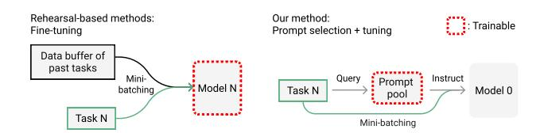
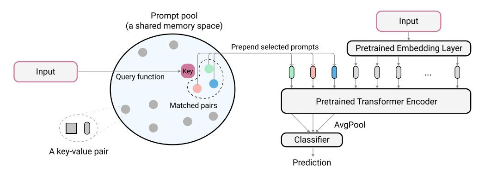
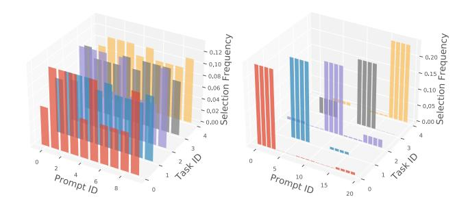
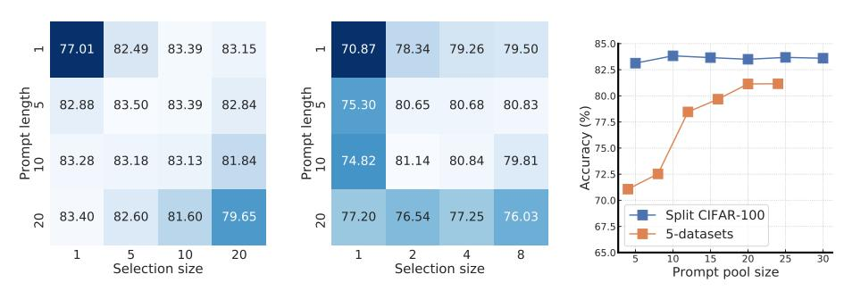

# **Learning to Prompt for Continual Learning**

<span id="page-0-1"></span>Zifeng Wang<sup>1\*</sup> Zizhao Zhang<sup>2</sup> Chen-Yu Lee<sup>2</sup> Han Zhang<sup>3</sup> Ruoxi Sun<sup>2</sup> Xiaoqi Ren<sup>2</sup> Guolong Su<sup>3</sup> Vincent Perot<sup>3</sup> Jennifer Dy<sup>1</sup> Tomas Pfister<sup>2</sup>

<sup>1</sup>Northeastern University <sup>2</sup>Google Cloud AI <sup>3</sup>Google Research

### **Abstract**

The mainstream paradigm behind continual learning has been to adapt the model parameters to non-stationary data distributions, where catastrophic forgetting is the central challenge. Typical methods rely on a rehearsal buffer or known task identity at test time to retrieve learned knowledge and address forgetting, while this work presents a new paradigm for continual learning that aims to train a more succinct memory system without accessing task identity at test time. Our method learns to dynamically prompt (L2P) a pre-trained model to learn tasks sequentially under different task transitions. In our proposed framework, prompts are small learnable parameters, which are maintained in a memory space. The objective is to optimize prompts to instruct the model prediction and explicitly manage task-invariant and task-specific knowledge while maintaining model plasticity. We conduct comprehensive experiments under popular image classification benchmarks with different challenging continual learning settings, where L2P consistently outperforms prior state-ofthe-art methods. Surprisingly, L2P achieves competitive results against rehearsal-based methods even without a rehearsal buffer and is directly applicable to challenging taskagnostic continual learning. Source code is available at https://github.com/google-research/12p.

### 1. Introduction

Contrary to ordinary supervised learning that trains on independent and identically distributed (i.i.d.) data, continual learning tackles the problem of training a single model on non-stationary data distributions where different classification tasks are presented sequentially. However, since the model only has access to the current data in an individual phase of the learning cycle, it is prone to overfit on the currently available data and suffers from performance deterioration on the previously trained data due to *catastrophic forgetting* [37].

<span id="page-0-0"></span>

Figure 1. Overview of the L2P framework. Compared with typical methods that adapt entire or partial model weights to tasks sequentially with a rehearsal buffer to avoid forgetting, L2P uses a single backbone model and learns a prompt pool to instruct the model conditionally. Task-specific knowledge is stored inside a prompt pool, thus a rehearsal buffer is no longer mandatory to mitigate forgetting. L2P automatically selects and updates prompts from the pool in an instance-wise fashion, thus task identity is not required at test time. Notably, our largest prompt space is smaller than the size of one  $224 \times 224$  image.

A major body of work in continual learning follows the learning paradigm by adapting the entire or partial model weights continually as the data distribution shifts, with a focus on preserving past knowledge [9,34]. Although many types of methods attain good results, there are still critical limitations that need to be addressed. First, motivated by the episodic memory in the hippocampus according to the Complementary Learning Systems (CLS) theory [23, 36], many state-of-the-art methods [3, 4, 8] rely on a rehearsal buffer to re-train a portion of past examples. However, they suffer from substantial performance deterioration with smaller buffer size [4] and become ineffective when a rehearsal buffer is not allowed – for example, in real-world scenarios where data privacy matters [54]. This suggests that simply buffering past data and re-train the model may not be the best approach to retrieve past knowledge. Without accessing a rehearsal buffer, another branch of works [19, 26, 45] bypass the forgetting issue by assuming known task identity at test time, so that they are able to attach task-independent modules to the shared model for inference. However, knowing task identity at test time restricts practical usage.

The limitations of prior work bring up critical questions in continual learning [13, 16]: (1) Whether the form of episodic memory can go beyond buffering past data to more

<sup>\*</sup>Work done during internship at Google Cloud AI Research.

<span id="page-1-0"></span>intelligent and succinct episodic memory system? (2) How to automatically select relevant knowledge component for arbitrary sample without knowing its task identity?

To answer the first question, we draw inspiration from recent advances in prompt-based learning (prompting) [\[29\]](#page-9-5), a new transfer learning technique in the field of natural language processing (NLP). Prompting techniques design model textual inputs with templated or learnable *prompt* tokens containing additional task-specific information, such that the pre-trained language model can process parameterized inputs in order to perform prompt-specific prediction [\[25,](#page-9-6) [27,](#page-9-7) [53\]](#page-10-1). Intuitively, prompt-based learning reformulates learning downstream tasks from directly adapting model weights to designing prompts that "instruct" the model to perform tasks conditionally. A prompt encodes task-specific knowledge and has the ability to utilize pretrained frozen models more effectively than ordinary finetuning [\[25,](#page-9-6) [47\]](#page-9-8). Thus, it is promising to leverage prompts to learn knowledge, and further store learned knowledge, in the continual learning context.

Nevertheless, it is not clear how to apply prompting to address the aforementioned second question in continual learning directly: On one hand, if we train different prompts for different tasks in the continual learning context, testtime task identity is still required for making predictions using an appropriate task-specific prompt. On the other hand, as a transfer learning technique, the target of prompting is to make frozen pre-trained models achieve good performance on down-streaming individually, not sequentially. Therefore, if we instead maintain a single shared prompt for all tasks, the problem of catastrophic forgetting may still exist (see Section [5.4\)](#page-7-0).

To this end, we propose a new continual learning method called Learning to Prompt for Continual Learning (L2P), which is orthogonal to popular rehearsal-based methods and applicable to practical continual learning scenarios without known task identity or boundaries. Figure [1](#page-0-0) gives an overview of our method in contrast to typical continual learning methods. L2P leverages the representative features from pre-trained models; however, instead of tuning the parameters during the continual learning process, L2P keeps the pre-trained model untouched, and instead learns a set of prompts that dynamically instruct models to solve corresponding tasks. Specifically, the prompts are structured in a key-value shared memory space called the prompt pool, and we design a query mechanism to dynamically lookup a subset of task-relevant prompts based on the instancewise input features. The prompt pool, which is optimized jointly with the supervised loss, ensures that shared prompts encode shared knowledge for knowledge transfer, and unshared prompts encode task-specific knowledge that help maintain model plasticity. Our design explicitly decouples shared and task-specific knowledge, thus largely reducing the interference between task-specific knowledge during optimization, leading to minimal catastrophic forgetting without the necessity of a rehearsal buffer. The instancewise query mechanism removes the necessity of knowing the task identity or boundaries, enabling the most challenging, yet under-investigated *task-agnostic* continual learning. The selected prompts are then prepended to the input embeddings (Figure [2\)](#page-3-0), which implicitly add task-relevant instruction to pre-trained models, so that the model recalls the most relevant features to conduct corresponding tasks. In summary, this work makes the following contributions:

- 1. We propose L2P, a novel continual learning framework based on prompts for continual learning, providing a new mechanism to tackle continual learning challenges through learning a prompt pool memory space, which are served as parameterized "instructions" for pre-trained models to learn tasks sequentially. The method is applicable to handle the most challenging task-agnostic continual learning.
- 2. We conduct comprehensive experiments to demonstrate the effectiveness of L2P on multiple continual learning benchmarks, including class- and domainincremental, and task-agnostic settings. The proposed L2P outperforms previous state-of-the-art methods consistently on all benchmarks. Surprisingly, even when a rehearsal buffer is *not* used, L2P still achieves competitive results against rehearsal-based methods, which is ideal in real-world scenarios when rehearsal buffer is prohibited.
- 3. To the best of our knowledge, we are the first to introduce the idea of prompting in the field of continual learning. We expect that our method provides a different perspective for solving frontier challenges in continual learning.

## 2. Related Work

Here we draw connections and discuss differences between our method to related works.

Continual learning. There are three main categories of recent continual learning algorithms. *Regularization-based* methods [\[1,](#page-8-8) [21,](#page-8-9) [28,](#page-9-9) [65\]](#page-10-2) limit the plasticity of the model by limiting the learning rate on important parameters for previous tasks. Although these methods address catastrophic forgetting to some extent without storing past examples, they cannot get satisfactory performance under challenging settings [\[34\]](#page-9-1) or complex datasets [\[49,](#page-9-10) [61\]](#page-10-3).

*Rehearsal-based* methods [\[7,](#page-8-10) [8,](#page-8-4) [17\]](#page-8-11) construct a data buffer to save samples from older tasks to train with data from the current task. Based on this simple yet effective idea, many recent methods improve upon it by involving additional knowledge distillation penalties [\[3,](#page-8-2)[6,](#page-8-12)[49,](#page-9-10)[61\]](#page-10-3), <span id="page-2-1"></span>or leveraging self-supervised learning techniques [4, 44]. Albeit its simplicity in concept, rehearsal-based methods achieve state-of-the-art performance on various benchmarks [34, 42]. However, the performance of rehearsal-based methods generally deteriorates with smaller buffer size [4], and rehearsal-based methods are eventually not applicable to scenarios where data privacy should be taken into account [54]. Different from directly saving data from past knowledge to re-train the model, our method stores past knowledge in small learnable prompt parameters to instruct the model to deal with current task, and in turn accumulate current knowledge to the prompts. Our method does not need a rehearsal buffer to achieve performance close to rehearsal-based methods, and could be further improved to set a new stat of the art given a small rehearsal buffer.

Architecture-based methods aim at having separate components for each task. The task-specific components can be identified by expanding the network [26, 31, 48, 50, 64, 68], or attend to task-specific sub-networks [19,35,51,59]. However, most methods, which require task identity to condition the network at test-time, are not applicable to more realistic class-incremental and task-agnostic settings when task identity is unknown. Some recent methods either infer task identity directly [60], or additionally add rehearsal buffer to bypass the problem [44, 63]. Nevertheless, these methods require substantial amount of additional parameters, sometimes close to the size of the full model [19,59]. On the contrary, L2P does not require test-time task identity and only adds negligible amount of additional parameters ( $\sim 0.1\%$ ). Although L2P also introduces additional prompt parameters, it has a totally different design principle from architecture based methods: L2P designs a novel prompt-based memory to learn high-level *instructions* from model inputs to steer model outputs and keeps the learned architecture fixed. In contrast, most architecture-based methods aim to separate model parameters.

Lastly, recent work of CTN [45] and DualNet [44] start to consider knowledge management via a controller that models task-level information in addition to a backbone model. However, CTN still requires task identity at test time, while DualNet needs a rehearsal buffer to work. Moreover, CTN and DualNet are inspired from a different perspective of CLS, which suggests human beings achieve continual learning through two systems that facilitate fast learning and long-term remembering respectively. Interestingly, though we get our inspiration differently, L2P could be interpreted through CLS theory exactly: The prompt pool deals with fast learning, and the backbone model serves as long-term memory.

**Prompting for transfer learning.** The high-level idea of prompting is to apply a function to modify the input text, so that the language model gets additional information about the task. However, the design of a prompting function

is challenging and requires heuristics. Recent work, including prompt tuning [25] and prefix tuning [27], seek to address this problem by applying learnable prompts in a continuous space, achieving excellent performance on transfer learning. Prompts capture task-specific knowledge with much smaller additional parameters, than its competitors, such as Adapter [43, 58] and LoRA [18]. The central idea of prompting is mainly designed for transfer learning. Note that it is non-trivial to directly apply prompting in continual learning. Our proposed novel framework reveals its values to continual learning problems.

### 3. Prerequisites

#### 3.1. Continual learning protocols

Continual learning is usually defined as training machine learning models on non-stationary data from sequential tasks. We define a sequence of tasks  $\mathcal{D} = \{\mathcal{D}_1, \cdots, \mathcal{D}_T\}$ , where the t-th task  $\mathcal{D}_t = \{(\boldsymbol{x}_i^t, y_i^t)\}_{i=1}^{n_t}$  contains tuples of the input sample  $\boldsymbol{x}_i^t \in \mathcal{X}$  and its corresponding label  $y_i^t \in \mathcal{Y}$ . The goal is to train a single model  $f_\theta: \mathcal{X} \to \mathcal{Y}$  parameterized by  $\theta$ , such that it predicts the label  $y = f_\theta(\boldsymbol{x}) \in \mathcal{Y}$  given an unseen test sample  $\boldsymbol{x}$  from arbitrary tasks. Data from the previous tasks may not be seen anymore when training future tasks.

Depending on the task transition environment, continual learning can be categorized into multiple settings with slightly different challenges. The common task-, class-, and domain-incremental setting assume task data  $\mathcal{D}_t$  arrives in sequence  $t = \{1, ..., T\}$  in a discrete manner. Different from class-incremental, task-incremental learning assumes task identity is known at test time and are often regarded as the simplest setting [34, 38]. Different from taskand class-incremental settings where each task has different classes, domain-incremental learning maintains the same set of classes for every task and only changes the distribution of x by task. In the more challenging task-agnostic setting, task data in  $\mathcal{D}$  changes smoothly, and the task identity t is unknown. Our paper tackles the more challenging class-incremental and domain-incremental, and further explores the task-agnostic settings.

#### <span id="page-2-0"></span>3.2. Prompt-based learning and baselines

Prompt-based learning is an emerging technique in NLP. In contrast to traditional supervised fine-tuning, this type of methods design task-specific prompt functions to instruct pre-trained models perform corresponding tasks conditionally [29]. One of recent techniques, Prompt Tuning (PT) [25], proposes to simply condition frozen T5-like language models [47] to perform down-stream NLP tasks by learning prompt parameters that are prepended to the input tokens to instruct the model prediction. Without loss of generality, here we introduce the definition of PT using the im-

<span id="page-3-2"></span><span id="page-3-0"></span>

Figure 2. Illustration of L2P at test time. We follow the same procedure at training time: First, L2P selects a subset of prompts from a key-value paired *prompt pool* based on our proposed instance-wise query mechanism. Then, L2P prepends the selected prompts to the input tokens. Finally, L2P feeds the extended tokens to the model, and optimize the prompt pool through the loss defined in equation [5.](#page-4-0) The objective is learning to select and update prompts to instruct the prediction of the pre-trained backbone model.

age modality transformer-based sequence models [\[10,](#page-8-14) [56\]](#page-10-12). The definition is easy to generalize to other modalities and sequence-based models.

Given an input of 2D image x ∈ R <sup>H</sup>×W×<sup>C</sup> and a pretrained vision transformer (ViT) f = f<sup>r</sup> ◦ f<sup>e</sup> (excluding the classification head), where f<sup>e</sup> is the input embedding layer, and f<sup>r</sup> represents a stack of self-attention layers [\[10\]](#page-8-14). Images are reshaped to a sequence of flattened 2D patches x<sup>p</sup> ∈ R L×(S ·C) , where L is the token length, *i.e.*, the number of patches, S is the patch size and C is the original number of channels. To simplify notation, we assume the first token in x<sup>p</sup> is the [class] token as part of the pre-trained model [\[10\]](#page-8-14). The pre-trained embedding layer f<sup>e</sup> : R L×(S ·C) → R <sup>L</sup>×<sup>D</sup> projects the patched image to the embedding feature x<sup>e</sup> = f<sup>e</sup> (x) ∈ R <sup>L</sup>×<sup>D</sup>, where D is the embedding dimension. When solving multiple downstreaming tasks, we keep the large-scale pre-trained backbone frozen to maintain its generality following PT. The direct application of PT is to prepend learnable parameters P<sup>e</sup> ∈ R <sup>L</sup>p×<sup>D</sup>, called a prompt, to the embedding feature x<sup>p</sup> = [Pe; xe], and feed the extended sequences to the model function fr(xp) for performing classification tasks. Different tasks have independent prompts and share one copy of the large model.

Compared with ordinary fine-tuning, literature shows that prompt-based learning results in a sequence-based model having higher capacity to learn features [\[25,](#page-9-6)[29\]](#page-9-5). Despite its successes in transfer learning to train individual prompts for each task, prompting can not be directly applied to continual learning scenarios where test-time task identity is unknown.

## 4. Learning to Prompt (L2P)

### 4.1. From prompt to prompt pool

The motivations of introducing prompt pool are threefold. First, the task identity at test time is unknown so training task-independent prompts is not feasible. Second, even if the task-independent prompt can be known at test time, it prevents possible knowledge sharing between similar tasks [\[16\]](#page-8-7). Third, while the naive way of learning a single shared prompt for all tasks enables knowledge sharing, it still causes severe forgetting issue (see Section [5.4\)](#page-7-0). Ideally one would learn a model that is able to share knowledge when tasks are similar, while maintaining knowledge independent otherwise. Thus, we propose using a *prompt pool* to store encoded knowledge, which can be flexibly grouped as an input to the model. The prompt pool is defined as

$$\mathbf{P} = \{P_1, P_2, \cdots, P_M\}, \quad M = \text{total } \# \text{ of prompts}, \quad (1)$$

where P<sup>j</sup> ∈ R <sup>L</sup>p×<sup>D</sup> is a single prompt with token length L<sup>p</sup> and the same embedding size D as xe. Following the notations in Section [3.2,](#page-2-0) we let x and x<sup>e</sup> = fe(x) be the input and its corresponding embedding feature, respectively. Note that we omit the task index t of x in our notation as our method is general enough to the task-agnostic setting. Denoting {si} N <sup>i</sup>=1 as a subset of N indices from [1, M], we can then adapt the input embedding as follows:

$$x_p = [P_{s_1}; \dots; P_{s_N}; x_e], \quad 1 \le N \le M,$$
 (2)

where ; represents concatenation along the token length dimension. Prompts are free to compose, so they can jointly encode knowledge (e.g. visual features or task information) for the model to process. Ideally, we want to achieve a more fine-grained knowledge sharing scheme via prompt combinations at the instance-wise level: similar inputs tend to share more common prompts, and vice versa.

## <span id="page-3-1"></span>4.2. Instance-wise prompt query

We design a key-value pair based query strategy to dynamically select suitable prompts for different inputs (see Figure [2\)](#page-3-0). This key-valued memory query mechanism shares some design principles with methods in other fields, <span id="page-4-3"></span>such as Differentiable Neural Computer [14] and VQ-VAE [41], which have external memory to maintain, and employ them for a different purpose.

We associate each prompt as value to a learnable key:  $\{(k_1,P_1),(k_2,P_2),\cdots,(k_M,P_M)\}$ , where  $k_i\in\mathbb{R}^{D_k}$ . And we denote the set of all keys by  $\mathbf{K}=\{k_i\}_{i=1}^M$ . Ideally, we would like to let the input instance itself decide which prompts to choose through query-key matching. To this end, we introduce a query function  $q:\mathbb{R}^{H\times W\times C}\to\mathbb{R}^{D_k}$  that encodes input x to the same dimension as the key. Moreover, q should be a deterministic function with respect to different tasks and has no learnable parameters. We directly use the whole pre-trained model as a frozen feature extractor to get the query features: q(x) = f(x)[0,:] (we use the feature vector corresponding to [class]). Other feature extractors like ConvNet are feasible as well.

Denote  $\gamma: \mathbb{R}^{D_k} \times \mathbb{R}^{D_k} \to \mathbb{R}$  as a function to score the match between the query and prompt key (we find cosine distance works well). Given an input x, we use q(x) to lookup the top-N keys by simply solving the objective:

<span id="page-4-1"></span>
$$\mathbf{K}_{\boldsymbol{x}} = \underset{\{s_i\}_{i=1}^{N} \subseteq [1,M]}{\operatorname{argmin}} \quad \sum_{i=1}^{N} \gamma\left(q(\boldsymbol{x}), \boldsymbol{k}_{s_i}\right), \tag{3}$$

where  $K_x$  represents the a subset of top-N keys selected specifically for x from K. Note that the design of this key-value strategy decouples the query mechanism learning and prompt learning processes, which has been experimentally shown to be critical (see Section 5.4). Furthermore, querying prompts is done in an instance-wise fashion, which makes the whole framework task-agnostic, meaning that the method works without needing clear task boundaries during training, nor task identity at test time.

Optionally diversifying prompt-selection. Although our method does not need task boundary information, in real-world scenarios and experimental datasets, it is quite common that the task transition is discrete and so task boundaries are known at train time. We find that adding such a prior into our framework can help the model learn better task-specific prompts, especially when tasks have high diversity. To this end, we propose a simple extension to add task boundary prior, which is optional for L2P.

During training of task t, we maintain a prompt frequency table  $H_t = [h_1, h_2, \cdots, h_M]$ , where each entry represents the normalized frequency of prompt  $P_i$  being selected up until task t-1. To encourage the query mechanism to select diverse prompts, we modify equation 3 to

<span id="page-4-2"></span>
$$\mathbf{K}_{\boldsymbol{x}} = \underset{\{s_i\}_{i=1}^{N} \subseteq [1,M]}{\operatorname{argmin}} \quad \sum_{i=1}^{N} \gamma\left(q(\boldsymbol{x}), \boldsymbol{k}_{s_i}\right) \cdot h_{s_i}, \quad (4)$$

where  $h_{s_i}$  penalizes the frequently-used prompts being selected to encourage diversified selection. Equation 4 is only applicable during training; at test time, equation 3 is used.

#### 4.3. Optimization objective for L2P

At every training step, after selecting N prompts following the aforementioned query strategy, the adapted embedding feature  $x_p$  is fed into the rest of the pre-trained model  $f_r$  and the final classifier  $g_{\phi}$  parametrized by  $\phi$ . Overall, we seek to minimize the end-to-end training loss function:

<span id="page-4-0"></span>
$$\min_{\mathbf{P}, \mathbf{K}, \phi} \quad \mathcal{L}(g_{\phi}(f_r^{\text{avg}}(\boldsymbol{x}_p)), y) + \lambda \sum_{\mathbf{K}_{\boldsymbol{x}}} \gamma \left(q(\boldsymbol{x}), \boldsymbol{k}_{s_i}\right),$$
s.t.,  $\mathbf{K}_{\boldsymbol{x}}$  is obtained with equation 3,

where  $f_r^{\mathrm{avg}} = \operatorname{AvgPool}(f_r(\boldsymbol{x}_p)[0:NL_p,:])$ , i.e., the output hidden vectors corresponding to the  $N \cdot L_p$  prompt locations are averaged before the classification head. The first term is the softmax cross-entropy loss, the second term is a surrogate loss to pull selected keys closer to corresponding query features.  $\lambda$  is a scalar to weight the loss.

## 5. Experiments

To evaluate the proposed L2P, we closely follow the settings proposed in prior works [32,55,66], and conduct comprehensive experiments. In particular, we mainly consider (1) the class-incremental setting, where the task identity is unknown during inference; (2) the domain-incremental setting, where the input domain shifts over time; (3) the task-agnostic setting, where there is no clear task boundary. We carefully compare L2P with state-of-the-art (SOTA) methods of different categories under proper experiment settings. Moreover, we conduct extensive ablation studies to provide a deeper understanding of our method.

### 5.1. Comparing methods

We compare L2P against several baselines and state-ofthe-art (SOTA) continual learning methods. Our method is based on a pre-trained ViT-B/16 [11,67], which has become a common asset in advanced vision communities. We carefully choose compared methods in the same environment for fair comparison. Many recent methods claimed SOTA performance in the simplest task-incremental setting, where task identity is known at test time [19, 45, 57]. We do not include these methods, since they are not applicable to more general class-incremental setting. We refer to multiple recent reviews papers [9, 34] and recent work [3, 4, 46] and select the most well-recognized and best-performing methods. For completeness, we also include naive sequential training approaches and representative regularization-based methods. Moreover, we refer to the original codebases for implementation and hyperparameter selection to ensure the best possible performance.

**Baseline methods.** *Upper-bound* is the usual supervised finetuning on the i.i.d. data of all tasks, which is the usually regarded as the upper bound performance a method can

<span id="page-5-3"></span><span id="page-5-0"></span>Table 1. Results on class-incremental learning (i.e., task identity is unknown at test time). Compared methods are grouped based on different rehearsal buffer sizes. 0 means no rehearsal is required, where most SOTA methods are not applicable anymore. Importantly, L2P can attain competitive results without it and greatly outperform them with a small buffer size.

| Method        | Buffer size | Split CIFAR-100  |                                       | Buffer size | 5-datasets       |                                   |
|---------------|-------------|------------------|---------------------------------------|-------------|------------------|-----------------------------------|
|               |             | Average Acc (†)  | Forgetting $(\downarrow)$             | Buller size | Average Acc (†)  | Forgetting $(\downarrow)$         |
| FT-seq-frozen |             | 17.72±0.34       | $59.09 \pm 0.25$                      | 0           | 39.49±0.12       | $42.62 \pm 0.20$                  |
| FT-seq        |             | 33.61±0.85       | $86.87 \pm 0.20$                      |             | $20.12\pm0.42$   | $94.63 \pm 0.68$                  |
| EWC [21]      | 0           | $47.01\pm0.29$   | $33.27 \pm 1.17$                      |             | 50.93±0.09       | $34.94 \pm 0.07$                  |
| LwF [28]      |             | $60.69 \pm 0.63$ | $27.77 \pm 2.17$                      |             | $47.91 \pm 0.33$ | $38.01 \pm 0.28$                  |
| L2P (ours)    |             | 83.83±0.04       | $7.63{\pm0.30}$                       |             | 81.14 $\pm$ 0.93 | $\textbf{4.64} \pm \textbf{0.52}$ |
| ER [8]        | 10/class    | 67.87±0.57       | 33.33±1.28                            | 5/class     | 80.32±0.55       | $15.69 \pm 0.89$                  |
| GDumb [46]    |             | $67.14 \pm 0.37$ | -                                     |             | $56.99 \pm 0.06$ | -                                 |
| BiC [61]      |             | 66.11±1.76       | $35.24 \pm 1.64$                      |             | $78.74 \pm 1.41$ | $21.15 \pm 1.00$                  |
| DER++ [3]     |             | $61.06 \pm 0.87$ | $39.87 \pm 0.99$                      |             | $80.81 \pm 0.07$ | $14.38 \pm 0.35$                  |
| $Co^2L$ [4]   |             | $72.15\pm1.32$   | $28.55{\pm}1.56$                      |             | 82.25±1.17       | $17.52 \pm 1.35$                  |
| L2P-R (ours)  |             | 84.21±0.53       | $\textbf{7.72} \!\pm\! \textbf{0.77}$ |             | 85.56±0.95       | $4.22{\pm0.03}$                   |
| ER [8]        | 50/class    | 82.53±0.17       | 16.46±0.25                            | 10/class    | 84.26±0.84       | 12.85±0.62                        |
| GDumb [46]    |             | 81.67±0.02       | -                                     |             | $70.76 \pm 0.12$ | -                                 |
| BiC [61]      |             | 81.42±0.85       | $17.31 \pm 1.02$                      |             | 85.53±2.06       | $10.27 \pm 1.32$                  |
| DER++ [3]     |             | 83.94±0.34       | $14.55 \pm 0.73$                      |             | 84.88±0.57       | $10.46 \pm 1.02$                  |
| $Co^2L$ [4]   |             | $82.49 \pm 0.89$ | $17.48 \pm 1.80$                      |             | $86.05\pm1.03$   | $12.28 \pm 1.44$                  |
| L2P-R (ours)  |             | 86.31±0.59       | $5.83 {\pm} 0.61$                     |             | 88.95±0.78       | $\textbf{4.92} \!\pm\! 0.71$      |
| Upper-bound   | -           | 90.85±0.12       | -                                     | -           | 93.93±0.18       | -                                 |

<span id="page-5-1"></span>Table 2. Class-incremental results on Split CIFAR-100 against architecture-based methods. Diff = Upper-Bound Acc - Method Acc (lower is better) measures how close the performance to the upper-bound of the used backbone.

| Method                                     | Backbone | Avg. Acc (†)                      | Diff (↓)       |
|--------------------------------------------|----------|-----------------------------------|----------------|
| Upper-bound<br>SupSup [60]<br>DualNet [44] | ResNet18 | 80.41<br>28.34±2.45<br>40.14±1.64 | 52.07<br>40.27 |
| Upper-bound L2P (ours)                     | ViT-B/16 | 90.85<br>83.83±0.04               | 7.02           |

achieve. FT-seq-frozen is the naive sequential fine-tuning approach with the pre-trained model frozen. FT-seq instead fine-tunes pre-trained model weights as well. EWC [21] and LwF [28] are representative regularization-based approaches that are widely compared.

**SOTA rehearsal-based methods.** We select 5 advanced rehearsal-based methods to compare, including ER [8, 17], GDumb [46], BiC [61], DER++ [3] and  $Co^2L$  [4]. ER and GDumb are simple in concept, but they have achieved very strong performance not only in their own work, but in later literature [3, 34] as well. DER++ and Co<sup>2</sup>L are the latest SOTA methods.

**SOTA** architeture-based methods. We select two representative architecture-based methods to compare. Sup-Sup [60] and DualNet [44] are both based on ResNet18,

<span id="page-5-2"></span>Table 3. Results on domain-incremental learning using CORe50 dataset, in terms of test accuracy.

| Method                | Buffer size | Test Acc (↑)     |
|-----------------------|-------------|------------------|
| EWC [21]              |             | 74.82±0.60       |
| LwF [28]              | 0           | $75.45\pm0.40$   |
| L2P (ours)            |             | 78.33±0.06       |
| ER [8]                |             | 80.10±0.56       |
| GDumb [46]            | 50/class    | $74.92 \pm 0.25$ |
| BiC [61]              |             | $79.28 \pm 0.30$ |
| DER++ [3]             |             | $79.70\pm0.44$   |
| Co <sup>2</sup> L [4] |             | $79.75 \pm 0.84$ |
| L2P-R (ours)          |             | 81.07±0.13       |
| Upper-bound           | -           | 82.15±0.37       |
|                       |             |                  |

recommended by their original authors. We compare the relative performance to the corresponding upper-bound performance for fairness.

**Our methods.** L2P is our proposed method without rehearsal buffer. L2P-R is L2P equipped with a rehearsal buffer for a fair comparison with SOTA methods.

#### 5.2. Datasets and experimental details

**Datasets.** We use Split CIFAR-100 [22] and 5-datasets [12] for class-incremental setting, CORe50 [30] for domain-incremental setting, and Gaussian scheduled CIFAR-100 [52] for task-agnostic setting, to evaluate the effectiveness of our method. Details of the datasets are in-

<span id="page-6-3"></span><span id="page-6-0"></span>Table 4. Results on task-agnostic continual learning using the Gaussian scheduled CIFAR-100 dataset, in terms of test accuracy.

| Method                                   | Buffer size | Test Acc (↑)                                                 |
|------------------------------------------|-------------|--------------------------------------------------------------|
| EWC [21]<br>L2P (ours)                   | 0           | 63.04±0.42<br>88.34±0.14                                     |
| ER [8] GDumb [46] DER++ [3] L2P-R (ours) | 50/class    | 82.63±0.27<br>81.67±0.02<br>85.24±0.71<br><b>88.92</b> ±0.39 |
| Upper-bound                              | -           | 90.85±0.12                                                   |

<span id="page-6-1"></span>Table 5. Ablation studies. See text for detailed explanations.

| Ablated components        | 5-datasets      |                           |  |
|---------------------------|-----------------|---------------------------|--|
| Ablated components        | Average Acc (†) | Forgetting $(\downarrow)$ |  |
| w/o prompt pool           | 51.96           | 26.60                     |  |
| w/o key-value pair        | 58.33           | 20.45                     |  |
| w/o diversified selection | 62.26           | 17.84                     |  |
| none                      | 81.14           | 4.64                      |  |

troduced in Appendix C.

**Evaluation metrics.** For settings with task boundaries and where each task has an associated test set, we use two metrics, *Average accuracy* (higher is better) and *Forgetting* (lower is better), which are widely used in previous works [7, 32, 34]. For settings without task boundary or where there is only a single test set available, we report the final test accuracy following the common protocol [30, 52].

**Training details.** For L2P, we train all models using Adam [20] with  $\beta_1 = 0.9$  and  $\beta_2 = 0.999$ , a batch size of 128, and a constant learning rate of 0.03 for all settings. Input images are resized to  $224 \times 224$  and normalized to the range of [0,1] to match the pretraining setting. As pointed out by [3], training multiple epochs for each task disentangles the effects of possible underfitting from forgetting. Thus, we train every task for 5 epochs in the class- and domain-incremental settings. However, in the task-agnostic setting where we don't have the concept of a task, we follow [52] to train every batch only once. We set  $M = 10, N = 5, L_p = 5$  for all CIFAR-100 based datasets and CORe50. For 5-datasets, we use  $M = 20, N = 4, L_p = 5$ . Prompts only add 46,080 and 92, 160 parameters to the original pre-trained model for these two settings, leading to a small 0.05% and 0.11% total parameter increase, respectively. We apply the optional prompt selection strategy introduced in 4.2 to this dataset. We find  $\lambda$  in equation 5 is not sensitive and works well in a large range, so we set  $\lambda = 0.5$  consistently for all datasets. Main experimental results are averaged over 3 runs, and corresponding standard deviation is reported as well.

<span id="page-6-2"></span>

Figure 3. Prompt selection histograms for (left) Split CIFAR-100 and (right) 5-datasets. CIFAR-100 has higher intra-task similarity compared to 5-datasets, thus largely sharing prompts between tasks results in good performance, while 5-datasets favors more task-specific prompts. We only show the first 5 tasks for Split CIFAR-100 for better readability.

#### 5.3. Main results

Results on class-incremental learning. Table 1 summarizes the results on these two class-incremental benchmarks. L2P outperforms all comparing methods consistently under different configurations, in terms of both average accuracy and forgetting. We observe that when the buffer size is relatively large, L2P not only outperforms all other methods, but also closes a significant part of the gap to the upper bound performance under the i.i.d. setting. When the buffer size gets smaller, L2P outperforms others by a even larger margin. Finally, when there is no buffer, rehearsal-based methods are no longer capable, while L2P still remains superior performance by beating regularization-based methods, and outperforms almost all rehearsal-based methods when buffer is small.

Table 2 shows the comparison between L2P and architecture-based methods on Split CIFAR-100. Instead of absolute performance in average accuracy, we use difference to upper-bound (Diff) to measure the performance of each method given a specific architecture. We observe that L2P outperforms both methods with (DualNet) or without (SupSup) rehearsal buffer, by a large margin.

The outstanding performance of L2P over all competing methods indicates that our proposed prompt pool successfully accumulates knowledge from experiences, thus it can overall improve the learning performance while mitigating catastrophic forgetting even without a rehearsal buffer.

Results on domain-incremental learning. Table 3 summarizes the results on the domain-incremental setting. L2P remains the best performance compared with other methods. Interestingly, all rehearsal-based comparing methods perform quite closely (except GDumb). The observation of relatively modest performance gap between baseline methods and the upper-bound result has also been reported in [30], thus there is indeed a significant performance gap between our method and others.

<span id="page-7-2"></span><span id="page-7-1"></span>

Figure 4. Left-Middle: Average accuracy w.r.t prompt length  $L_p$  and prompt selection size N for Split CIFAR-100 and 5-datasets, respectively, given M=20. Right: Average accuracy (%) w.r.t. prompt pool size M, given  $L_p=5$ , N=5 for Split CIFAR-100 and  $L_p=5$ , N=4 for 5-datasets.

**Results on task-agnostic learning.** Although taskagnostic setting is usually considered more challenging [52], the topic is under-investigated. We conduct more exploratory studies on task-agnostic settings. Table 4 summarizes the results on the challenging task-agnostic learning setting. We do not compare with LwF, BiC and Co<sup>2</sup>L since they require task boundary to save model snapshots and calculate distillation loss. It is beyond our scope to extend them to this setting. We also use the online version of EWC proposed by [5] for the task agnostic setting. Since all compared methods are based on pre-trained models, the absolute numbers are not too far away from Upper-bound. As can been seen, rehearsal-based methods have clear advantages. Nevertheless, L2P still achieves the best performance even when buffer size is zero, among all methods, including ones have a rehearsal buffer. We believe that the smoother transition of tasks implicitly help L2P consolidate knowledge into prompts. Since we have better prompts, the benefit of a rehearsal buffer is naturally weakened.

### <span id="page-7-0"></span>5.4. Effectiveness of core designs

Effect of prompt related components for L2P. Table 5 (row 1) removes the prompt pool design and uses a single prompt to train sequentially. The performance has a significant drop, suggesting that a single prompt suffers severe catastrophic forgetting and knowledge interference between tasks, while our design of prompt pool encodes taskinvariant and task-specific knowledge well. Table 5 (row 2) removes the learnable key associated with prompts and directly uses mean of prompts as keys. As results show, learnable keys play an important role to decouple the query and prompt learning processes. Table 5 (row 3) removes the diversified prompt selection (only used in 5-dataset experiments). Basically, removing it allows instances from different tasks to choose prompts freely. The decrease in performance suggests that, when tasks are diverse, adding this strategy indeed reduces unnecessary knowledge sharing and thus mitigating interference between unrelated tasks.

To better understand the prompt selection mechanism, we plot the prompt selection histograms for each task in both Split CIFAR-100 and 5-datasets in Figure 3 under the best-performing parameters settings, respectively. From the plot of Split CIFAR-100 (left), the tasks largely share all prompts, meaning that our prompt selection mechanism encourages more knowledge sharing between similar tasks. In contrast, in the plot of 5-datasets (right), diverse tasks require more task-specific prompts and share less.

Effect of hyperparameters for L2P. Recall that there are three key hyperparameters, including the size of the prompt pool M, length of a single prompt  $L_p$ , and the selection size N used as model input. Intuitively, M decides the total capacity of learnable prompts.  $L_p$  decides capacity of a singe prompt (which jointly encodes certain knowledge), and  $L_n \times N$  decides the total size used to prepend the input. From the results on both datasets (Figure 4 (leftmiddle)), a too small  $L_p$  always negatively affects results, while an oversized prompt may introduce knowledge underfitting. We hypothesize that a reasonable capacity of a single prompt is critical to encode a certain aspect of shared knowledge. Increasing the prompt pool size shows positive effect on performance as shown in Figure 4 (right) on 5-datasets while not as effective on Split CIFAR-100, suggesting a large enough pool size is needed to encode taskspecific knowledge when tasks are diverse.

#### 6. Conclusion

This paper presents a novel method to address some of the key challenges in continual learning with a method that can achieve strong performance without a need for rehearsal and task identity. L2P introduces prompt-based learning to continual learning and proposes a novel technique to enable a single pre-trained model to adapt to sequential tasks via a shared prompt pool, successfully mitigating the catastrophic forgetting problem. The resulting method significantly outperforms previous SOTA on several continual learning problems, including class-incremental and domain-incremental. We show our method is general enough to handle even more challenging task-agnostic settings where previous methods are incapable of.

# Acknowledgments

We would like to thank Chun-Liang Li, Jeremy Martin Kubica, Sayna Ebrahimi, Stratis Ioannidis, Nan Hua, and Emmanouil Koukoumidis, for their valuable discussions.

## References

- <span id="page-8-8"></span>[1] Rahaf Aljundi, Francesca Babiloni, Mohamed Elhoseiny, Marcus Rohrbach, and Tinne Tuytelaars. Memory aware synapses: Learning what (not) to forget. In *ECCV*, 2018. [2](#page-1-0)
- <span id="page-8-22"></span>[2] Yaroslav Bulatov. notmnist dataset, 2011. [12](#page-11-1)
- <span id="page-8-2"></span>[3] Pietro Buzzega, Matteo Boschini, Angelo Porrello, Davide Abati, and Simone Calderara. Dark experience for general continual learning: a strong, simple baseline. In *NeurIPS*, 2020. [1,](#page-0-1) [2,](#page-1-0) [5,](#page-4-3) [6,](#page-5-3) [7](#page-6-3)
- <span id="page-8-3"></span>[4] Hyuntak Cha, Jaeho Lee, and Jinwoo Shin. Co2l: Contrastive continual learning. In *ICCV*, 2021. [1,](#page-0-1) [3,](#page-2-1) [5,](#page-4-3) [6](#page-5-3)
- <span id="page-8-20"></span>[5] Arslan Chaudhry, Puneet K Dokania, Thalaiyasingam Ajanthan, and Philip HS Torr. Riemannian walk for incremental learning: Understanding forgetting and intransigence. In *ECCV*, pages 532–547, 2018. [8](#page-7-2)
- <span id="page-8-12"></span>[6] Arslan Chaudhry, Albert Gordo, Puneet Kumar Dokania, Philip Torr, and David Lopez-Paz. Using hindsight to anchor past knowledge in continual learning. *arXiv preprint arXiv:2002.08165*, 2(7), 2020. [2](#page-1-0)
- <span id="page-8-10"></span>[7] Arslan Chaudhry, Marc'Aurelio Ranzato, Marcus Rohrbach, and Mohamed Elhoseiny. Efficient lifelong learning with a-gem. *arXiv preprint arXiv:1812.00420*, 2018. [2,](#page-1-0) [7](#page-6-3)
- <span id="page-8-4"></span>[8] Arslan Chaudhry, Marcus Rohrbach, Mohamed Elhoseiny, Thalaiyasingam Ajanthan, Puneet K Dokania, Philip HS Torr, and Marc'Aurelio Ranzato. On tiny episodic memories in continual learning. *arXiv preprint arXiv:1902.10486*, 2019. [1,](#page-0-1) [2,](#page-1-0) [6,](#page-5-3) [7](#page-6-3)
- <span id="page-8-0"></span>[9] Matthias Delange, Rahaf Aljundi, Marc Masana, Sarah Parisot, Xu Jia, Ales Leonardis, Greg Slabaugh, and Tinne Tuytelaars. A continual learning survey: Defying forgetting in classification tasks. *TPAMI*, 2021. [5](#page-4-3)
- <span id="page-8-14"></span>[10] Alexey Dosovitskiy, Lucas Beyer, Alexander Kolesnikov, Dirk Weissenborn, Xiaohua Zhai, Thomas Unterthiner, Mostafa Dehghani, Matthias Minderer, Georg Heigold, Sylvain Gelly, et al. An image is worth 16x16 words: Transformers for image recognition at scale. *ICLR*, 2021. [4](#page-3-2)
- <span id="page-8-16"></span>[11] Alexey Dosovitskiy, Lucas Beyer, Alexander Kolesnikov, Dirk Weissenborn, Xiaohua Zhai, Thomas Unterthiner, Mostafa Dehghani, Matthias Minderer, Georg Heigold, Sylvain Gelly, Jakob

- Uszkoreit, and Neil Houlsby. An image is worth 16x16 words: Transformers for image recognition at scale. In *ICLR*. OpenReview.net, 2021. [5](#page-4-3)
- <span id="page-8-18"></span>[12] Sayna Ebrahimi, Franziska Meier, Roberto Calandra, Trevor Darrell, and Marcus Rohrbach. Adversarial continual learning. In *ECCV*, 2020. [6,](#page-5-3) [12](#page-11-1)
- <span id="page-8-6"></span>[13] Sebastian Farquhar and Yarin Gal. Towards robust evaluations of continual learning. *arXiv preprint arXiv:1805.09733*, 2018. [1](#page-0-1)
- <span id="page-8-15"></span>[14] Alex Graves, Greg Wayne, Malcolm Reynolds, Tim Harley, Ivo Danihelka, Agnieszka Grabska-Barwinska, Sergio G ´ omez Colmenarejo, Edward ´ Grefenstette, Tiago Ramalho, John Agapiou, et al. Hybrid computing using a neural network with dynamic external memory. *Nature*, 538(7626):471–476, 2016. [5](#page-4-3)
- <span id="page-8-21"></span>[15] Sorin Grigorescu, Bogdan Trasnea, Tiberiu Cocias, and Gigel Macesanu. A survey of deep learning techniques for autonomous driving. *Journal of Field Robotics*, 37(3):362–386, 2020. [12](#page-11-1)
- <span id="page-8-7"></span>[16] Raia Hadsell, Dushyant Rao, Andrei A Rusu, and Razvan Pascanu. Embracing change: Continual learning in deep neural networks. *Trends in cognitive sciences*, 2020. [1,](#page-0-1) [4](#page-3-2)
- <span id="page-8-11"></span>[17] Tyler L Hayes, Nathan D Cahill, and Christopher Kanan. Memory efficient experience replay for streaming learning. In *ICRA*, 2019. [2,](#page-1-0) [6](#page-5-3)
- <span id="page-8-13"></span>[18] Edward J Hu, Yelong Shen, Phillip Wallis, Zeyuan Allen-Zhu, Yuanzhi Li, Shean Wang, Lu Wang, and Weizhu Chen. Lora: Low-rank adaptation of large language models. *arXiv preprint arXiv:2106.09685*, 2021. [3](#page-2-1)
- <span id="page-8-5"></span>[19] Zixuan Ke, Bing Liu, and Xingchang Huang. Continual learning of a mixed sequence of similar and dissimilar tasks. *NeurIPS*, 33, 2020. [1,](#page-0-1) [3,](#page-2-1) [5](#page-4-3)
- <span id="page-8-19"></span>[20] Diederik P Kingma and Jimmy Ba. Adam: A method for stochastic optimization. *arXiv preprint arXiv:1412.6980*, 2014. [7](#page-6-3)
- <span id="page-8-9"></span>[21] James Kirkpatrick, Razvan Pascanu, Neil Rabinowitz, Joel Veness, Guillaume Desjardins, Andrei A Rusu, Kieran Milan, John Quan, Tiago Ramalho, Agnieszka Grabska-Barwinska, et al. Overcoming catastrophic forgetting in neural networks. *PNAS*, 114(13):3521– 3526, 2017. [2,](#page-1-0) [6,](#page-5-3) [7](#page-6-3)
- <span id="page-8-17"></span>[22] Alex Krizhevsky, Geoffrey Hinton, et al. Learning multiple layers of features from tiny images. 2009. [6,](#page-5-3) [12](#page-11-1)
- <span id="page-8-1"></span>[23] Dharshan Kumaran, Demis Hassabis, and James L McClelland. What learning systems do intelligent agents need? complementary learning systems theory

- updated. *Trends in cognitive sciences*, 20(7):512–534, 2016. [1](#page-0-1)
- <span id="page-9-23"></span>[24] Yann LeCun. The mnist database of handwritten digits. *http://yann. lecun. com/exdb/mnist/*, 1998. [12](#page-11-1)
- <span id="page-9-6"></span>[25] Brian Lester, Rami Al-Rfou, and Noah Constant. The power of scale for parameter-efficient prompt tuning. *arXiv preprint arXiv:2104.08691*, 2021. [2,](#page-1-0) [3,](#page-2-1) [4](#page-3-2)
- <span id="page-9-3"></span>[26] Xilai Li, Yingbo Zhou, Tianfu Wu, Richard Socher, and Caiming Xiong. Learn to grow: A continual structure learning framework for overcoming catastrophic forgetting. In *ICML*, pages 3925–3934. PMLR, 2019. [1,](#page-0-1) [3](#page-2-1)
- <span id="page-9-7"></span>[27] Xiang Lisa Li and Percy Liang. Prefix-tuning: Optimizing continuous prompts for generation. *arXiv preprint arXiv:2101.00190*, 2021. [2,](#page-1-0) [3](#page-2-1)
- <span id="page-9-9"></span>[28] Zhizhong Li and Derek Hoiem. Learning without forgetting. *TPAMI*, 40(12):2935–2947, 2017. [2,](#page-1-0) [6](#page-5-3)
- <span id="page-9-5"></span>[29] Pengfei Liu, Weizhe Yuan, Jinlan Fu, Zhengbao Jiang, Hiroaki Hayashi, and Graham Neubig. Pre-train, prompt, and predict: A systematic survey of prompting methods in natural language processing. *arXiv preprint arXiv:2107.13586*, 2021. [2,](#page-1-0) [3,](#page-2-1) [4](#page-3-2)
- <span id="page-9-21"></span>[30] Vincenzo Lomonaco and Davide Maltoni. Core50: a new dataset and benchmark for continuous object recognition. In *Conference on Robot Learning*, 2017. [6,](#page-5-3) [7,](#page-6-3) [12](#page-11-1)
- <span id="page-9-13"></span>[31] Noel Loo, Siddharth Swaroop, and Richard E Turner. Generalized variational continual learning. *arXiv preprint arXiv:2011.12328*, 2020. [3](#page-2-1)
- <span id="page-9-19"></span>[32] David Lopez-Paz and Marc'Aurelio Ranzato. Gradient episodic memory for continual learning. *NeurIPS*, 2017. [5,](#page-4-3) [7](#page-6-3)
- <span id="page-9-22"></span>[33] Aleksander Madry, Aleksandar Makelov, Ludwig Schmidt, Dimitris Tsipras, and Adrian Vladu. Towards deep learning models resistant to adversarial attacks. *arXiv preprint arXiv:1706.06083*, 2017. [12](#page-11-1)
- <span id="page-9-1"></span>[34] Zheda Mai, Ruiwen Li, Jihwan Jeong, David Quispe, Hyunwoo Kim, and Scott Sanner. Online continual learning in image classification: An empirical survey. *arXiv preprint arXiv:2101.10423*, 2021. [1,](#page-0-1) [2,](#page-1-0) [3,](#page-2-1) [5,](#page-4-3) [6,](#page-5-3) [7,](#page-6-3) [12](#page-11-1)
- <span id="page-9-15"></span>[35] Arun Mallya and Svetlana Lazebnik. Packnet: Adding multiple tasks to a single network by iterative pruning. In *CVPR*, 2018. [3](#page-2-1)
- <span id="page-9-2"></span>[36] James L McClelland, Bruce L McNaughton, and Randall C O'Reilly. Why there are complementary learning systems in the hippocampus and neocortex: insights from the successes and failures of connectionist models of learning and memory. *Psychological review*, 102(3):419, 1995. [1](#page-0-1)

- <span id="page-9-0"></span>[37] Michael McCloskey and Neal J Cohen. Catastrophic interference in connectionist networks: The sequential learning problem. In *Psychology of learning and motivation*, volume 24, pages 109–165. Elsevier, 1989. [1](#page-0-1)
- <span id="page-9-17"></span>[38] Ninareh Mehrabi, Fred Morstatter, Nripsuta Saxena, Kristina Lerman, and Aram Galstyan. A survey on bias and fairness in machine learning. *ACM Computing Surveys (CSUR)*, 54(6):1–35, 2021. [3,](#page-2-1) [12](#page-11-1)
- <span id="page-9-25"></span>[39] Sanket Vaibhav Mehta, Darshan Patil, Sarath Chandar, and Emma Strubell. An empirical investigation of the role of pre-training in lifelong learning. *ICML Workshop on Theory and Foundation of Continual Learning*, 2021. [12](#page-11-1)
- <span id="page-9-24"></span>[40] Yuval Netzer, Tao Wang, Adam Coates, Alessandro Bissacco, Bo Wu, and Andrew Y Ng. Reading digits in natural images with unsupervised feature learning. In *NIPS*, 2011. [12](#page-11-1)
- <span id="page-9-18"></span>[41] Aaron van den Oord, Oriol Vinyals, and Koray Kavukcuoglu. Neural discrete representation learning. *arXiv preprint arXiv:1711.00937*, 2017. [5](#page-4-3)
- <span id="page-9-12"></span>[42] German I Parisi, Ronald Kemker, Jose L Part, Christopher Kanan, and Stefan Wermter. Continual lifelong learning with neural networks: A review. *Neural Networks*, 113:54–71, 2019. [3](#page-2-1)
- <span id="page-9-16"></span>[43] Jonas Pfeiffer, Aishwarya Kamath, Andreas Ruckl ¨ e,´ Kyunghyun Cho, and Iryna Gurevych. Adapterfusion: Non-destructive task composition for transfer learning. *arXiv preprint arXiv:2005.00247*, 2020. [3](#page-2-1)
- <span id="page-9-11"></span>[44] Quang Pham, Chenghao Liu, and Steven Hoi. Dualnet: Continual learning, fast and slow. *NeurIPS*, 2021. [3,](#page-2-1) [6](#page-5-3)
- <span id="page-9-4"></span>[45] Quang Pham, Chenghao Liu, Doyen Sahoo, et al. Contextual transformation networks for online continual learning. In *ICLR*, 2020. [1,](#page-0-1) [3,](#page-2-1) [5](#page-4-3)
- <span id="page-9-20"></span>[46] Ameya Prabhu, Philip HS Torr, and Puneet K Dokania. Gdumb: A simple approach that questions our progress in continual learning. In *ECCV*, 2020. [5,](#page-4-3) [6,](#page-5-3) [7](#page-6-3)
- <span id="page-9-8"></span>[47] Colin Raffel, Noam Shazeer, Adam Roberts, Katherine Lee, Sharan Narang, Michael Matena, Yanqi Zhou, Wei Li, and Peter J Liu. Exploring the limits of transfer learning with a unified text-to-text transformer. *JMLR*, 21:1–67, 2020. [2,](#page-1-0) [3](#page-2-1)
- <span id="page-9-14"></span>[48] Dushyant Rao, Francesco Visin, Andrei Rusu, Razvan Pascanu, Yee Whye Teh, and Raia Hadsell. Continual unsupervised representation learning. *NeurIPS*, 32, 2019. [3](#page-2-1)
- <span id="page-9-10"></span>[49] Sylvestre-Alvise Rebuffi, Alexander Kolesnikov, Georg Sperl, and Christoph H Lampert. icarl: Incremental classifier and representation learning. In *CVPR*, pages 2001–2010, 2017. [2](#page-1-0)

- <span id="page-10-4"></span>[50] Andrei A Rusu, Neil C Rabinowitz, Guillaume Desjardins, Hubert Soyer, James Kirkpatrick, Koray Kavukcuoglu, Razvan Pascanu, and Raia Hadsell. Progressive neural networks. *arXiv preprint arXiv:1606.04671*, 2016. [3](#page-2-1)
- <span id="page-10-7"></span>[51] Joan Serra, Didac Suris, Marius Miron, and Alexandros Karatzoglou. Overcoming catastrophic forgetting with hard attention to the task. In *ICML*, pages 4548– 4557. PMLR, 2018. [3](#page-2-1)
- <span id="page-10-17"></span>[52] Murray Shanahan, Christos Kaplanis, and Jovana Mitrovic. Encoders and ensembles for task-free con- ´ tinual learning. *arXiv preprint arXiv:2105.13327*, 2021. [6,](#page-5-3) [7,](#page-6-3) [8,](#page-7-2) [12](#page-11-1)
- <span id="page-10-1"></span>[53] Taylor Shin, Yasaman Razeghi, Robert L Logan IV, Eric Wallace, and Sameer Singh. Autoprompt: Eliciting knowledge from language models with automatically generated prompts. *arXiv preprint arXiv:2010.15980*, 2020. [2](#page-1-0)
- <span id="page-10-0"></span>[54] Reza Shokri and Vitaly Shmatikov. Privacypreserving deep learning. In *Proc SIGSAC conference on computer and communications security*, 2015. [1,](#page-0-1) [3](#page-2-1)
- <span id="page-10-13"></span>[55] Gido M Van de Ven and Andreas S Tolias. Three scenarios for continual learning. *arXiv preprint arXiv:1904.07734*, 2019. [5](#page-4-3)
- <span id="page-10-12"></span>[56] Ashish Vaswani, Noam Shazeer, Niki Parmar, Jakob Uszkoreit, Llion Jones, Aidan N Gomez, Lukasz Kaiser, and Illia Polosukhin. Attention is all you need. *NeurIPS*, 2017. [4](#page-3-2)
- <span id="page-10-16"></span>[57] Tom Veniat, Ludovic Denoyer, and Marc'Aurelio Ranzato. Efficient continual learning with modular networks and task-driven priors. *arXiv preprint arXiv:2012.12631*, 2020. [5](#page-4-3)
- <span id="page-10-11"></span>[58] Ruize Wang, Duyu Tang, Nan Duan, Zhongyu Wei, Xuanjing Huang, Guihong Cao, Daxin Jiang, Ming Zhou, et al. K-adapter: Infusing knowledge into pre-trained models with adapters. *arXiv preprint arXiv:2002.01808*, 2020. [3](#page-2-1)
- <span id="page-10-8"></span>[59] Zifeng Wang, Tong Jian, Kaushik Chowdhury, Yanzhi Wang, Jennifer Dy, and Stratis Ioannidis. Learnprune-share for lifelong learning. In *ICDM*, 2020. [3](#page-2-1)
- <span id="page-10-9"></span>[60] Mitchell Wortsman, Vivek Ramanujan, Rosanne Liu, Aniruddha Kembhavi, Mohammad Rastegari, Jason Yosinski, and Ali Farhadi. Supermasks in superposition. *NeurIPS*, 33:15173–15184, 2020. [3,](#page-2-1) [6](#page-5-3)
- <span id="page-10-3"></span>[61] Yue Wu, Yinpeng Chen, Lijuan Wang, Yuancheng Ye, Zicheng Liu, Yandong Guo, and Yun Fu. Large scale incremental learning. In *CVPR*, pages 374–382, 2019. [2,](#page-1-0) [6](#page-5-3)
- <span id="page-10-18"></span>[62] Han Xiao, Kashif Rasul, and Roland Vollgraf. Fashion-mnist: a novel image dataset for benchmark-

- ing machine learning algorithms. *arXiv preprint arXiv:1708.07747*, 2017. [12](#page-11-1)
- <span id="page-10-10"></span>[63] Shipeng Yan, Jiangwei Xie, and Xuming He. Der: Dynamically expandable representation for class incremental learning. In *CVPR*, pages 3014–3023, 2021. [3](#page-2-1)
- <span id="page-10-5"></span>[64] Jaehong Yoon, Eunho Yang, Jeongtae Lee, and Sung Ju Hwang. Lifelong learning with dynamically expandable networks. *arXiv preprint arXiv:1708.01547*, 2017. [3](#page-2-1)
- <span id="page-10-2"></span>[65] Friedemann Zenke, Ben Poole, and Surya Ganguli. Continual learning through synaptic intelligence. In *ICML*, 2017. [2](#page-1-0)
- <span id="page-10-14"></span>[66] Chen Zeno, Itay Golan, Elad Hoffer, and Daniel Soudry. Task agnostic continual learning using online variational bayes. *arXiv preprint arXiv:1803.10123*, 2018. [5](#page-4-3)
- <span id="page-10-15"></span>[67] Zizhao Zhang, Han Zhang, Long Zhao, Ting Chen, , Sercan O. Arık, and Tomas Pfister. Nested hierarchi- ¨ cal transformer: Towards accurate, data-efficient and interpretable visual understanding. In *AAAI*, 2022. [5](#page-4-3)
- <span id="page-10-6"></span>[68] Tingting Zhao, Zifeng Wang, Aria Masoomi, and Jennifer Dy. Deep bayesian unsupervised lifelong learning. *Neural Networks*, 2022. [3](#page-2-1)

# <span id="page-11-1"></span>A. Potential negative societal impact

L2P is a strong continual learning method and has great potential to be applied in various fields. However, there are some ways it could be misused. Our method takes a well-pretrained model as a backbone, thus any bias and fairness issues [\[38\]](#page-9-17) in the original model may be carried over during the continual learning process. We encourage any users to thoroughly check the pretrained model to mitigate any bias and fairness issues. Moreover, the method could be deployed in safety-critical applications, such as autonomous driving systems [\[15\]](#page-8-21), which may present potential security issues in terms of adversarial attacks [\[33\]](#page-9-22). We would recommend testing the robustness of our method in future work and design corresponding defense techniques to deal with potential security concerns.

## B. Limitations

Although our method is demonstrated on vision models, it does not make any assumption of modalities. We leave exploration on other modalities as future work. Additionally, L2P assumes there are pre-trained sequence-based models. While they have become common assets and future directions in advanced communities, how to generalize our framework to other vision architectures (e.g. ConvNet) could be an appealing research direction.

How to achieve continual learning that can satisfy the real-world requirements is an important direction that remains challenging. For example, the task-agnostic setting is known as the most challenging setting and is very close to realworld scenarios. Although our method takes a step further towards this goal, however, the current commonly used Gaussian scheduled CIFAR-100 is synthetic and still far from realistic. Thus, we think it also requires more complex benchmarks to evaluate the ability of task-agnostic continual learning methods and push forward the advances of this real-world challenge.

## <span id="page-11-0"></span>C. Dataset details and licensing information

Split CIFAR-100 (class-incremental). This dataset splits the original CIFAR-100 [\[22\]](#page-8-17) into 10 tasks, 10 disjoint classes per task. Since the tasks are from a single original dataset, they share some similarities and some classes could be from the same superclass. Although CIFAR-100 is a simple image classification dataset, it remains quite challenging for continual learning studies, especially in the class-incremental setting [\[34\]](#page-9-1).

5-datasets (class-incremental). We also use a challenging dataset proposed in [\[12\]](#page-8-18). This dataset consists of five image classification datasets: CIFAR-10, MNIST [\[24\]](#page-9-23), Fashion-MNIST [\[62\]](#page-10-18), SVHN [\[40\]](#page-9-24), and notMNIST [\[2\]](#page-8-22). Although each dataset alone is not hard, the sequential training of them is fairly challenging even with ImageNet pre-trained models, since models are susceptible to forgetting when the tasks are diverse [\[39\]](#page-9-25).

CORe50 (domain-incremental). This is a widely used dataset specifically designed for continual object recognition [\[30\]](#page-9-21). It is a collection of 50 objects collected in 11 distinct domains, where 8 of them (120,000 samples) are used for training, and the rest are considered as a single test set (45,000). Methods are trained on each domain sequentially.

Gaussian scheduled CIFAR-100 (task-agnostic). The distribution of data shifts gradually throughout the learning process [\[52\]](#page-10-17), the probability that a class is present in a batch follows a Gaussian distribution centered with intervals. There is no explicit task boundaries between batches, thus requiring methods to be able to implicitly adapt to non-stationary data distribution without utilizing any task-specific information during both training and inference.

- CIFAR-10 and CIFAR-100 [\[22\]](#page-8-17), Fashion-MNIST [\[62\]](#page-10-18) are licensed under the MIT license.
- MNIST [\[24\]](#page-9-23) is licensed under the Creative Commons Attribution-Share Alike 3.0 license.
- CORe50 [\[30\]](#page-9-21) is under the Creative Commons Attribution 4.0 International license.
- The licensing information is not available for SVHN [\[40\]](#page-9-24), notMNIST [\[2\]](#page-8-22).

## D. Algorithm details

To better illustrate our proposed method, we present a whole picture of the training procedure in Algorithm [1.](#page-12-0) Note that for prediction, we simply replace loss calculation to label prediction. Optionally, we can replace the top-N keys lookup by equation 4, when task boundary prior is known.

#### Algorithm 1: Learning to Prompt for Continual Learning (L2P)

```
Input: Pre-trained input embedding layer f_e, pre-trained self-attention layers f_r, final classification layer g_{\phi}, number
 of tasks T, training set \{(\boldsymbol{x}_i^t, y_i^t)\}_{i=1}^{n_t}\}_{t=1}^{T}, prompt pool \mathbf{P} = \{P_j\}_{j=1}^{M}, prompt keys \mathbf{K} = \{K_j\}_{j=1}^{M}, number of training epochs of the t-th task E_t, learning rate \eta, balancing parameter \lambda
Initialize: g_{\phi}, P, K
for t = 1, \cdots, T do
      for e=1,\cdots,E_t do
             Draw a mini-batch B = \{(\boldsymbol{x}_i^t, y_i^t)\}_{i=1}^l
             Initialize the sets of chosen keys and prompts for current batch: \mathbf{K}_B = \{\}, \mathbf{P}_B = \{\}.
             for (x, y) in B do
                   Calculate query feature q(x)
                                                                                     \underset{\{s_i\}_{i=1}^N\subseteq [1,M]}{\operatorname{argmin}} \sum_{i=1}^N \gamma\left(q(\boldsymbol{x}),\boldsymbol{k}_{s_i}\right) \text{ (equation 3)}
                   Lookup top-N keys by solving \mathbf{K}_x =
                   Select top-N prompts associated with the keys in P_x
                   Calculate the input embedding sequence x_e = f_e(x)
                   Prepending x_e with corresponding top-N prompts by x_p = [P_{s_1}; \cdots; P_{s_N}; x_e] (equation 2)
                   Calculate per sample loss \mathcal{L}_{x} = \mathcal{L}(g_{\phi}(f_{r}^{\text{avg}}(\boldsymbol{x}_{p})), y) + \lambda \sum_{\mathbf{K}_{x}} \gamma(q(\boldsymbol{x}), \boldsymbol{k}_{s_{i}}) (equation 5) Update sets of chosen keys and prompts: \mathbf{K}_{B} = \mathbf{K}_{B} \cup \mathbf{K}_{x}, \mathbf{P}_{B} = \mathbf{P}_{B} \cup \mathbf{P}_{x}
             end
             Calculate per batch loss \mathcal{L}_B by accumulating \mathcal{L}_{\boldsymbol{x}}
             for (K, P) in zip(\mathbf{K}_B, \mathbf{P}_B) do
                   Update K by K \leftarrow K - \eta \nabla_K \mathcal{L}_B
                   Update P by P \leftarrow P - \eta \nabla_P \mathcal{L}_B
             Update \phi by \phi \leftarrow \phi - \eta \nabla_{\phi} \mathcal{L}_B
      end
end
```