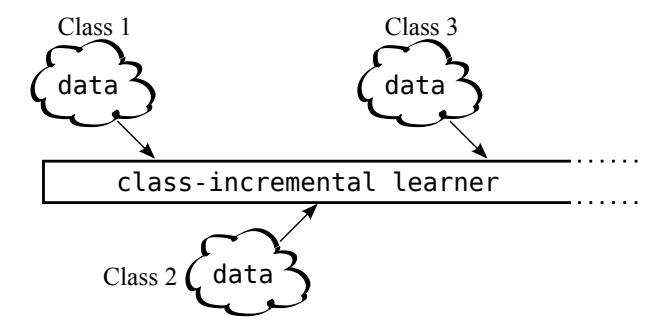
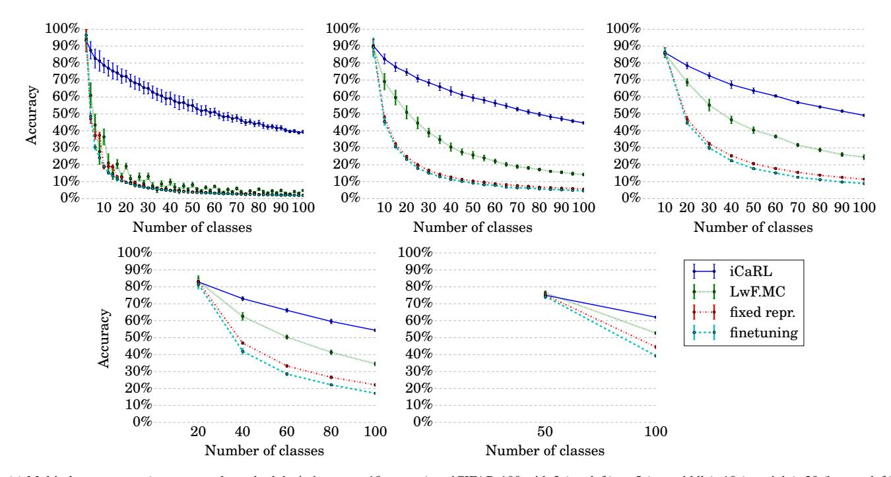
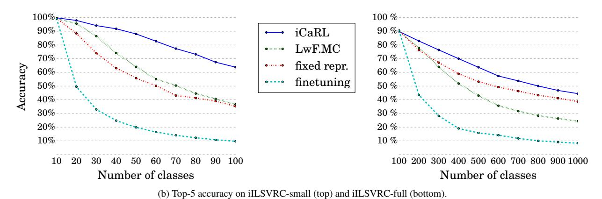
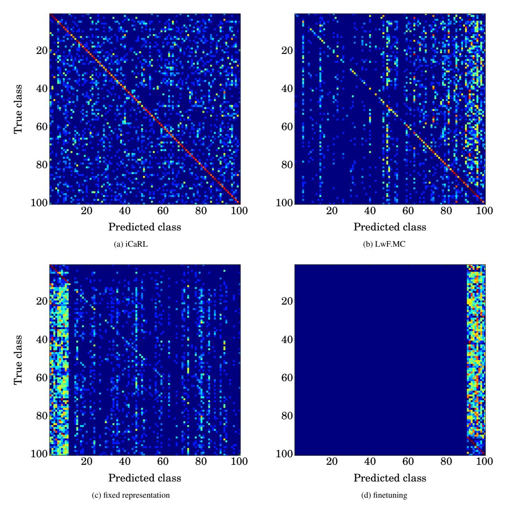
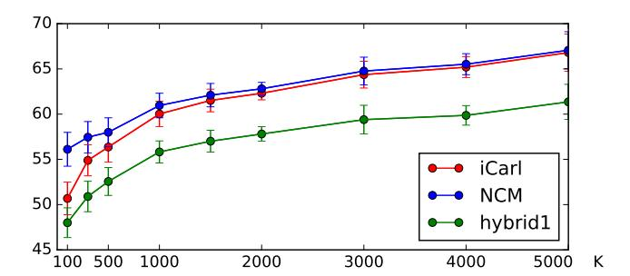
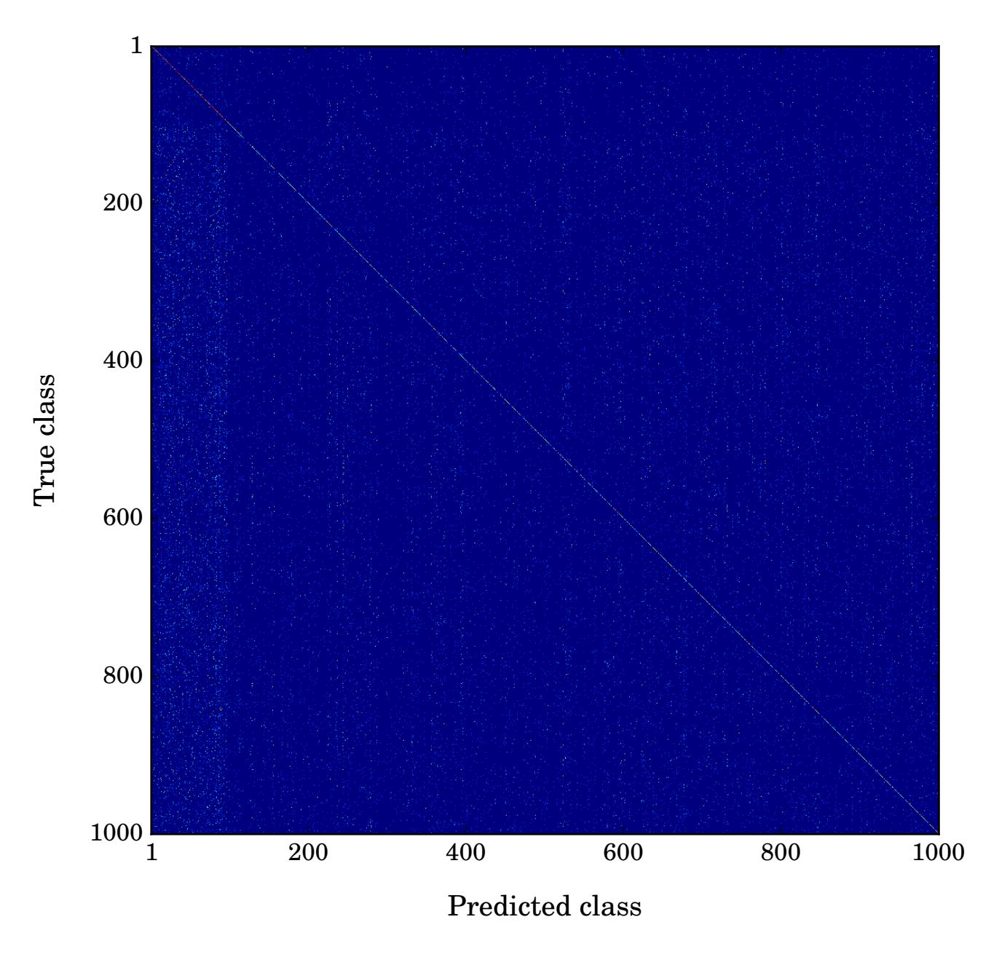
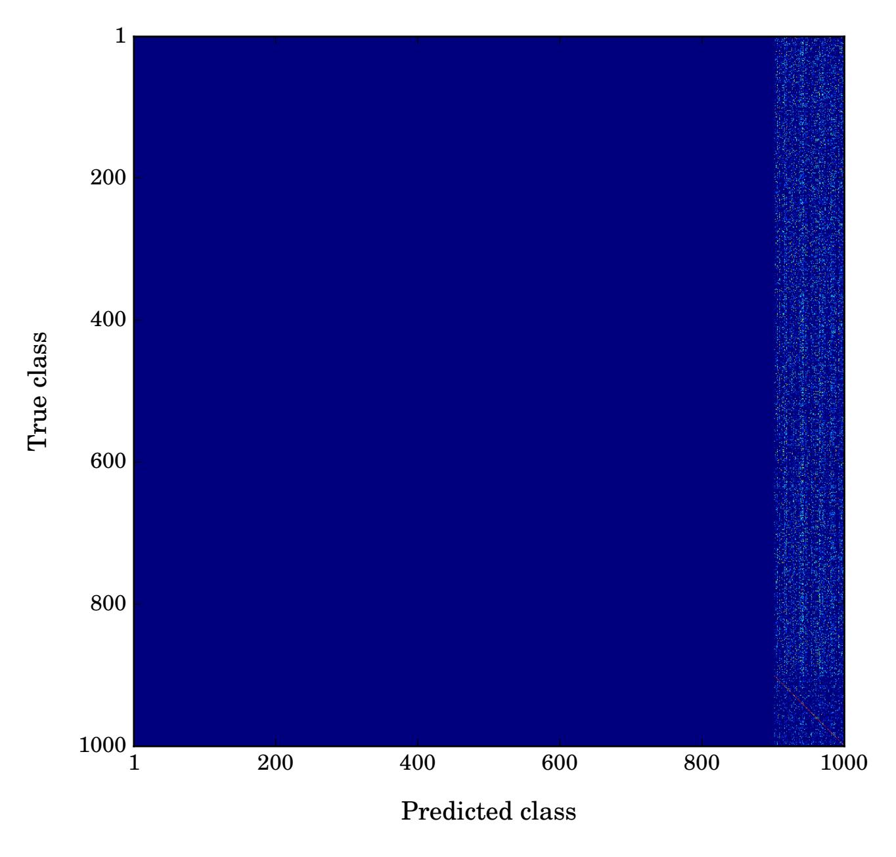

# <span id="page-0-1"></span>iCaRL: Incremental Classifier and Representation Learning

Sylvestre-Alvise Rebuffi University of Oxford/IST Austria Alexander Kolesnikov, Georg Sperl, Christoph H. Lampert IST Austria

## Abstract

*A major open problem on the road to artificial intelligence is the development of incrementally learning systems that learn about more and more concepts over time from a stream of data. In this work, we introduce a new training strategy, iCaRL, that allows learning in such a classincremental way: only the training data for a small number of classes has to be present at the same time and new classes can be added progressively.*

*iCaRL learns strong classifiers and a data representation simultaneously. This distinguishes it from earlier works that were fundamentally limited to fixed data representations and therefore incompatible with deep learning architectures. We show by experiments on CIFAR-100 and ImageNet ILSVRC 2012 data that iCaRL can learn many classes incrementally over a long period of time where other strategies quickly fail.*

## <span id="page-0-0"></span>1. Introduction

Natural vision systems are inherently incremental: new visual information is continuously incorporated while existing knowledge is preserved. For example, a child visiting the zoo will learn about many new animals without forgetting the pet it has at home. In contrast, most artificial object recognition systems can only be trained in a batch setting, where all object classes are known in advance and they the training data of all classes can be accessed at the same time and in arbitrary order.

As the field of computer vision moves closer towards artificial intelligence it becomes apparent that more flexible strategies are required to handle the large-scale and dynamic properties of real-world object categorization situations. At the very least, a visual object classification system should be able to incrementally learn about new classes, when training data for them becomes available. We call this scenario *class-incremental learning*.

Formally, we demand the following three properties of an algorithm to qualify as class-incremental:

i) it should be trainable from a stream of data in which examples of different classes occur at different times,



Figure 1: Class-incremental learning: an algorithm learns continuously from a sequential data stream in which new classes occur. At any time, the learner is able to perform multi-class classification for all classes observed so far.

- ii) it should at any time provide a competitive multi-class classifier for the classes observed so far,
- iii) its computational requirements and memory footprint should remain bounded, or at least grow very slowly, with respect to the number of classes seen so far.

The first two criteria express the essence of classincremental learning. The third criterion prevents trivial algorithms, such as storing all training examples and retraining an ordinary multi-class classifier whenever new data becomes available.

Interestingly, despite the vast progress that image classification has made over the last decades, there is not a single satisfactory class-incremental learning algorithm these days. Most existing multi-class techniques simply violate i) or ii) as they can only handle a fixed number of classes and/or need all training data to be available at the same time. Naively, one could try to overcome this by training classifiers from class-incremental data streams, *e.g*. using stochastic gradient descent optimization. This, however, will cause the classification accuracy to quickly deteriorate, an effect known in the literature as *catastrophic forgetting* or *catastrophic interference* [\[22\]](#page-10-0). The few existing techniques that do fulfill the above properties are principally limited to situations with a fixed data representation. They cannot be extended to deep architectures that learn classifiers and feature representations at the same time and are

#### <span id="page-1-5"></span><span id="page-1-2"></span>Algorithm 1 iCaRL CLASSIFY

therefore not competitive anymore in terms of classification accuracy. More related work is discussed in Section 3.

In this work, we introduce *iCaRL* (*incremental classifier* and representation learning), a practical strategy for simultaneously learning classifiers and a feature representation in the class-incremental setting. Based on a careful analysis of the shortcomings of existing approaches, we introduce three main components that in combination allow *iCaRL* to fulfill all criteria put forth above. These three components are:

- classification by a nearest-mean-of-exemplars rule,
- prioritized exemplar selection based on herding,
- representation learning using knowledge distillation and prototype rehearsal.

We explain the details of these steps in Section 2, and subsequently put them into the context of previous work in Section 3. In Section 4 we report on experiments on the CIFAR and ImageNet datasets that show that iCaRL is able to class-incrementally learn over a long periods of time, where other methods quickly fail. Finally, we conclude in Section 5 with a discussion of remaining limitations and future work.

### <span id="page-1-0"></span>2. Method

In this section we describe iCaRL's main components and explain how their combination allows true class-incremental learning. Section 2.1 explains the underlying architecture and gives a high-level overview of the training and classification steps. Sections 2.2 to 2.4 then provides the algorithmic details and explains the design choices.

#### <span id="page-1-1"></span>2.1. Class-Incremental Classifier Learning

iCaRL learns classifiers and a feature representation simultaneously from on a data stream in class-incremental form, *i.e.* sample sets  $X^1, X^2, \ldots$ , where all examples of a set  $X^y = \{x_1^y, \ldots, x_{ny}^y\}$  are of class  $y \in \mathbb{N}$ .

**Classification.** For classification, iCaRL relies on sets,  $P_1, \ldots, P_t$ , of *exemplar images* that it selects dynamically out of the data stream. There is one such exemplar set for

#### <span id="page-1-3"></span>Algorithm 2 iCaRL INCREMENTALTRAIN

```
input X^s, \ldots, X^t
                          // training examples in per-class sets
input K
                           // memory size
require \Theta
                             // current model parameters
require \mathcal{P} = (P_1, \dots, P_{s-1})
                                          // current exemplar sets
   \Theta \leftarrow \text{UpdateRepresentation}(X^s, \dots, X^t; \mathcal{P}, \Theta)
   m \leftarrow K/t
                      // number of exemplars per class
   for y = 1, ..., s - 1 do
      P_y \leftarrow \text{REDUCEEXEMPLARSET}(P_y, m)
   for y = s, \ldots, t do
      P_y \leftarrow \text{ConstructExemplarSet}(X_y, m, \Theta)
   end for
   \mathcal{P} \leftarrow (P_1, \dots, P_t)
                                      // new exemplar sets
```

each observed class so far, and iCaRL ensures that the total number of exemplar images never exceeds a fixed parameter K. Algorithm 1 describes the mean-of-exemplars classifier that is used to classify images into the set of classes observed so far, see Section 2.2 for a detailed explanation.

**Training.** For training, iCaRL processes batches of classes at a time using an incremental learning strategy. Every time data for new classes is available iCaRL calls an update routine (Algorithm 2, see Sections 2.3 and 2.4). The routine adjusts iCaRL's *internal knowledge* (the network parameters and exemplars) based on the additional information available in the *new observations* (the current training data). This is also how iCaRL learns about the existence of new classes.

**Architecture.** Under the hood, iCaRL makes use of a convolutional neural network (CNN) [19]<sup>1</sup>. We interpret the network as a *trainable feature extractor*,  $\varphi: \mathcal{X} \to \mathbb{R}^d$ , followed by a single classification layer with as many sigmoid output nodes as classes observed so far [3]. All feature vectors are  $L^2$ -normalized, and the results of any operation on feature vectors, *e.g.* averages, are also re-normalized, which we do not write explicitly to avoid a cluttered notation.

We denote the parameters of the network by  $\Theta$ , split into a fixed number of parameters for the feature extraction part and a variable number of weight vectors. We denote the latter by  $w_1, \ldots, w_t \in \mathbb{R}^d$ , where here and in the following sections we use the convention that t denotes the number of classes that have been observed so far. The resulting net-

<span id="page-1-4"></span><sup>&</sup>lt;sup>1</sup>In principle, the iCaRL strategy is largely architecture agnostic and could be use on top of other feature or metric learning strategies. Here, we discuss it only in the context of CNNs to avoid an overly general notation.

<span id="page-2-5"></span>work outputs are, for any class  $y \in \{1, \dots, t\}$ ,

$$g_y(x) = \frac{1}{1 + \exp(-a_y(x))}$$
 with  $a_y(x) = w_y^{\top} \varphi(x)$ . (1)

Note that even though one can interpret these outputs as probabilities, iCaRL uses the network only for representation learning, not for the actual classification step.

**Resource usage.** Due to its incremental nature, iCaRL does not need a priori information about which and how many classes will occur, and it can -in theory- run for an unlimited amount of time. At any time during its runtime its memory requirement will be the size of the feature extraction parameters, the storage of K exemplar images and as many weight vectors as classes that have been observed. This knowledge allows us to assign resources depending on the application scenario. If an upper bound on the number of classes is known, one can simply pre-allocate space for as many weight vectors as required and use all remaining available memory to store exemplars. Without an upper limit, one would actually grow the number of weight vectors over time, and decrease the size of the exemplar set accordingly. Clearly, at least one exemplar image and weight vector is required for each classes to be learned, so ultimately, only a finite number of classes can be learned, unless one allows for the possibility to add more resources over the runtime of the algorithm. Note that iCaRL can handle an increase of resources on-the-fly without retraining: it will simply not discard any exemplars unless it is forced to do so by memory limitations.

#### <span id="page-2-0"></span>2.2. Nearest-Mean-of-Exemplars Classification

iCaRL uses a *nearest-mean-of-exemplars* classification strategy. To predict a label,  $y^*$ , for a new image, x, it computes a prototype vector for each class observed so far,  $\mu_1,\ldots,\mu_t$ , where  $\mu_y=\frac{1}{|P_y|}\sum_{p\in P_y}\varphi(p)$  is the average feature vector of all exemplars for a class y. It also computes the feature vector of the image that should be classified and assigns the class label with most similar prototype:

$$y^* = \underset{y=1,\dots,t}{\operatorname{argmin}} \|\varphi(x) - \mu_y\|. \tag{2}$$

**Background.** The nearest-mean-of-exemplars classification rule overcomes two major problems of the incremental learning setting, as can be seen by contrasting it against other possibilities for multi-class classification.

The usual classification rule for a neural network would be  $y^* = \operatorname{argmax}_{y=1,\dots,t} g_y(x)$ , where  $g_y(x)$  is the network output as defined in (1) or alternatively with a softmax output layer. Because  $\operatorname{argmax}_y g_y(x) = \operatorname{argmax}_y w_y^\top \varphi(x)$ , the network's prediction rule is equivalent to the use of a

#### <span id="page-2-4"></span>Algorithm 3 iCaRL UPDATEREPRESENTATION

<span id="page-2-2"></span> $\begin{array}{lll} \textbf{input} & X^s, \dots, X^t & \textit{ // training images of classes } s, \dots, t \\ \textbf{require} & \mathcal{P} = (P_1, \dots, P_{s-1}) & \textit{ // exemplar sets} \\ \textbf{require} & \Theta & \textit{ // current model parameters} \\ \textit{ // form combined training set:} \\ \end{array}$ 

$$\mathcal{D} \leftarrow \bigcup_{y=s,\dots,t} \{(x,y) : x \in X^y\} \ \cup \bigcup_{y=1,\dots,s-1} \{(x,y) : x \in P^y\}$$

// store network outputs with pre-update parameters:

$$\begin{aligned} & \textbf{for } y = 1, \dots, s-1 \ \textbf{do} \\ & q_i^y \leftarrow g_y(x_i) \quad \text{ for all } (x_i, \cdot) \in \mathcal{D} \end{aligned}$$

end for

run network training (e.g. BackProp) with loss function

$$\ell(\Theta) = -\sum_{(x_i, y_i) \in \mathcal{D}} \left[ \sum_{y=s}^{t} \delta_{y=y_i} \log g_y(x_i) + \delta_{y \neq y_i} \log(1 - g_y(x_i)) + \sum_{y=1}^{s-1} q_i^y \log g_y(x_i) + (1 - q_i^y) \log(1 - g_y(x_i)) \right]$$

that consists of classification and distillation terms.

linear classifier with non-linear feature map  $\varphi$  and weight vectors  $w_1,\ldots,w_t$ . In the class-incremental setting, it is problematic that the weight vectors  $w_y$  are decoupled from the feature extraction routine  $\varphi$ : whenever  $\varphi$  changes, all  $w_1,\ldots,w_t$  must be updated as well. Otherwise, the network outputs will change uncontrollably, which is observable as catastrophic forgetting. In contrast, the nearest-mean-of-exemplars rule (2) does not have decoupled weight vectors. The class-prototypes automatically change whenever the feature representation changes, making the classifier robust against changes of the feature representation.

The choice of the average vector as prototype is inspired by the *nearest-class-mean* classifier [24] for incremental learning with a fixed feature representation. In the class-incremental setting, we cannot make use of the true class mean, since all training data would have to be stored in order to recompute this quantity after a representation change. Instead, we use the average over a flexible number of exemplars that are chosen in a way to provide a good approximation to the class mean.

<span id="page-2-3"></span>Note that, because we work with normalized feature vectors, Equation (2) can be written equivalently as  $y^* = \operatorname{argmax}_y \ \mu_y^{\mathsf{T}} \varphi(x)$ . Therefore, we can also interpret the classification step as classification with a weight vector, but one that is not decoupled from the data representation but changes consistently with it.

#### <span id="page-2-1"></span>2.3. Representation Learning

Whenever iCaRL obtains data,  $X^s, ..., X^t$ , for new classes, s, ..., t, it updates its feature extraction routine

#### <span id="page-3-3"></span><span id="page-3-1"></span>Algorithm 4 iCaRL CONSTRUCTEXEMPLARSET

```
\begin{array}{l} \textbf{input} \;\; \text{image set} \; X = \{x_1, \dots, x_n\} \; \text{of class} \; y \\ \textbf{input} \;\; m \; \text{target number of exemplars} \\ \textbf{require} \;\; \text{current feature function} \; \varphi : \mathcal{X} \to \mathbb{R}^d \\ \mu \leftarrow \frac{1}{n} \sum_{x \in X} \varphi(x) \;\; \text{// current class mean} \\ \textbf{for} \; k = 1, \dots, m \; \textbf{do} \\ p_k \leftarrow \underset{x \in X}{\operatorname{argmin}} \; \left\| \mu - \frac{1}{k} [\varphi(x) + \sum_{j=1}^{k-1} \varphi(p_j)] \right\| \\ \textbf{end for} \\ P \leftarrow (p_1, \dots, p_m) \\ \textbf{output} \;\; \text{exemplar set} \; P \end{array}
```

and the exemplar set. Algorithm 3 lists the steps for incrementally improving the feature representation. First, iCaRL constructs an augmented training set consisting of the currently available training examples together with the stored exemplars. Next, the current network is evaluated for each example and the resulting network outputs for all previous classes are stored (not for the new classes, since the network has not been trained for these, yet). Finally, the network parameters are updated by minimizing a loss function that for each new image encourages the network to output the correct class indicator for new classes (classification loss), and for old classes, to reproduce the scores stored in the previous step (distillation loss).

**Background.** The representation learning step resembles ordinary network finetuning: starting from previously learned network weights it minimizes a loss function over a training set. As a consequence, standard end-to-end learning methods can be used, such as backpropagation with mini-batches, but also recent improvements, such as *dropout* [39], *adaptive stepsize selection* [14] or *batch normalization* [13], as well as potential future improvements.

There are two modifications to plain finetuning that aim at preventing or at least mitigating catastrophic forgetting. First, the training set is augmented. It consists not only of the new training examples but also of the stored exemplars. By this it is ensured that at least some information about the data distribution of all previous classes enters the training process. Note that for this step it is important that the exemplars are stored as images, not in a feature representation that would become outdated over time. Second, the loss function is augmented as well. Besides the standard classification loss, which encourages improvements of the feature representation that allow classifying the newly observed classes well, it also contains the distillation loss, which ensures that the discriminative information learned previously is not lost during the new learning step.

#### <span id="page-3-2"></span>Algorithm 5 iCaRL REDUCEEXEMPLARSET

```
\begin{array}{ll} \textbf{input} \quad m & \text{ // target number of exemplars} \\ \textbf{input} \quad P = (p_1, \dots, p_{|P|}) & \text{ // current exemplar set} \\ P \leftarrow (p_1, \dots, p_m) & \text{ // i.e. keep only first } m \\ \textbf{output} \quad \text{exemplar set } P \end{array}
```

#### <span id="page-3-0"></span>2.4. Exemplar Management

Whenever iCaRL encounters new classes it adjusts its exemplar set. All classes are treated equally in this, *i.e.*, when t classes have been observed so far and K is the total number of exemplars that can be stored, iCaRL will use m=K/t exemplars (up to rounding) for each class. By this it is ensured that the available memory budget of K exemplars is always used to full extent, but never exceeded.

Two routines are responsible for exemplar management: one to select exemplars for new classes and one to reduce the sizes of the exemplar sets of previous classes. Algorithm 4 describes the exemplar selection step. Exemplars  $p_1, \ldots, p_m$  are selected and stored iteratively until the target number, m, is met. In each step of the iteration, one more example of the current training set is added to the exemplar set, namely the one that causes the average feature vector over all exemplars to best approximate the average feature vector over all training examples. Thus, the exemplar "set" is really a prioritized list. The order of its elements matters, with exemplars earlier in the list being more important. The procedure for removing exemplars is specified in Algorithm 5. It is particularly simple: to reduce the number of exemplars from any m' to m, one discards the exemplars  $p_{m+1}, \ldots, p_{m'}$ , keeping only the examples  $p_1, \ldots, p_m$ .

**Background.** The exemplar management routines are designed with two objectives in mind: the initial exemplar set should approximate the class mean vector well, and it should be possible to remove exemplars at any time during the algorithm's runtime without violating this property.

The latter property is challenging because the actual class mean vector is not available to the algorithm anymore when the removal procedure is called. Therefore, we adopt a data-independent removal strategy, removing elements in fixed order starting at the end, and we make it the responsibility of the exemplar set construction routine to make sure that the desired approximation properties are fulfilled even after the removal procedure is called at later times. The prioritized construction is the logical consequence of this condition: it ensures that the average feature vector over any subset of exemplars, starting at the first one, is a good approximation of the mean vector. The same prioritized construction is used in *herding* [40] to create a representative set of samples from a distribution. There it was also shown that the iterative selection requires fewer samples to achieve a

<span id="page-4-1"></span>high approximation quality than, *e.g*., random subsampling. In contrast, other potential methods for exemplar selection, such as [\[7,](#page-9-3) [26\]](#page-10-5), were designed with other objectives and are not guaranteed to provide a good approximation quality for any number of prototypes.

Overall, iCaRL's steps for exemplar selection and reduction fit exactly to the incremental learning setting: the selection step is required for each class only once, when it is first observed and its training data is available. At later times, only the reduction step is called, which does not need access to any earlier training data.

## <span id="page-4-0"></span>3. Related work

iCaRL builds on the insights of multiple earlier attempts to address class-incremental learning. In this section, we describe the most important ones, structuring them on the one hand into learning techniques with *fixed data representations* and on the other hand into techniques that also learn the data representation, both from the *classical connectionists* era as well as recent *deep learning* approaches.

Learning with a fixed data representation. When the data representation is fixed, the main challenge for classincremental learning is to design a classifier architecture that can accommodate new classes at any time during the training process without requiring access to all training data seen so far. The simplest such process of this type could be a *(k-)nearest neighbor* classifier, but that would require storing all training data during the learning process and therefore does not qualify as a class-incremental procedure by our definition.

Mensink *et al*. [\[23\]](#page-10-6) observed that the *nearest class mean (NCM)* classifier has this property. NCM represents each class as a prototype vector that is the average feature vector of all examples observed for the class so far. This vector can be computed incrementally from a data stream, so there is no need to store all training examples. A new example is classified by assigning it the class label that has a prototype most similar to the example's feature vector, with respect to a metric that can also be learned from data. Despite (or because of) its simplicity, NCM has been shown to work well and be more robust than standard parametric classifiers in an incremental learning setting [\[23,](#page-10-6) [24,](#page-10-2) [32\]](#page-10-7).

NCM's main shortcoming is that it cannot easily be extended to the situation in which a nonlinear data representation should be learned together with the classifiers, as this prevents the class mean vectors from being computable in an incremental way. For iCaRL we adopt from NCM the idea of prototype-based classification. However, the prototypes we use are not the average features vectors over all examples but only over a specifically chosen subset, which allows us to keep a small memory footprint and perform all necessary updates with constant computational effort.

Alternative approaches fulfill the class-incremental learning criteria i)–iii), that we introduced in Section [1,](#page-0-0) only partially: Kuzborskij *et al*. [\[17\]](#page-9-4) showed that a loss of accuracy can be avoided when adding new classes to an existing linear multi-class classifier, as long as the classifiers can be retrained from at least a small amount of data for all classes. Chen *et al*. [\[4,](#page-9-5) [5\]](#page-9-6) and Divvala *et al*. [\[6\]](#page-9-7) introduced systems that autonomously retrieve images from web resources and identifies relations between them, but they does not incrementally learn object classifiers. Royer and Lampert [\[34\]](#page-10-8) adapt classifiers to a time-varying data stream but their method cannot handle newly appearing classes, while Pentina *et al*. [\[29\]](#page-10-9) show that learning multiple tasks sequentially can beneficial, but for choosing the order the data for all tasks has to be available at the same time.

Li and Wechsler [\[20\]](#page-10-10), Scheirer *et al*. [\[38\]](#page-10-11), as well as Bendale and Boult [\[2\]](#page-9-8) aimed at the related but distinct problem of *Open Set Recognition* in which test examples might come from other classes than the training examples seen so far. Polikar *et al*. [\[28,](#page-10-12) [30\]](#page-10-13) introduced an ensemble based approach that can handle an increasing number of classes but needs training data for all classes to occur repeatedly. Zero-shot learning, as proposed by Lampert *et al*. [\[18\]](#page-9-9), can classify examples of previously unseen classes, but it does not include a training step for those.

Representation learning. The recent success of (deep) neural networks can in large parts be attributed to their ability to learn not only classifiers but also suitable data representations [\[3,](#page-9-0) [21,](#page-10-14) [25,](#page-10-15) [37\]](#page-10-16), at least in the standard batch setting. First attempts to learn data representations in an incremental fashion can already be found in the classic neural network literature, *e.g*. [\[1,](#page-9-10) [8,](#page-9-11) [9,](#page-9-12) [33\]](#page-10-17). In particular, in the late 1980s McCloskey *et al*. [\[22\]](#page-10-0) described the problem of *catastrophic forgetting*, *i.e*. the phenomenon that training a neural network with new data causes it to overwrite (and thereby forget) what it has learned on previous data. However, these classical works were mainly in the context of connectionist memory networks, not classifiers, and the networks used were small and shallow by today's standards. Generally, the existing algorithms and architectural changes are unable to prevent catastrophic forgetting, see, for example, Moe-Helgesen *et al*.'s survey [\[27\]](#page-10-18) for classical and Goodfellow *et al*.'s [\[10\]](#page-9-13) for modern architectures, except in specific settings, such as Kirkpatrick *et al*.'s [\[15\]](#page-9-14).

A major achievement of the early connectionist works, however, is that they identified the two main strategies of how catastrophic forgetting can be addressed: 1) by *freezing* parts of the network weights while at the same time *growing* the network in order to preserve the ability to learn, 2) by *rehearsal*, *i.e*. continuously stimulating the network not only with the most recent, but also with earlier data.

Recent works on incremental learning of neural net-

<span id="page-5-4"></span>works have mainly followed the freeze/grow strategy, which however requires allocating more and more resources to the network over time and therefore violates principle iii) of our definition of class-incremental learning. For example, Xiao *et al*. [\[41\]](#page-10-19) learn a tree-structured model that grows incrementally as more classes are observed. In the context of multi-task reinforcement learning, Rusu *et al*. [\[36\]](#page-10-20) propose growing the networks by extending all layer horizontally.

For iCaRL, we adopt the principle of *rehearsal*: to update the model parameters for learning a representation, we use not only the training data for the currently available classes, but also the exemplars from earlier classes, which are available anyway as they are required for the prototypebased classification rule. Additionally, iCaRL also uses *distillation* to prevent that information in the network deteriorates too much over time. while Hinton *et al*. [\[12\]](#page-9-15) originally proposed distillation to transfer information between different neural networks, in iCaRL, we use it within a single network between different time points. The same principle was recently proposed by Li and Hoiem [\[21\]](#page-10-14) under the name of *Learning without Forgetting (LwF)* to incrementally train a single network for learning multiple tasks, *e.g*. multiple object recognition datasets. The main difference to the class-incremental multi-class situation lies in the prediction step: a multi-class learner has to pick one classifier that predicts correctly any of the observed classes. A multi-task (multi-dataset) leaner can make use of multiple classifiers, each being evaluated only on the data from its own dataset.

## <span id="page-5-0"></span>4. Experiments

In this section we propose a protocol for evaluating incremental learning methods and compare iCaRL's classification accuracy to that of alternative methods (Section [4.1\)](#page-5-1). We also report on further experiments that shed light on iCaRL's working mechanisms by isolating the effect of individual components (Section [4.2\)](#page-8-1).

Benchmark protocol. So far, no agreed upon benchmark protocol for evaluation class-incremental learning methods exist. Therefore, we propose the following evaluation procedure: for a given multi-class classification dataset, the classes are arranged in a fixed random order. Each method is then trained in a class-incremental way on the available training data. After each batch of classes, the resulting classifier is evaluated on the test part data of the dataset, considering only those classes that have already been trained. Note that, even though the test data is used more than once, no overfitting can occur, as the testing results are not revealed to the algorithms. The result of the evaluation are curves of the classification accuracies after each batch of classes. If a single number is preferable, we report the average of these accuracies, called *average incremental accuracy*.

For the task of image classification we introduce two instantiations of the above protocol. 1) *iCIFAR-100 benchmark*: we use the CIFAR-100 [\[16\]](#page-9-16) data and train all 100 classes in batches of 2, 5, 10, 20 or 50 classes at a time. The evaluation measure is the standard multi-class accuracy on the test set. As the dataset is of manageable size, we run this benchmark ten times with different class orders and reports averages and standard deviations of the results. 2) *iILSVRC benchmark*: we use the ImageNet ILSVRC 2012 [\[35\]](#page-10-21) dataset in two settings: using only a subset of 100 classes, which are trained in batches of 10 (*iILSVRC-small*) or using all 1000 classes, processed in batches of 100 (*iILSVRC-full*). The evaluation measure is the *top-5* accuracy on the *val* part of the dataset.

iCaRL implementation. For iCIFAR-100 we rely on the *theano* package[2](#page-5-2) and train a 32-layers ResNet [\[11\]](#page-9-17), allowing iCaRL to store up to K = 2000 exemplars. Each training step consists of 70 epochs. The learning rate starts at 2.0 and is divided by 5 after 49 and 63 epochs (7/10 and 9/10 of all epochs). For iILSVRC the maximal number of exemplars is K = 20000 and we use the *tensorflow* framework[3](#page-5-3) to train an 18-layers ResNet [\[11\]](#page-9-17) for 60 epochs per class batch. The learning rate starts at 2.0 and is divided by 5 after 20, 30, 40 and 50 epochs (1/3, 1/2, 2/3 and 5/6 of all epochs). For all methods we train the network using standard backpropagation with minibatches of size 128 and a weight decay parameter of 0.00001. Note that the learning rates might appear large, but for our purpose they worked well, likely because we use binary cross-entropy in the network layer. Smaller rates might be required for a multi-class softmax layer. Our source code and further data are available at <http://www.github.com/srebuffi/iCaRL>.

### <span id="page-5-1"></span>4.1. Results

Our main set of experiments studies the classification accuracy of different methods under class-incremental conditions. Besides iCaRL we implemented and tested three alternative class-incremental methods. *Finetuning* learns an ordinary multi-class network without taking any measures to prevent catastrophic forgetting. It can also be interpreted as learning a multi-class classifier for new incoming classes by finetuning the previously learned multiclass classification network. *Fixed representation* also learns a multi-class classification network, but in a way that prevents catastrophic forgetting. It freezes the feature representation after the first batch of classes has been processed and the weights of the classification layer after the corresponding classes have been processed. For subsequent batches of classes, only the weights vectors of new classes are trained. Finally,

<span id="page-5-3"></span><span id="page-5-2"></span><sup>2</sup><http://deeplearning.net/software/theano/> <sup>3</sup><https://www.tensorflow.org/>

<span id="page-6-0"></span>

(a) Multi-class accuracy (averages and standard deviations over 10 repeats) on iCIFAR-100 with 2 (top left), 5 (top middle), 10 (top right), 20 (bottom left) or 50 (bottom right) classes per batch.



Figure 2: Experimental results of class-incremental training on iCIFAR-100 and iILSVRC: reported are multi-class accuracies across all classes observed up to a certain time point. iCaRL clearly outperforms the other methods in this setting. Fixing the data representation after having trained on the first batch (*fixed repr.*) performs worse than distillation-based LwF.MC, except for *iILSVRC-full*. Finetuning the network without preventing catastrophic forgetting (*finetuning*) achieves the worst results. For comparison, the same network trained with all data available achieves 68.6% multi-class accuracy.

we also compare to a network classifier that attempts at preventing catastrophic forgetting by using the distillation loss during learning, like iCaRL does, but that does not use an exemplar set. For classification, it uses the network output values themselves. This is essentially the *Learning without Forgetting* approach, but applied to multi-class classification we, so denote it by LwF.MC. Figure 2 shows the results. One can see that iCaRL clearly outperforms the other methods, and the more so the more incremental the setting

is (*i.e.* the fewer classes can be processed at the same time). Among the other methods, *distillation*-based network training (LwF.MC) is always second best, except for *iILSVRC-full*, where it is better to fix the representation after the first batch of 100 classes. *Finetuning* always achieves the worst results, confirming that catastrophic forgetting is indeed a major problem for in class-incremental learning.

Figure 3 provides further insight into the behavior of the different methods. Is shows the confusion matrices of

<span id="page-7-0"></span>

Figure 3: Confusion matrices of different method on iCIFAR-100 (with entries transformed by log(1+x) for better visibility). iCaRL's predictions are distributed close to uniformly over all classes, whereas LwF.MC tends to predict classes from recent batches more frequently. The classifier with fixed representation has a bias towards classes from the first batch, while the network trained by finetuning predicts exclusively classes labels from the last batch.

the 100-class classifier on iCIFAR-100 after training using batches of 10 classes at a time (larger versions can be found in the appendix). One can see very characteristic patterns: iCaRL's confusion matrix looks homogeneous over all classes, both in terms of the diagonal entries (*i.e*. correct predictions) as well as off-diagonal entries (*i.e*. mistakes). This shows that iCaRL has no intrinsic bias towards or against classes that it encounters early or late during learning. In particular, it does not suffer from catastrophic forgetting.

In contrast to this, the confusion matrices for the other classes show inhomogeneous patterns: *distillation*-based training (LwF.MC) has many more non-zero entries towards the right, *i.e*. for recently learned classes. Even more extreme is the effect for *finetuning*, where all predicted class labels come from the last batch of classes that the network has been trained with. The finetuned network simply *forgot* that earlier classes even exist. The *fixed representation* shows the opposite pattern: it prefers to output classes from the first batch of classes it was trained on (which were used to obtained the data representation). Confusion matrices for iILSVRC show the same patterns, they can be found in the appendix.

### <span id="page-8-1"></span>4.2. Differential Analysis

To provide further insight into the working mechanism of iCaRL, we performed additional experiments on iCIFAR-100, in which we isolate individual aspects of the methods.

First, we analyze why exactly iCaRL improves over plain finetuning-based training, from which it differs in three aspects: by the use of the mean-of-exemplars classification rule, by the use of exemplars during the representation learning, and by the use of the distillation loss. We therefore created three hybrid setups: the first *(hybrid1)* learns a representation in the same way as iCaRL, but uses the network's outputs directly for classification, not the mean-of-exemplar classifier. The second *(hybrid2)* uses the exemplars for classification, but does not use the distillation loss during training. The third *(hybrid3)* uses neither the distillation loss nor exemplars for classification, but it makes use of the exemplars during representation learning. For comparison, we also include LwF.MC again, which uses distillation, but no exemplars at all.

Table [1a](#page-9-18) summarizes the results as the average of the classification accuracies over all steps of the incremental training. One can see that the hybrid setups mostly achieve results in between iCaRL and LwF.MC, showing that indeed all of iCaRL's new components contribute substantially to its good performance. In particular, the comparison of iCaRL with *hybrid1* shows that the mean-of-exemplar classifiers is particularly advantageous for smaller batch sizes, *i.e*. when more updates of the representation are performed. Comparing iCaRL and *hybrid2* one sees that for very small class batch sizes, distillation can even hurt classification accuracy compared to just using prototypes. For larger batch sizes and fewer updates, the use of the distillation loss is clearly advantageous. Finally, comparing the result of *hybrid3* with LwF.MC clearly shows the effectiveness of exemplars in preventing catastrophic forgetting.

In a second set of experiments we study how much accuracy is lost by using the means-of-exemplars as classification prototypes instead of the nearest-class-mean *(NCM)* rule. For the latter, we use the unmodified iCaRL to learn a representation, but we classify images with NCM, where the class-means are recomputed after each representation update using the current feature extractor. Note that this re-

<span id="page-8-2"></span>

Figure 4: Average incremental accuracy on iCIFAR-100 with 10 classes per batch for different memory budgets K.

quires storing all training data, so it would not qualify as a class-incremental method. The results in Table [1b](#page-9-19) show only minor differences between iCaRL and NCM, confirming that iCaRL reliably identifies representative exemplars.

Figure [4](#page-8-2) illustrates the effect of different memory budgets, comparing iCaRL with the *hybrid1* classifier of Table [1a](#page-9-18) and the NCM classifier of Table [1b.](#page-9-19) Both use the same data representation as iCaRL but differ in their classification rules. All method benefit from a larger memory budget, showing that iCaRL's representation learning step indeed benefits from more prototypes. Given enough prototypes (here at least 1000), iCaRL's mean-of-exemplars classifier performs similarly to the NCM classifier, while classifying by the network outputs is not competitive.

## <span id="page-8-0"></span>5. Conclusion

We introduced iCaRL, a strategy for class-incremental learning that learns classifiers and a feature representation simultaneously. iCaRL's three main components are: 1) a *nearest-mean-of-exemplars* classifier that is robust against changes in the data representation while needing to store only a small number of exemplars per class, 2) a *herding*based step for prioritized exemplar selection, and 3) a representation learning step that uses the exemplars in combination with *distillation* to avoid catastrophic forgetting. Experiments on CIFAR-100 and ImageNet ILSVRC 2012 data show that iCaRL is able to learn incrementally over a long period of time where other methods fail quickly.

The main reason for iCaRL's strong classification results are its use of exemplar images. While it is intuitive that being able to rely on stored exemplars in addition to the network parameters could be beneficial, we nevertheless find it an important observation how pronounced this effect is in the class-incremental setting. We therefore hypothesize that also other architectures should be able to benefit from using a combination of network parameters and exemplars, especially given the fact that many thousands of images can be stored (in compressed form) with memory requirements comparable to the sizes of current deep networks.

Despite the promising results, class-incremental classi-

Table 1: Average multi-class accuracy on iCIFAR-100 for different modifications of iCaRL.

<span id="page-9-20"></span><span id="page-9-18"></span>(a) Switching off different components of iCaRL (*hybrid1*, *hybrid2*, *hybrid3*, see text for details) leads to results mostly inbetween iCaRL and LwF.MC, showing that all of iCaRL's new components contribute to its performance.

| batch size | iCaRL | hybrid1 | hybrid2 | hybrid3 | LwF.MC |
|------------|-------|---------|---------|---------|--------|
| 2 classes  | 57.0  | 36.6    | 57.6    | 57.0    | 11.7   |
| 5 classes  | 61.2  | 50.9    | 57.9    | 56.7    | 32.6   |
| 10 classes | 64.1  | 59.3    | 59.9    | 58.1    | 44.4   |
| 20 classes | 67.2  | 65.6    | 63.2    | 60.5    | 54.4   |
| 50 classes | 68.6  | 68.2    | 65.3    | 61.5    | 64.5   |

fication is far from solved. In particular, iCaRL's performance is still lower than what systems achieve when trained in a batch setting, *i.e*. with all training examples of all classes available at the same time. In future work we plan to analyze the reasons for this in more detail with the goal of closing the remaining performance gap. We also plan to study related scenarios in which the classifier cannot store any of the training data in raw form, *e.g*. for privacy reasons. A possible direction for this would be to encode feature characteristics of earlier tasks implicitly by a autoencoder, as recently proposed by Rannen Triki *et al*. [\[31\]](#page-10-22).

Acknowledgments. This work was in parts funded by the European Research Council under the European Union's Seventh Framework Programme (FP7/2007-2013)/ERC grant agreement no 308036: "Life-long learning of visual scene understanding" (L3ViSU). The Tesla K40 cards used for this research were donated by the NVIDIA Corporation.

## References

- <span id="page-9-10"></span>[1] B. Ans and S. Rousset. Avoiding catastrophic forgetting by coupling two reverberating neural networks. *Comptes Rendus de l'Academie des Sciences ´* , 320(12), 1997. [5](#page-4-1)
- <span id="page-9-8"></span>[2] A. Bendale and T. Boult. Towards open world recognition. In *Conference on Computer Vision and Pattern Recognition (CVPR)*, 2015. [5](#page-4-1)
- <span id="page-9-0"></span>[3] Y. Bengio, A. Courville, and P. Vincent. Representation learning: A review and new perspectives. *IEEE Transactions on Pattern Analysis and Machine Intelligence (T-PAMI)*, 35(8), 2013. [2,](#page-1-5) [5](#page-4-1)
- <span id="page-9-5"></span>[4] X. Chen, A. Shrivastava, and A. Gupta. NEIL: Extracting visual knowledge from web data. In *International Conference on Computer Vision (ICCV)*, 2013. [5](#page-4-1)
- <span id="page-9-6"></span>[5] X. Chen, A. Shrivastava, and A. Gupta. Enriching visual knowledge bases via object discovery and segmentation. In *Conference on Computer Vision and Pattern Recognition (CVPR)*, 2014. [5](#page-4-1)
- <span id="page-9-7"></span>[6] S. K. Divvala, A. Farhadi, and C. Guestrin. Learning everything about anything: Webly-supervised visual concept learning. In *Conference on Computer Vision and Pattern Recognition (CVPR)*, 2014. [5](#page-4-1)

<span id="page-9-19"></span>(b) Replacing iCaRL's mean-of-exemplars by a nearest-class-mean classifier (NCM) has only a small positive effect on the classification accuracy, showing that iCaRL's strategy for selecting exemplars is effective.

| batch size | iCaRL | NCM  |
|------------|-------|------|
| 2 classes  | 57.0  | 59.3 |
| 5 classes  | 61.2  | 62.1 |
| 10 classes | 64.1  | 64.5 |
| 20 classes | 67.2  | 67.5 |
| 50 classes | 68.6  | 68.7 |

- <span id="page-9-3"></span>[7] E. Elhamifar and R. Vidal. Sparse subspace clustering: Algorithm, theory, and applications. *IEEE Transactions on Pattern Analysis and Machine Intelligence (T-PAMI)*, 35(11):2765–2781, 2013. [5](#page-4-1)
- <span id="page-9-11"></span>[8] R. M. French. Catastrophic interference in connectionist networks: Can it be predicted, can it be prevented? In *Conference on Neural Information Processing Systems (NIPS)*, 1993. [5](#page-4-1)
- <span id="page-9-12"></span>[9] R. M. French. Catastrophic forgetting in connectionist networks. *Trends in cognitive sciences*, 3(4), 1999. [5](#page-4-1)
- <span id="page-9-13"></span>[10] I. J. Goodfellow, M. Mirza, D. Xiao, A. Courville, and Y. Bengio. An empirical investigation of catastrophic forgeting in gradient-based neural networks. In *International Conference on Learning Representations (ICLR)*, 2014. [5](#page-4-1)
- <span id="page-9-17"></span>[11] K. He, X. Zhang, S. Ren, and J. Sun. Deep residual learning for image recognition. *arXiv preprint arXiv:1512.03385*, 2015. [6](#page-5-4)
- <span id="page-9-15"></span>[12] G. Hinton, O. Vinyals, and J. Dean. Distilling the knowledge in a neural network. In *NIPS Workshop on Deep Learning*, 2014. [6](#page-5-4)
- <span id="page-9-2"></span>[13] S. Ioffe and C. Szegedy. Batch normalization: Accelerating deep network training by reducing internal covariate shift. In *International Conference on Machine Learing (ICML)*, 2015. [4](#page-3-3)
- <span id="page-9-1"></span>[14] D. P. Kingma and J. Ba. Adam: A method for stochastic optimization. In *International Conference on Learning Representations (ICLR)*, 2015. [4](#page-3-3)
- <span id="page-9-14"></span>[15] J. Kirkpatrick, R. Pascanu, N. Rabinowitz, J. Veness, G. Desjardins, A. A. Rusu, K. Milan, J. Quan, T. Ramalho, A. Grabska-Barwinska, et al. Overcoming catastrophic forgetting in neural networks. *Proceedings of the National Academy of Sciences (PNAS)*, 2017. [5](#page-4-1)
- <span id="page-9-16"></span>[16] A. Krizhevsky. Learning multiple layers of features from tiny images. Technical report, University of Toronto, 2009. [6](#page-5-4)
- <span id="page-9-4"></span>[17] I. Kuzborskij, F. Orabona, and B. Caputo. From n to n + 1: Multiclass transfer incremental learning. In *Conference on Computer Vision and Pattern Recognition (CVPR)*, 2013. [5](#page-4-1)
- <span id="page-9-9"></span>[18] C. H. Lampert, H. Nickisch, and S. Harmeling. Attributebased classification for zero-shot visual object categorization. *IEEE Transactions on Pattern Analysis and Machine Intelligence (T-PAMI)*, 2013. [5](#page-4-1)

- <span id="page-10-1"></span>[19] Y. LeCun, L. Bottou, Y. Bengio, and P. Haffner. Gradientbased learning applied to document recognition. *Proceedings of the IEEE*, 86(11), 1998. [2](#page-1-5)
- <span id="page-10-10"></span>[20] F. Li and H. Wechsler. Open set face recognition using transduction. *IEEE Transactions on Pattern Analysis and Machine Intelligence (T-PAMI)*, 27(11), 2005. [5](#page-4-1)
- <span id="page-10-14"></span>[21] Z. Li and D. Hoiem. Learning without forgetting. In *European Conference on Computer Vision (ECCV)*, 2016. [5,](#page-4-1) [6](#page-5-4)
- <span id="page-10-0"></span>[22] M. McCloskey and N. J. Cohen. Catastrophic interference in connectionist networks: The sequential learning problem. *Psychology of learning and motivation*, 24:109–165, 1989. [1,](#page-0-1) [5](#page-4-1)
- <span id="page-10-6"></span>[23] T. Mensink, J. Verbeek, F. Perronnin, and G. Csurka. Metric learning for large scale image classification: Generalizing to new classes at near-zero cost. In *European Conference on Computer Vision (ECCV)*, 2012. [5](#page-4-1)
- <span id="page-10-2"></span>[24] T. Mensink, J. Verbeek, F. Perronnin, and G. Csurka. Distance-based image classification: Generalizing to new classes at near-zero cost. *IEEE Transactions on Pattern Analysis and Machine Intelligence (T-PAMI)*, 35(11), 2013. [3,](#page-2-5) [5](#page-4-1)
- <span id="page-10-15"></span>[25] I. Misra, A. Shrivastava, A. Gupta, and M. Hebert. Crossstitch networks for multi-task learning. In *Conference on Computer Vision and Pattern Recognition (CVPR)*, 2016. [5](#page-4-1)
- <span id="page-10-5"></span>[26] I. Misra, A. Shrivastava, and M. Hebert. Data-driven exemplar model selection. In *Winter Conference on Applications of Computer Vision (WACV)*, pages 339–346, 2014. [5](#page-4-1)
- <span id="page-10-18"></span>[27] O.-M. Moe-Helgesen and H. Stranden. Catastophic forgetting in neural networks. Technical report, Norwegian University of Science and Technology (NTNU), 2005. [5](#page-4-1)
- <span id="page-10-12"></span>[28] M. D. Muhlbaier, A. Topalis, and R. Polikar. Learn++.NC: Combining ensemble of classifiers with dynamically weighted consult-and-vote for efficient incremental learning of new classes. *IEEE Transactions on Neural Networks (T-NN)*, 20(1), 2009. [5](#page-4-1)
- <span id="page-10-9"></span>[29] A. Pentina, V. Sharmanska, and C. H. Lampert. Curriculum learning of multiple tasks. In *Conference on Computer Vision and Pattern Recognition (CVPR)*, 2015. [5](#page-4-1)
- <span id="page-10-13"></span>[30] R. Polikar, L. Upda, S. S. Upda, and V. Honavar. Learn++: an incremental learning algorithm for supervised neural networks. *IEEE Transactions on Systems, Man, and Cybernetics, Part C*, 31(4), 2001. [5](#page-4-1)
- <span id="page-10-22"></span>[31] A. Rannen Triki, R. Aljundi, M. B. Blaschko, and T. Tuytelaars. Encoder based lifelong learning. *arXiv preprint arXiv:1704.01920*, 2017. [10](#page-9-20)
- <span id="page-10-7"></span>[32] M. Ristin, M. Guillaumin, J. Gall, and L. Van Gool. Incremental learning of NCM forests for large-scale image classification. In *Conference on Computer Vision and Pattern Recognition (CVPR)*, 2014. [5](#page-4-1)
- <span id="page-10-17"></span>[33] A. V. Robins. Catastrophic forgetting, rehearsal and pseudorehearsal. *Connection Science*, 7(2):123–146, 1995. [5](#page-4-1)
- <span id="page-10-8"></span>[34] A. Royer and C. H. Lampert. Classifier adaptation at prediction time. In *Conference on Computer Vision and Pattern Recognition (CVPR)*, 2015. [5](#page-4-1)
- <span id="page-10-21"></span>[35] O. Russakovsky, J. Deng, H. Su, J. Krause, S. Satheesh, S. Ma, Z. Huang, A. Karpathy, A. Khosla, M. Bernstein,

- A. C. Berg, and L. Fei-Fei. ImageNet Large Scale Visual Recognition Challenge. *International Journal of Computer Vision (IJCV)*, 115(3), 2015. [6](#page-5-4)
- <span id="page-10-20"></span>[36] A. A. Rusu, N. C. Rabinowitz, G. Desjardins, H. Soyer, J. Kirkpatrick, K. Kavukcuoglu, R. Pascanu, and R. Hadsell. Progressive neural networks. *arXiv preprint arXiv:1606.04671*, 2016. [6](#page-5-4)
- <span id="page-10-16"></span>[37] S. Saxena and J. Verbeek. Convolutional neural fabrics. In *Conference on Neural Information Processing Systems (NIPS)*, 2016. [5](#page-4-1)
- <span id="page-10-11"></span>[38] W. J. Scheirer, A. Rocha, A. Sapkota, and T. E. Boult. Towards open set recognition. *IEEE Transactions on Pattern Analysis and Machine Intelligence (T-PAMI)*, 36, 2013. [5](#page-4-1)
- <span id="page-10-3"></span>[39] N. Srivastava, G. E. Hinton, A. Krizhevsky, I. Sutskever, and R. Salakhutdinov. Dropout: a simple way to prevent neural networks from overfitting. *Journal of Machine Learning Research (JMLR)*, 15(1), 2014. [4](#page-3-3)
- <span id="page-10-4"></span>[40] M. Welling. Herding dynamical weights to learn. In *International Conference on Machine Learing (ICML)*, 2009. [4](#page-3-3)
- <span id="page-10-19"></span>[41] T. Xiao, J. Zhang, K. Yang, Y. Peng, and Z. Zhang. Errordriven incremental learning in deep convolutional neural network for large-scale image classification. In *International Conference on Multimedia (ACM MM)*, 2014. [6](#page-5-4)


Figure 5: Confusion matrix for *iCaRL* on *iILSVRC-large* (1000 classes in batches of 100)


Figure 6: Confusion matrix for *LwF.MC* on *iILSVRC-large* (1000 classes in batches of 100)



Figure 7: Confusion matrix for *fixed representation* on *iILSVRC-large* (1000 classes in batches of 100)



Figure 8: Confusion matrix for *finetuning* on *iILSVRC-large* (1000 classes in batches of 100)